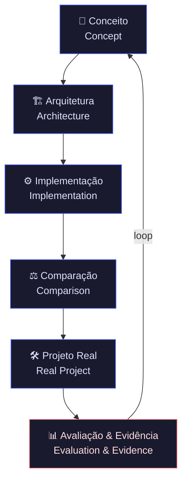
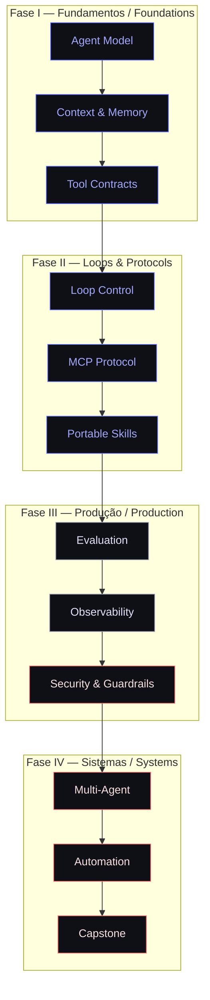

<div align="center">

<!-- NEXUS Brand Header — Inline HTML/CSS for Visual Impact -->
<style>
  .nexus-header {
    font-family: 'Space Grotesk', 'Inter', -apple-system, BlinkMacSystemFont, 'Segoe UI', sans-serif;
    text-align: center;
    padding: 2.5rem 1rem 1.5rem;
    background: linear-gradient(180deg, #0a0a0f 0%, #111118 40%, #0f0f16 100%);
    border-radius: 12px;
    margin-bottom: 2rem;
    border: 1px solid #22222e;
  }
  .nexus-logo {
    width: 96px;
    height: 96px;
    margin: 0 auto 1.5rem;
    display: block;
  }
  .nexus-title {
    font-size: 3.2rem;
    font-weight: 700;
    letter-spacing: -0.04em;
    background: linear-gradient(135deg, #e0e0ff 0%, #a0a8ff 50%, #6a7fff 100%);
    -webkit-background-clip: text;
    -webkit-text-fill-color: transparent;
    background-clip: text;
    margin: 0 0 0.5rem 0;
    line-height: 1.1;
  }
  .nexus-subtitle {
    font-size: 1.15rem;
    color: #8a8faa;
    font-weight: 400;
    letter-spacing: 0.02em;
    margin: 0 0 1.5rem 0;
    line-height: 1.5;
    max-width: 640px;
    margin-left: auto;
    margin-right: auto;
  }
  .nexus-badges {
    display: flex;
    flex-wrap: wrap;
    justify-content: center;
    gap: 0.5rem;
    margin-top: 1rem;
  }
  .nexus-badges img {
    height: 22px;
    border-radius: 4px;
    opacity: 0.9;
    transition: opacity 0.2s;
  }
  .nexus-badges img:hover {
    opacity: 1;
  }
  .nexus-divider {
    width: 80px;
    height: 2px;
    background: linear-gradient(90deg, transparent, #4a5fff, transparent);
    margin: 1.5rem auto;
    border: none;
  }
  .nexus-meta {
    font-size: 0.85rem;
    color: #555570;
    font-family: 'SF Mono', 'Fira Code', monospace;
    margin-top: 1rem;
  }
</style>

<div class="nexus-header">
  <svg class="nexus-logo" viewBox="0 0 96 96" fill="none" xmlns="http://www.w3.org/2000/svg">
    <rect width="96" height="96" rx="16" fill="#111118" stroke="#22222e" stroke-width="1"/>
    <path d="M28 68L48 28L68 68H58L48 48L38 68H28Z" fill="url(#nexusGrad)"/>
    <circle cx="48" cy="48" r="3" fill="#6a7fff"/>
    <defs>
      <linearGradient id="nexusGrad" x1="28" y1="28" x2="68" y2="68" gradientUnits="userSpaceOnUse">
        <stop stop-color="#a0a8ff"/>
        <stop offset="1" stop-color="#4a5fff"/>
      </linearGradient>
    </defs>
  </svg>

  <h1 class="nexus-title">NEXUS</h1>
  <p class="nexus-subtitle">
    <strong>Agent Engineering Academy</strong><br>
    <span style="font-size:0.95em;">From first loop to production-grade multi-agent systems.</span>
  </p>
  <div class="nexus-divider"></div>
  <p class="nexus-subtitle" style="font-size:1rem; color:#6a7fff; font-weight:500;">
    Engineering rigor. Multi-platform. Vendor-independent. Evidence-backed.
  </p>

  <div class="nexus-badges">
    
    
    
    
    
    
  </div>

  <p class="nexus-meta">
    <code>markdown</code> · <code>obsidian</code> · <code>python</code> · <code>mermaid</code> · <code>github-actions</code>
  </p>
</div>

</div>

---

> **English readers:** The NEXUS Academy is canonically authored in **Brazilian Portuguese (pt-BR)**. Key sections below include bilingual headings for cross-language navigation. Full English translation will ship with the Ecosystem milestone.

---

## 1. Manifesto — Por que a NEXUS existe / Why NEXUS Exists

> **A engenharia de agentes de IA não é prompt engineering. É sistemas distribuídos com intenção, memória, falhas e orquestração.**

A revolução dos agentes de IA está sendo construída sobre fundações instáveis: frameworks opacos, segurança retrativa, e um oceano de tutoriais que ensinam *copiar e colar* antes de *pensar e provar*.

A **NEXUS Agent Engineering Academy** nasce para corrigir essa trajetória. Nós tratamos agentes de IA como **sistemas de missão crítica** — não como scripts de demonstração. Cada loop é modelado, cada ferramenta é contratada, cada falha é orquestrada, cada decisão é instrumentada.

Nosso compromisso é simples e não negociável:

| Princípio | Declaração |
|-----------|------------|
| **Contratos explícitos** | Nenhuma ferramenta, skill ou handoff sem interface formalizada |
| **Falha como domínio** | Modelagem de erro, budgets, circuit breakers e rollback desde o módulo 00 |
| **Segurança by design** | Prompt injection, least privilege, aprovação humana e MCP sanitization são obrigatórios |
| **Evidência verificável** | Fontes primárias, ABNT/Vancouver, benchmarks reproduzíveis |
| **Multiplataforma real** | Adapters independentes com matriz explícita de equivalência — nenhum vendor lock-in |
| **Longevidade estrutural** | Markdown puro, YAML frontmatter, IDs estáveis, observabilidade nativa |

> **Não ensinamos a usar frameworks. Ensinamos a construir sistemas que frameworks apenas implementam.**

---

## 2. O Método NEXUS / The NEXUS Method

Nosso ciclo pedagógico é um **máquina de estados de aprendizagem** — cada transição é mensurável, cada artefato é versionado, cada evidência é auditável.



**Fases do ciclo:**

| Fase | Objetivo | Artefato |
|------|----------|----------|
| **Conceito** | Modelar o problema como sistema de estados | Diagrama de estados, contrato de I/O |
| **Arquitetura** | Definir componentes, fronteiras e falhas | ADR, diagrama de sequência, threat model |
| **Implementação** | Codificar com testes, telemetria e observabilidade | Módulo testado, métricas instrumentadas |
| **Comparação** | Contrastar abordagens em múltiplas plataformas | Matriz de equivalência, benchmarks |
| **Projeto Real** | Integrar em cenário de produção simulado | Entrega funcional, review de pares |
| **Avaliação** | Coletar evidência, revisar, documentar | Rubrica preenchida, portfólio versionado |

---

## 3. Arquitetura Conceitual / Conceptual Architecture



---

## 4. Diferenciais Enterprise / Enterprise Differentiators

| Pilar | Diferencial NEXUS | Padrão do Mercado |
|-------|-------------------|-------------------|
| **🔧 Engenharia** | Contratos, estados, falhas, budgets, telemetria e testes antes de frameworks | Prompt engineering em notebooks sem CI |
| **🌐 Multiplataforma** | Adapters independentes com matriz explícita de equivalência (ChatGPT, Claude, Gemini, Kimi, OpenAI Agents SDK, LangGraph, CrewAI, AutoGen, n8n, Make) | Lock-in em única API ou framework |
| **🔒 Segurança** | Prompt injection, MCP sanitization, least privilege, aprovação humana, rollback desde Módulo 00 | Segurança adicionada como afterthought |
| **📜 Evidência** | Fontes primárias, ABNT/Vancouver, benchmarks reproduzíveis, rubricas de avaliação | Tutorial sem fontes ou verificação |
| **🧠 Aprendizagem** | Laboratórios mensuráveis, checklists, projetos de portfólio, revisão de pares | Vídeo passivo sem prática estruturada |
| **♾️ Longevidade** | Markdown puro, YAML frontmatter, Obsidian, IDs estáveis, Dependabot, Conventional Commits | Formatos proprietários, links quebram em 2 anos |

---

## 5. Currículo Estruturado / Structured Curriculum

> **Programa Executivo de 12 Módulos — 4 Fases de Especialização**

### 🎓 Fase I — Fundamentos *(Módulos 00–02)*
Modelar agentes, contexto e ferramentas com contratos explícitos.

| Módulo | Título | Conceito-Chave |
|--------|--------|----------------|
| `00` | **Orientation** | Ontologia da engenharia de agentes; contratos vs. prompts |
| `01` | **The Agent Model** | Estados, transições, ciclo de vida, budgets |
| `02` | **Context & Tools** | Memória estruturada, schema de ferramentas, I/O contracts |

### 🔄 Fase II — Loops e Protocolos *(Módulos 03–05)*
Loops controláveis, MCP e skills portáteis.

| Módulo | Título | Conceito-Chave |
|--------|--------|----------------|
| `03` | **Loop Control** | State machines, stop conditions, retry budgets, circuit breakers |
| `04` | **MCP Protocol** | Model Context Protocol, sanitization, adapters seguros |
| `05` | **Portable Skills** | Skills como pacotes versionados, portabilidade cross-platform |

### 🛡️ Fase III — Produção *(Módulos 06–08)*
Avaliar, observar, proteger e operar agentes confiáveis.

| Módulo | Título | Conceito-Chave |
|--------|--------|----------------|
| `06` | **Evaluation** | Métricas, benchmarks, AB testing, rubricas de qualidade |
| `07` | **Observability** | Telemetria, tracing, logging estruturado, dashboards |
| `08` | **Security & Guardrails** | Prompt injection, sandboxing, aprovação humana, rollback |

### 🌐 Fase IV — Sistemas *(Módulos 09–11)*
Multiagentes, automações e capstone de produção.

| Módulo | Título | Conceito-Chave |
|--------|--------|----------------|
| `09` | **Multi-Agent Systems** | Coordenação, handoffs, consenso, escalonamento |
| `10` | **Automation** | Workflows, triggers, scheduling, integração com infraestrutura |
| `11` | **Capstone** | Projeto integrador de sistema multi-agente em produção simulada |

---

## 6. Ecossistema de Plataformas / Platform Ecosystem

A NEXUS não escolhe um vencedor. Nós **mapeamos equivalências** e construímos adapters independentes para que seu investimento em engenharia de agentes seja portátil.

**Plataformas com suporte ativo ou planejado:**

| Categoria | Plataformas |
|-----------|-------------|
| **LLM Core** | OpenAI GPT, Anthropic Claude, Google Gemini, Moonshot Kimi |
| **Agent Frameworks** | OpenAI Agents SDK, LangGraph, CrewAI, AutoGen |
| **Low-Code / No-Code** | n8n, Make, Zapier (via webhooks) |
| **Infraestrutura** | GitHub Actions, Docker, Kubernetes, AWS Lambda, Cloudflare Workers |

> Cada adapter inclui: contrato de I/O, matriz de equivalência, testes de integração e threat model específico.

---

## 7. Estrutura do Repositório / Repository Structure

```text
nexus-agent-academy/
├── 📁 agents/              # Padrões, papéis, memória, handoffs e coordenação
├── 📁 course/              # Sequência pedagógica (00-Orientation → 11-Capstone)
│   ├── 00-orientation/
│   ├── 01-agent-model/
│   ├── ...
│   └── 11-capstone/
├── 📁 docs/                # Conceitos, arquitetura, segurança, padrões (Obsidian-ready)
├── 📁 examples/            # Implementações mínimas comparáveis (one-file demos)
├── 📁 labs/                # Experimentos guiados e mensuráveis (rubricas + checklists)
├── 📁 loops/               # Máquinas de estado, budgets, stop conditions, circuit breakers
├── 📁 platforms/           # Adapters multiplataforma (ver Ecossistema acima)
├── 📁 projects/            # Projetos integradores e entregas de portfólio
├── 📁 templates/           # Contratos, ADRs, threat models, avaliações, checklists
├── 📁 tests/               # Validação estrutural, CI, regressão de adapters
├── 📄 README.md            # Este documento (pt-BR canônico)
├── 📄 ROADMAP.md           # Trajetória: Foundation → Core → Production → Ecosystem → Stable
├── 📄 CONTRIBUTING.md      # Guia de contribuição (segurança, revisão científica, adapters)
├── 📄 SECURITY.md          # Política de segurança, vulnerabilidades, responsável disclosure
├── 📄 CODE_OF_CONDUCT.md   # Código de conduta para contribuidores
└── 📄 LICENSE              # Apache-2.0
```

---

## 8. Quick Start — Para Engenheiros / For Engineers

```bash
# 1. Clone o repositório canônico
$ git clone https://github.com/matheusflorindo32/nexus-agent-engineering-academy.git
$ cd nexus-agent-engineering-academy

# 2. Configure o ambiente de estudo (Obsidian + Python + Mermaid)
$ python -m venv .venv
$ source .venv/bin/activate  # Windows: .venv\Scripts\activate
$ pip install -r requirements.txt

# 3. Abra o vault no Obsidian (ou editor Markdown de preferência)
$ obsidian .  # ou code . / zeditor . / etc.

# 4. Inicie pelo Módulo 00 — Orientation
$ open course/00-orientation/README.md
```

**Pré-requisitos:** Python 3.11+, Git, editor Markdown (Obsidian recomendado), curiosidade técnica e tolerância a ambiguidade.

---

## 9. Contribuição de Elite / Elite Contributions

A NEXUS é um projeto aberto, mas com barra de qualidade institucional. Buscamos contribuições nas seguintes áreas:

| Área | Tipo de Contribuição | Nível de Rigor |
|------|---------------------|----------------|
| **🔒 Segurança** | Threat models, CVEs, sanitizers, fuzzing de adapters | Peer-reviewed + evidência |
| **📚 Revisão Científica** | Fontes primárias, atualização de referências ABNT/Vancouver | Validação cruzada |
| **🌐 Adapters** | Novas plataformas, matrizes de equivalência, testes de integração | CI pass + regression test |
| **🧪 Laboratórios** | Novos experimentos mensuráveis, rubricas, datasets | Rubrica preenchida |
| **🛠️ Infraestrutura** | CI/CD, Dependabot, GitHub Actions, pre-commit hooks | 100% pass rate |
| **🌍 Tradução** | Traduções estruturadas (en, es, de, fr, zh, ja) | Bilingue nativo + revisão técnica |

> Leia [`CONTRIBUTING.md`](CONTRIBUTING.md) antes de abrir um PR. Não aceitamos "prompts legais" sem contrato de I/O.

---

## 10. Roadmap & Milestones

| Milestone | Status | Descrição |
|-----------|--------|-----------|
| **Foundation** | ✅ Concluído | Estrutura de repositório, CI/CD, templates, módulo 00 |
| **Core Curriculum** | 🚧 Em Progresso | Módulos 01–05 em desenvolvimento ativo |
| **Production Engineering** | 📋 Planejado | Módulos 06–08, observabilidade, segurança |
| **Ecosystem** | 📋 Planejado | Adapters de plataformas, traduções, comunidade |
| **Stable** | 📋 Futuro | Versão 1.0, revisão científica completa, certificação |

> Detalhes completos em [`ROADMAP.md`](ROADMAP.md).

---

## 11. Footer Institucional

<div align="center">

---

**NEXUS Agent Engineering Academy** — *Engineering rigor for the agentic era.*

[](LICENSE)
&nbsp;·&nbsp;
[🗺️ Roadmap](ROADMAP.md)
&nbsp;·&nbsp;
[🤝 Contributing](CONTRIBUTING.md)
&nbsp;·&nbsp;
[🔒 Security](SECURITY.md)
&nbsp;·&nbsp;
[⚖️ Code of Conduct](CODE_OF_CONDUCT.md)

---

> *"We do not teach prompt engineering. We teach the engineering of systems that prompts merely activate."*

**Built with intention. Validated with evidence. Designed to endure.**

</div>