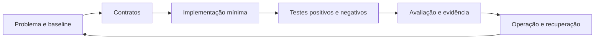

<p align="center">
  
</p>

<p align="center">
  <strong>Aprenda a construir agentes de IA que você consegue explicar, testar, proteger, observar e parar.</strong><br>
  Currículo aberto · laboratórios reproduzíveis · projetos auditáveis · pt-BR canônico
</p>

<p align="center">
  <a href="LICENSE"></a>
  <a href="ROADMAP.md"></a>
  <a href="CONTRIBUTING.md"></a>
  <a href="QUICKSTART.md"></a>
</p>

> [!IMPORTANT]
> A NEXUS está em `review`. O currículo e os laboratórios possuem validação automatizada, mas ainda dependem de integração ordenada dos PRs, revisão humana, acessibilidade prática e piloto com estudantes antes de qualquer promoção para `stable`.

## O que é

A NEXUS Agent Engineering Academy é uma academia open source em português para aprender engenharia de agentes por meio de contratos, estados, testes, segurança, observabilidade e evidência reproduzível.

O projeto evita ensinar apenas ferramentas ou prompts. O foco são decisões transferíveis entre plataformas:

- quando usar agente, workflow ou regra determinística;
- como limitar autoridade e efeitos externos;
- como projetar contexto, tools, loops e memória;
- como avaliar respostas e trajetórias;
- como operar, observar, interromper e recuperar sistemas agentic.

## Comece em 10 minutos — sem chave de API

Pré-requisitos: Git e Python 3.11 ou superior.

```bash
git clone https://github.com/matheusflorindo32/nexus-agent-engineering-academy.git
cd nexus-agent-engineering-academy
python tests/validate_repository.py
python examples/minimal_readonly_agent.py --demo
```

Resultado esperado:

1. o validador confirma estrutura, links e contratos editoriais;
2. o exemplo executa localmente sem conta externa;
3. nenhuma chave, pagamento ou serviço de nuvem é necessário;
4. você consegue seguir para o [Módulo 00](course/modules/00-orientation/README.md).

Veja o passo a passo, troubleshooting e evidências em [QUICKSTART.md](QUICKSTART.md).

## Escolha sua trilha

| Trilha | Para quem | Resultado |
|---|---|---|
| Trilha Zero | iniciante absoluto | entende terminal, Git, arquivos, JSON, APIs e segurança básica |
| NEXUS Start | primeiro agente | contrato read-only, baseline e testes de recusa |
| NEXUS Builder | quem já programa ou automatiza | tools, loops, memória e coordenação governada |
| NEXUS Engineer | sistemas em produção | avaliação, segurança, arquitetura, observabilidade e automação |
| NEXUS Elite | liderança técnica e capstone | sistema auditável, game day, defesa e reprodução independente |

O mapa completo está em [course/README.md](course/README.md).

## Método NEXUS



Cada módulo busca produzir um artefato verificável. Cada laboratório precisa declarar hipótese, baseline, cenários, métricas, stop conditions, evidências e limitações.

## Currículo

| Fase | Módulos | Resultado |
|---|---|---|
| Fundamentos | 00–02 | orientação, agentes e contexto |
| Construção confiável | 03–06 | tools, loops, memória e multiagentes |
| Qualidade e segurança | 07–08 | avaliação, regressão e guardrails |
| Produção | 09–11 | arquitetura, observabilidade e automação |
| Capstone | 12 | projeto production-grade com game day e defesa |

Os módulos permanecem em `review` até validação pedagógica real. CI verde não equivale a aprovação pedagógica, segurança absoluta ou prontidão irrestrita para produção.

## O que você encontra no repositório

```text
.
├── agents/       # contratos, papéis, memória e handoffs
├── course/       # Trilha Zero, módulos e rubricas
├── docs/         # arquitetura, segurança, padrões e referências
├── examples/     # demos locais e determinísticas
├── labs/         # experimentos com evidência e hard gates
├── loops/        # estados, budgets, checkpoint e stop conditions
├── platforms/    # adapters e matriz de capacidades
├── projects/     # projeto starter e capstone
├── templates/    # ADR, threat model, eval e contratos
├── tests/        # validadores estruturais e editoriais
└── .github/      # CI e governança de colaboração
```

## Princípios

1. **Baseline antes do agente.** Uma solução simples precisa ser comparada.
2. **Autoridade fora do modelo.** Identidade, tenant, política e permissões não são escolhidos livremente pelo LLM.
3. **Deny by default.** Efeitos sensíveis exigem controles explícitos e aprovação vinculada.
4. **Hard gates antes da média.** Uma falha crítica não é compensada por bom desempenho agregado.
5. **Timeout não prova falha.** Efeitos desconhecidos exigem reconciliação antes de retry.
6. **Evidência antes da alegação.** Segurança, qualidade e prontidão devem ser demonstradas no escopo testado.
7. **Humano mantém autoridade final.** Nenhum merge, release ou promoção ocorre apenas porque a automação aprovou.

## Plataformas

O conteúdo é independente de fornecedor. Adapters podem cobrir ChatGPT, OpenAI Agents SDK, Codex, Claude, Gemini, Kimi, LangGraph, AutoGen, n8n, Make e outras ferramentas, mas cada integração deve declarar versão, capacidades, limitações e fonte oficial.

Inclusão na matriz não significa paridade, endosso ou garantia de funcionamento futuro. Consulte [platforms/README.md](platforms/README.md).

## Projetos e portfólio

- [Projeto Starter — Triagem Segura](projects/starter-safe-triage/README.md)
- [Capstone production-grade](projects/capstone/README.md)
- [Gate Premium Elite de projetos](projects/PROJECTS_PREMIUM_ELITE_GATE.md)

Projetos exigem baseline, dataset, avaliação, threat model, observabilidade, rollback, evidence bundle e reprodução independente.

## Contribuir

Contribuições são bem-vindas em conteúdo, exemplos, revisão técnica, ciência, segurança, acessibilidade, tradução e experiência de aprendizagem.

Antes de abrir um PR:

1. leia [CONTRIBUTING.md](CONTRIBUTING.md);
2. siga o [Código de Conduta](CODE_OF_CONDUCT.md);
3. não publique vulnerabilidades; use [SECURITY.md](SECURITY.md);
4. execute `python tests/validate_repository.py`;
5. mantenha mudanças pequenas e auditáveis;
6. preserve o status `review` até existir evidência humana suficiente.

## Licenciamento e marca

Código e documentação são distribuídos sob Apache License 2.0, salvo indicação específica no próprio ativo. A identidade visual, nomes, logotipos e materiais de terceiros podem possuir regras adicionais.

Leia [LICENSING.md](LICENSING.md) antes de redistribuir materiais, imagens, datasets ou derivados da marca NEXUS.

## Segurança

Não use credenciais reais, dados pessoais reais, contas de produção ou efeitos irreversíveis nos exemplos e laboratórios. Vulnerabilidades devem ser relatadas de forma privada conforme [SECURITY.md](SECURITY.md).

## Estado honesto do projeto

- currículo principal: redesenhado em Premium Elite;
- laboratórios principais: redesenhados e validados estruturalmente;
- projetos e rubricas: redesenhados;
- integração dos PRs: pendente de aprovação humana e ordem controlada;
- piloto com estudantes: pendente;
- acessibilidade prática e revisão independente: pendentes;
- portal público e release estável: pendentes.

Consulte [ROADMAP.md](ROADMAP.md) para marcos e critérios.

---

<p align="center"><strong>NEXUS</strong> — engenharia de agentes com contratos, controle e evidência.</p>
