<div align="center">

<!-- ============================================ -->
<!-- HERO SVG ANIMADO — AGENTES E LOOPS EM MOVIMENTO -->
<!-- ============================================ -->
<svg width="800" height="300" viewBox="0 0 800 300" xmlns="http://www.w3.org/2000/svg" style="max-width:100%">
  <defs>
    <!-- Gradientes -->
    <linearGradient id="bg" x1="0%" y1="0%" x2="100%" y2="100%">
      <stop offset="0%" style="stop-color:#0a0e27"/>
      <stop offset="100%" style="stop-color:#1a1f4b"/>
    </linearGradient>
    <linearGradient id="glow" x1="0%" y1="0%" x2="100%" y2="100%">
      <stop offset="0%" style="stop-color:#4a5fff"/>
      <stop offset="100%" style="stop-color:#00d4ff"/>
    </linearGradient>
    <linearGradient id="agent" x1="0%" y1="0%" x2="100%" y2="100%">
      <stop offset="0%" style="stop-color:#4a5fff"/>
      <stop offset="100%" style="stop-color:#7b68ee"/>
    </linearGradient>
    <linearGradient id="loop" x1="0%" y1="0%" x2="100%" y2="100%">
      <stop offset="0%" style="stop-color:#00d4aa"/>
      <stop offset="100%" style="stop-color:#00d4ff"/>
    </linearGradient>
    <filter id="blur">
      <feGaussianBlur stdDeviation="3"/>
    </filter>
  </defs>

  <!-- Fundo -->
  <rect width="800" height="300" fill="url(#bg)" rx="12"/>

  <!-- Grid sutil -->
  <pattern id="grid" width="40" height="40" patternUnits="userSpaceOnUse">
    <path d="M 40 0 L 0 0 0 40" fill="none" stroke="#1a1f4b" stroke-width="0.5"/>
  </pattern>
  <rect width="800" height="300" fill="url(#grid)" rx="12"/>

  <!-- Agentes (nós) -->
  <g>
    <!-- Agente 1 -->
    <circle cx="200" cy="150" r="35" fill="url(#agent)" opacity="0.9">
      <animate attributeName="r" values="35;38;35" dur="3s" repeatCount="indefinite"/>
      <animate attributeName="opacity" values="0.9;1;0.9" dur="3s" repeatCount="indefinite"/>
    </circle>
    <circle cx="200" cy="150" r="45" fill="none" stroke="url(#agent)" stroke-width="1" opacity="0.3">
      <animate attributeName="r" values="45;55;45" dur="3s" repeatCount="indefinite"/>
      <animate attributeName="opacity" values="0.3;0.1;0.3" dur="3s" repeatCount="indefinite"/>
    </circle>
    <text x="200" y="155" text-anchor="middle" fill="white" font-family="monospace" font-size="12" font-weight="bold">AGENT</text>

    <!-- Agente 2 -->
    <circle cx="400" cy="100" r="30" fill="url(#loop)" opacity="0.9">
      <animate attributeName="r" values="30;33;30" dur="2.5s" repeatCount="indefinite"/>
    </circle>
    <circle cx="400" cy="100" r="40" fill="none" stroke="url(#loop)" stroke-width="1" opacity="0.3">
      <animate attributeName="r" values="40;48;40" dur="2.5s" repeatCount="indefinite"/>
    </circle>
    <text x="400" y="105" text-anchor="middle" fill="white" font-family="monospace" font-size="11" font-weight="bold">LOOP</text>

    <!-- Agente 3 -->
    <circle cx="600" cy="150" r="35" fill="#ff6b6b" opacity="0.9">
      <animate attributeName="r" values="35;38;35" dur="3.5s" repeatCount="indefinite"/>
    </circle>
    <circle cx="600" cy="150" r="45" fill="none" stroke="#ff6b6b" stroke-width="1" opacity="0.3">
      <animate attributeName="r" values="45;55;45" dur="3.5s" repeatCount="indefinite"/>
    </circle>
    <text x="600" y="155" text-anchor="middle" fill="white" font-family="monospace" font-size="12" font-weight="bold">MCP</text>

    <!-- Agente 4 -->
    <circle cx="400" cy="220" r="28" fill="#ffd93d" opacity="0.9">
      <animate attributeName="r" values="28;31;28" dur="2.8s" repeatCount="indefinite"/>
    </circle>
    <text x="400" y="225" text-anchor="middle" fill="#0a0e27" font-family="monospace" font-size="10" font-weight="bold">SKILL</text>
  </g>

  <!-- Conexões (loops) -->
  <g fill="none" stroke-width="2" opacity="0.6">
    <!-- Loop 1-2 -->
    <path d="M 230 130 Q 300 80 370 95" stroke="url(#glow)">
      <animate attributeName="stroke-dasharray" values="0,200;200,0" dur="2s" repeatCount="indefinite"/>
    </path>
    <!-- Loop 2-3 -->
    <path d="M 430 105 Q 500 80 570 130" stroke="url(#glow)">
      <animate attributeName="stroke-dasharray" values="0,200;200,0" dur="2.5s" repeatCount="indefinite"/>
    </path>
    <!-- Loop 3-4 -->
    <path d="M 580 180 Q 500 220 430 220" stroke="#ff6b6b" opacity="0.5">
      <animate attributeName="stroke-dasharray" values="0,200;200,0" dur="3s" repeatCount="indefinite"/>
    </path>
    <!-- Loop 4-1 -->
    <path d="M 370 205 Q 300 220 230 180" stroke="#ffd93d" opacity="0.5">
      <animate attributeName="stroke-dasharray" values="0,200;200,0" dur="2.2s" repeatCount="indefinite"/>
    </path>
    <!-- Loop 1-3 (diagonal) -->
    <path d="M 235 150 Q 400 150 565 150" stroke="url(#glow)" stroke-dasharray="5,5" opacity="0.3"/>
  </g>

  <!-- Partículas de dados -->
  <g>
    <circle r="3" fill="#00d4ff">
      <animateMotion path="M 230 130 Q 300 80 370 95" dur="2s" repeatCount="indefinite"/>
    </circle>
    <circle r="2" fill="#4a5fff">
      <animateMotion path="M 430 105 Q 500 80 570 130" dur="2.5s" repeatCount="indefinite"/>
    </circle>
    <circle r="2.5" fill="#ff6b6b">
      <animateMotion path="M 580 180 Q 500 220 430 220" dur="3s" repeatCount="indefinite"/>
    </circle>
    <circle r="2" fill="#ffd93d">
      <animateMotion path="M 370 205 Q 300 220 230 180" dur="2.2s" repeatCount="indefinite"/>
    </circle>
  </g>

  <!-- Título -->
  <text x="400" y="275" text-anchor="middle" fill="white" font-family="system-ui, -apple-system, sans-serif" font-size="28" font-weight="800" letter-spacing="3">NEXUS</text>
  <text x="400" y="292" text-anchor="middle" fill="#8a8faa" font-family="system-ui, -apple-system, sans-serif" font-size="12" letter-spacing="4">AGENT ENGINEERING ACADEMY</text>

  <!-- Borda glow -->
  <rect x="1" y="1" width="798" height="298" fill="none" stroke="url(#glow)" stroke-width="1" rx="12" opacity="0.5">
    <animate attributeName="opacity" values="0.3;0.7;0.3" dur="4s" repeatCount="indefinite"/>
  </rect>
</svg>

<!-- ============================================ -->
<!-- TAGLINE -->
<!-- ============================================ -->

<br/>

<h3 align="center">
  <samp>
    Engineering rigor for the agentic era.<br/>
    <sub>We don't teach prompt engineering. We teach the engineering of systems that prompts merely activate.</sub>
  </samp>
</h3>

<!-- ============================================ -->
<!-- BADGES DE STATUS — FORMATO QUE FUNCIONA -->
<!-- ============================================ -->

<p align="center">
  <a href="LICENSE">
    
  </a>
  <a href="#roadmap">
    
  </a>
  <a href="https://github.com/matheusflorindo32/nexus-agent-engineering-academy/actions">
    
  </a>
  <a href="SECURITY.md">
    
  </a>
</p>

<p align="center">
  <a href="#">
    
  </a>
  <a href="#ecosystem">
    
  </a>
  <a href="#curriculum">
    
  </a>
  <a href="#">
    
  </a>
</p>

<br/>

<!-- ============================================ -->
<!-- BOTÕES DE CTA -->
<!-- ============================================ -->

<p align="center">
  <a href="#quick-start">
    
  </a>
  &nbsp;
  <a href="#enterprise">
    
  </a>
  &nbsp;
  <a href="#curriculum">
    
  </a>
  &nbsp;
  <a href="CONTRIBUTING.md">
    
  </a>
  &nbsp;
  <a href="ROADMAP.md">
    
  </a>
</p>

<br/>

</div>

---

<!-- ============================================ -->
<!-- PROBLEMA → SOLUÇÃO -->
<!-- ============================================ -->

## 🎯 Seus Agentes de IA Estão Quebrando em Produção

> **70% dos projetos de agentes de IA falham ao sair do PoC.** Não por falta de prompts inteligentes — por falta de **engenharia**.

<div align="center">

| ❌ O Que O Mercado Faz | ✅ O Que A NEXUS Ensina |
|:--|:--|
| Frameworks opacos que escondem falhas até o bill chegar | Contratos explícitos, estados modelados, falhas orquestradas |
| Segurança retrativa — patch depois do vazamento | Threat modeling, least privilege, sanitization desde Módulo 00 |
| Prompt engineers sem noção de estados ou circuit breakers | State machines, retry budgets, rollback ensaiado |
| Vendor lock-in que transforma experimento em dívida técnica | Adapters independentes com matriz de equivalência — 9+ plataformas |
| Zero observabilidade — descobrir falhas pelo Twitter | Telemetria nativa, SLOs, traces, dashboards |
| Formatos proprietários, links quebram em 2 anos | Markdown puro, YAML frontmatter, IDs estáveis, versionamento Git |

</div>

<br/>

---

<!-- ============================================ -->
<!-- CARDS DE FEATURES — GRID PREMIUM -->
<!-- ============================================ -->

## ⚡ Diferenciais Enterprise

<div align="center">

<table>
<tr>
<td width="50%">

### 🔧 Engenharia de Sistemas
Não ensinamos a usar frameworks. Ensinamos a construir **sistemas que frameworks apenas implementam** — com estados, transições, budgets e contratos formais.

</td>
<td width="50%">

### 🌐 Multiplataforma Real
Adapters independentes com matriz explícita de equivalência. **Zero vendor lock-in.** Migre de OpenAI para Claude, de LangGraph para CrewAI, sem reescrever seu core.

</td>
</tr>
<tr>
<td width="50%">

### 🔒 Segurança By Design
Prompt injection defense, MCP sanitization, least privilege, aprovação humana e rollback — **obrigatórios desde o Módulo 00**, não afterthought.

</td>
<td width="50%">

### 📊 Observabilidade Nativa
Telemetria, tracing estruturado, logging correlacionado, SLOs e runbooks — **você vê a falha antes do cliente**, não no Twitter.

</td>
</tr>
<tr>
<td width="50%">

### 📜 Evidência Verificável
Fontes primárias, ABNT/Vancouver, benchmarks reproduzíveis, rubricas de avaliação. **O que não tem evidência, não entra no currículo.**

</td>
<td width="50%">

### ♾️ Longevidade Estrutural
Markdown puro, YAML frontmatter, Obsidian-ready, Dependabot, Conventional Commits. **Seu conhecimento sobrevive à plataforma.**

</td>
</tr>
</table>

</div>

<br/>

---

<!-- ============================================ -->
<!-- STATS VISUAIS — CONTADORES -->
<!-- ============================================ -->

<div align="center">

## 📈 NEXUS Em Números

<p>
  
  &nbsp;
  
  &nbsp;
  
  &nbsp;
  
  &nbsp;
  
</p>

<p>
  
  &nbsp;
  
  &nbsp;
  
</p>

</div>

<br/>

---

<!-- ============================================ -->
<!-- STACK DE TECNOLOGIAS — CARDS COLORIDOS -->
<!-- ============================================ -->

## 🛠️ Stack & Tecnologias

<div align="center">

### Linguagens & Core

<p>
  
  &nbsp;
  
  &nbsp;
  
  &nbsp;
  
  &nbsp;
  
</p>

### Frameworks de Agentes

<p>
  
  &nbsp;
  
  &nbsp;
  
  &nbsp;
  
</p>

### LLMs & APIs

<p>
  
  &nbsp;
  
  &nbsp;
  
  &nbsp;
  
</p>

### Infraestrutura & DevOps

<p>
  
  &nbsp;
  
  &nbsp;
  
  &nbsp;
  
  &nbsp;
  
</p>

### Low-Code / No-Code

<p>
  
  &nbsp;
  
  &nbsp;
  
</p>

### Ferramentas de Produtividade

<p>
  
  &nbsp;
  
  &nbsp;
  
</p>

</div>

<br/>

---

<!-- ============================================ -->
<!-- ARQUITETURA CONCEITUAL — MERMAID -->
<!-- ============================================ -->

## 🏛️ Arquitetura Conceitual

```mermaid
%%{init: {'theme': 'dark', 'themeVariables': { 'primaryColor': '#1a1f4b', 'primaryTextColor': '#e0e0ff', 'primaryBorderColor': '#4a5fff', 'lineColor': '#6a7fff', 'secondaryColor': '#0f0f16', 'tertiaryColor': '#ff4757'}}}%%
graph TB
    subgraph "<b>🎓 FASE I — FUNDAMENTOS</b>"
        I1["🧠 Agent Model<br/><small>Estados · Transições · Budgets</small>"]
        I2["💾 Context & Memory<br/><small>Pipeline estruturado · Versionamento</small>"]
        I3["📋 Tool Contracts<br/><small>Schema I/O · Sanitization · Allowlists</small>"]
    end

    subgraph "<b>🔄 FASE II — LOOPS & PROTOCOLS</b>"
        II1["🎛️ Loop Control<br/><small>State machines · Circuit breakers · Retry budgets</small>"]
        II2["🔗 MCP Protocol<br/><small>Model Context Protocol · Adapters seguros</small>"]
        II3["🧰 Portable Skills<br/><small>Packages versionados · Cross-platform</small>"]
    end

    subgraph "<b>🛡️ FASE III — PRODUÇÃO</b>"
        III1["📊 Evaluation<br/><small>Métricas · Benchmarks · A/B testing</small>"]
        III2["📡 Observability<br/><small>Traces · Logs · Dashboards · SLOs</small>"]
        III3["🔐 Security & Guardrails<br/><small>Injection defense · Sandboxing · Rollback</small>"]
    end

    subgraph "<b>🌐 FASE IV — SISTEMAS</b>"
        IV1["🤝 Multi-Agent<br/><small>Coordenação · Handoffs · Consenso</small>"]
        IV2["⚙️ Automation<br/><small>Workflows · Triggers · Scheduling</small>"]
        IV3["🏆 Capstone<br/><small>Sistema production-grade · Review de pares</small>"]
    end

    I1 --> I2 --> I3 --> II1 --> II2 --> II3 --> III1 --> III2 --> III3 --> IV1 --> IV2 --> IV3

    style I1 fill:#1a1f4b,stroke:#4a5fff,color:#e0e0ff,stroke-width:2px
    style I2 fill:#1a1f4b,stroke:#4a5fff,color:#e0e0ff,stroke-width:2px
    style I3 fill:#1a1f4b,stroke:#4a5fff,color:#e0e0ff,stroke-width:2px
    style II1 fill:#1a1f4b,stroke:#6a7fff,color:#e0e0ff,stroke-width:2px
    style II2 fill:#1a1f4b,stroke:#6a7fff,color:#e0e0ff,stroke-width:2px
    style II3 fill:#1a1f4b,stroke:#6a7fff,color:#e0e0ff,stroke-width:2px
    style III1 fill:#0f0f16,stroke:#8a8faa,color:#e0e0ff,stroke-width:2px
    style III2 fill:#0f0f16,stroke:#8a8faa,color:#e0e0ff,stroke-width:2px
    style III3 fill:#0f0f16,stroke:#ff4757,color:#ffe0e0,stroke-width:2px
    style IV1 fill:#0f0f16,stroke:#ff6b6b,color:#ffe0e0,stroke-width:2px
    style IV2 fill:#0f0f16,stroke:#ff6b6b,color:#ffe0e0,stroke-width:2px
    style IV3 fill:#0f0f16,stroke:#ff4757,color:#ffe0e0,stroke-width:3px
```



<br/>

---

<!-- ============================================ -->
<!-- CURRÍCULO — TABELA PREMIUM -->
<!-- ============================================ -->

## <a name="curriculum"></a>📚 Programa Executivo

> **12 Módulos · 4 Fases · 155+ Horas · Evidência Verificável**

### 🎓 Fase I — Fundamentos *(27h)*

| Módulo | Título | Carga | Evidência de Saída |
|:------:|--------|:-----:|-------------------|
| `00` | **Orientation** | 3h | Ambiente validado + ADR |
| `01` | **The Agent Model** | 8h | Agent spec com estados e budgets |
| `02` | **Context & Tools** | 16h | Pipeline de contexto + ferramenta testada |

### 🔄 Fase II — Loops & Protocols *(36h)*

| Módulo | Título | Carga | Evidência de Saída |
|:------:|--------|:-----:|-------------------|
| `03` | **Loop Control** | 12h | Loop com budgets, recovery e circuit breaker |
| `04` | **MCP Protocol** | 12h | Servidor MCP + adapter sanitizado |
| `05` | **Portable Skills** | 12h | Skill versionada, portável cross-platform |

### 🛡️ Fase III — Produção *(38h)*

| Módulo | Título | Carga | Evidência de Saída |
|:------:|--------|:-----:|-------------------|
| `06` | **Evaluation** | 12h | Eval suite reproduzível com benchmarks |
| `07` | **Observability & SRE** | 12h | SLOs, traces e runbook documentado |
| `08` | **Security & Guardrails** | 14h | Threat model + adversarial tests passando |

### 🌐 Fase IV — Sistemas *(56h)*

| Módulo | Título | Carga | Evidência de Saída |
|:------:|--------|:-----:|-------------------|
| `09` | **Multi-Agent Systems** | 14h | Baseline e coordenação medida |
| `10` | **Automation** | 12h | Workflow idempotente em produção simulada |
| `11` | **Capstone** | 30h | Sistema multi-agente production-grade |

> ⚠️ **Critério de bloqueio:** Segurança e rastreabilidade são não-negociáveis. Um projeto perigoso não é aprovado por ser tecnicamente sofisticado.

<br/>

---

<!-- ============================================ -->
<!-- O MÉTODO NEXUS — MAQUINA DE ESTADOS -->
<!-- ============================================ -->

## 🔬 O Método NEXUS

```mermaid
%%{init: {'theme': 'dark'}}%%
graph LR
    A["📐 CONCEITO<br/><small>Modelar como sistema de estados</small>"] --> B["🏗️ ARQUITETURA<br/><small>ADR · Diagramas · Threat model</small>"]
    B --> C["⚙️ IMPLEMENTAÇÃO<br/><small>Código · Testes · Telemetria</small>"]
    C --> D["⚖️ COMPARAÇÃO<br/><small>Multiplataforma · Benchmarks</small>"]
    D --> E["🛠️ PROJETO REAL<br/><small>Produção simulada · Review</small>"]
    E --> F["📊 AVALIAÇÃO<br/><small>Rubrica · Evidência · Portfólio</small>"]
    F -->|loop contínuo| A

    style A fill:#1a1f4b,stroke:#4a5fff,color:#e0e0ff
    style B fill:#1a1f4b,stroke:#4a5fff,color:#e0e0ff
    style C fill:#1a1f4b,stroke:#4a5fff,color:#e0e0ff
    style D fill:#1a1f4b,stroke:#6a7fff,color:#e0e0ff
    style E fill:#1a1f4b,stroke:#6a7fff,color:#e0e0ff
    style F fill:#0f0f16,stroke:#ff4757,color:#ffe0e0
```



<br/>

---

<!-- ============================================ -->
<!-- ECOSISTEMA — PLATAFORMAS -->
<!-- ============================================ -->

## <a name="ecosystem"></a>🌍 Ecossistema Multiplataforma

<p align="center">
  
  &nbsp;
  
  &nbsp;
  
  &nbsp;
  
</p>

<p align="center">
  
  &nbsp;
  
  &nbsp;
  
  &nbsp;
  
</p>

<p align="center">
  
  &nbsp;
  
  &nbsp;
  
</p>

> Cada adapter inclui: **contrato de I/O** · **matriz de equivalência** · **testes de integração** · **threat model específico**

<br/>

---

<!-- ============================================ -->
<!-- PARA QUEM É — PERSONAS -->
<!-- ============================================ -->

## 👤 Para Quem é a NEXUS?

<div align="center">

<table>
<tr>
<td width="33%" align="center">

### 👨‍💻 Engenheiro de ML/AI

Você constrói agentes que precisam **funcionar**.

Aprenda a modelar estados, orquestrar falhas, instrumentar telemetria e provar que seu sistema funciona — não apenas que "funcionou uma vez".

</td>
<td width="33%" align="center">

### 🏢 CTO / VP de Engenharia

Você precisa de agentes confiáveis, não de demos.

Adote um padrão de engenharia que transforma experimentos em sistemas auditáveis, com segurança by design e zero vendor lock-in.

</td>
<td width="33%" align="center">

### 🎓 Educador / Pesquisador

Você ensina ou estuda sistemas inteligentes.

Use um currículo com rigor científico, fontes primárias, rubricas mensuráveis e evidência verificável — pronto para publicação e replicação.

</td>
</tr>
</table>

</div>

<br/>

---

<!-- ============================================ -->
<!-- QUICK START — TERMINAL STYLE -->
<!-- ============================================ -->

## <a name="quick-start"></a>🚀 Quick Start

```bash
# 1. Clone o repositório canônico
git clone https://github.com/matheusflorindo32/nexus-agent-engineering-academy.git
cd nexus-agent-engineering-academy

# 2. Configure o ambiente (Obsidian + Python + Mermaid)
python -m venv .venv
source .venv/bin/activate  # Windows: .venv\Scripts\activate
pip install -r requirements.txt

# 3. Abra no Obsidian (recomendado) ou editor Markdown de preferência
obsidian .  # ou code . / zeditor .

# 4. Inicie pelo Módulo 00 — Orientation
open course/00-orientation/README.md
```

**Pré-requisitos:** Python 3.11+ · Git · Editor Markdown (Obsidian recomendado) · Curiosidade técnica · Tolerância a ambiguidade

<br/>

---

<!-- ============================================ -->
<!-- ENTERPRISE — CUSTO VS BENEFÍCIO -->
<!-- ============================================ -->

## <a name="enterprise"></a>🏢 NEXUS para Enterprise

### Por que empresas estão adotando padrões de engenharia de agentes:

<div align="center">

| 💸 Custo Escondido | 🛡️ Como a NEXUS Resolve |
|:--|:--|
| Agente quebra em produção → churn de cliente | Circuit breakers, budgets, rollback ensaiado desde Módulo 04 |
| Vazamento de dados via prompt injection → multa LGPD/GDPR | Threat modeling, sanitization, least privilege desde Módulo 00 |
| Vendor lock-in → reescrita de 6 meses de trabalho | Adapters com matriz de equivalência — migração em dias |
| Zero observabilidade → descobrir falhas pelo Twitter | Telemetria nativa, SLOs, traces — você vê antes do cliente |
| Equipe sem padrão → cada dev faz do seu jeito | Contratos explícitos, ADRs, revisão de pares |
| Conhecimento em cabeças → pessoa sai, sistema morre | Markdown puro, YAML, IDs estáveis — documentação é código |

</div>

<br/>

---

<!-- ============================================ -->
<!-- ESTRUTURA DO REPOSITÓRIO -->
<!-- ============================================ -->

## 📁 Estrutura do Repositório

```text
nexus-agent-academy/
├── 📁 agents/           # Padrões, papéis, memória, handoffs e coordenação
├── 📁 course/           # Sequência pedagógica 00→11 (155h+)
│   ├── 00-orientation/
│   ├── 01-agent-model/
│   └── ...
├── 📁 docs/             # Conceitos, arquitetura, segurança, padrões
├── 📁 examples/         # Implementações mínimas comparáveis (one-file demos)
├── 📁 labs/             # Experimentos guiados com rubricas + checklists
├── 📁 loops/            # State machines, budgets, circuit breakers
├── 📁 platforms/        # Adapters multiplataforma com testes
├── 📁 projects/         # Projetos integradores e portfólio
├── 📁 templates/        # Contratos, ADRs, threat models, avaliações
├── 📁 tests/            # Validação estrutural, CI, regressão
├── 📄 README.md         # Este documento (pt-BR canônico)
├── 📄 ROADMAP.md        # Foundation → Core → Production → Ecosystem → Stable
├── 📄 CONTRIBUTING.md   # Guia de contribuição institucional
├── 📄 SECURITY.md       # Política de segurança + responsible disclosure
└── 📄 LICENSE           # Apache-2.0
```

<br/>

---

<!-- ============================================ -->
<!-- ROADMAP — TIMELINE VISUAL -->
<!-- ============================================ -->

## <a name="roadmap"></a>🗺️ Roadmap & Milestones

<div align="center">

| Milestone | Versão | Status | O Que Entrega |
|-----------|:------:|:------:|---------------|
| **Foundation** | v0.1 | ✅ **Concluído** | Arquitetura modular, CI/CD, templates, módulo 00, governança |
| **Core Curriculum** | v0.2 | 🚧 **Em Progresso** | Módulos 01–05 com laboratórios e rubricas |
| **Production Engineering** | v0.3 | 📋 Planejado | Observabilidade, segurança, ambientes reproduzíveis, adversarial tests |
| **Ecosystem** | v0.4 | 📋 Planejado | Adapters 9+ plataformas, traduções EN/ES, trilhas corporativas |
| **Stable** | v1.0 | 📋 Futuro | Validação com turmas reais, revisão externa, certificação |

</div>

> Detalhes técnicos completos em [`ROADMAP.md`](ROADMAP.md).

<br/>

---

<!-- ============================================ -->
<!-- CONTRIBUIÇÃO -->
<!-- ============================================ -->

## 🤝 Contribuição de Elite

A NEXUS é open source com barra de qualidade institucional:

<div align="center">

| Área | O Que Buscamos | Rigor Mínimo |
|:--|:--|:--|
| 🔒 **Segurança** | Threat models, CVEs, fuzzing de adapters | Peer-reviewed + evidência |
| 📚 **Revisão Científica** | Fontes primárias, ABNT/Vancouver | Validação cruzada |
| 🌐 **Adapters** | Novas plataformas, matrizes de equivalência | CI pass + regression test |
| 🧪 **Laboratórios** | Experimentos mensuráveis, rubricas, datasets | Rubrica preenchida |
| 🛠️ **Infraestrutura** | CI/CD, Dependabot, pre-commit hooks | 100% pass rate |
| 🌍 **Tradução** | EN, ES, DE, FR, ZH, JA | Bilingue nativo + revisão técnica |

</div>

> Leia [`CONTRIBUTING.md`](CONTRIBUTING.md) antes de abrir um PR. **Não aceitamos "prompts legais" sem contrato de I/O.**

<br/>

---

<!-- ============================================ -->
<!-- CONTATO & SOCIAL -->
<!-- ============================================ -->

## 📬 Contato & Comunidade

<div align="center">

<p>
  <a href="mailto:contato@nexusacademy.dev">
    
  </a>
  &nbsp;
  <a href="https://linkedin.com/company/nexus-agent-engineering">
    
  </a>
  &nbsp;
  <a href="https://twitter.com/nexusacademy">
    
  </a>
</p>

<p>
  <a href="https://discord.gg/nexusacademy">
    
  </a>
  &nbsp;
  <a href="https://www.youtube.com/@nexusacademy">
    
  </a>
  &nbsp;
  <a href="https://nexusacademy.dev">
    
  </a>
</p>

</div>

<br/>

---

<!-- ============================================ -->
<!-- FILOSOFIA -->
<!-- ============================================ -->

## 💬 Filosofia NEXUS

> *"We do not teach prompt engineering. We teach the engineering of systems that prompts merely activate."*

A engenharia de agentes de IA não é uma skill de moda. É a disciplina que separa **demos que impressionam** de **sistemas que duram**.

<div align="center">

| Princípio | Declaração |
|:--|:--|
| **Contratos explícitos** | Nenhuma ferramenta, skill ou handoff sem interface formalizada |
| **Falha como domínio** | Modelagem de erro, budgets, circuit breakers e rollback desde o módulo 00 |
| **Segurança by design** | Prompt injection, least privilege, aprovação humana e MCP sanitization são obrigatórios |
| **Evidência verificável** | Fontes primárias, ABNT/Vancouver, benchmarks reproduzíveis |
| **Multiplataforma real** | Adapters independentes com matriz explícita de equivalência — nenhum vendor lock-in |
| **Longevidade estrutural** | Markdown puro, YAML frontmatter, IDs estáveis, observabilidade nativa |

</div>

<br/>

---

<!-- ============================================ -->
<!-- FOOTER INSTITUCIONAL — COM BADGES REAIS -->
<!-- ============================================ -->

<div align="center">

---

**NEXUS Agent Engineering Academy** — *Engineering rigor for the agentic era.*

<p>
  <a href="LICENSE">
    
  </a>
  &nbsp;·&nbsp;
  <a href="ROADMAP.md">
    
  </a>
  &nbsp;·&nbsp;
  <a href="CONTRIBUTING.md">
    
  </a>
  &nbsp;·&nbsp;
  <a href="SECURITY.md">
    
  </a>
  &nbsp;·&nbsp;
  <a href="CODE_OF_CONDUCT.md">
    
  </a>
</p>

---

**Built with intention. Validated with evidence. Designed to endure.**

<br/>

<sub>🇧🇷 Canonicamente em português brasileiro · Tradução EN em breve · Ecosystem milestone</sub>

</div>
