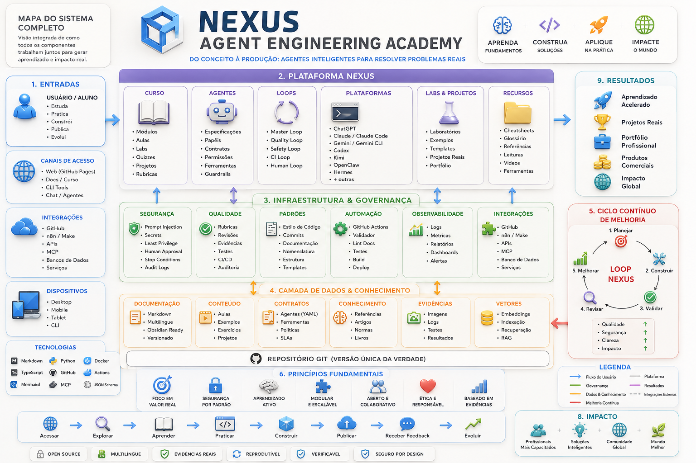
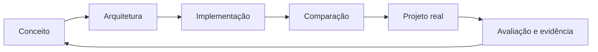
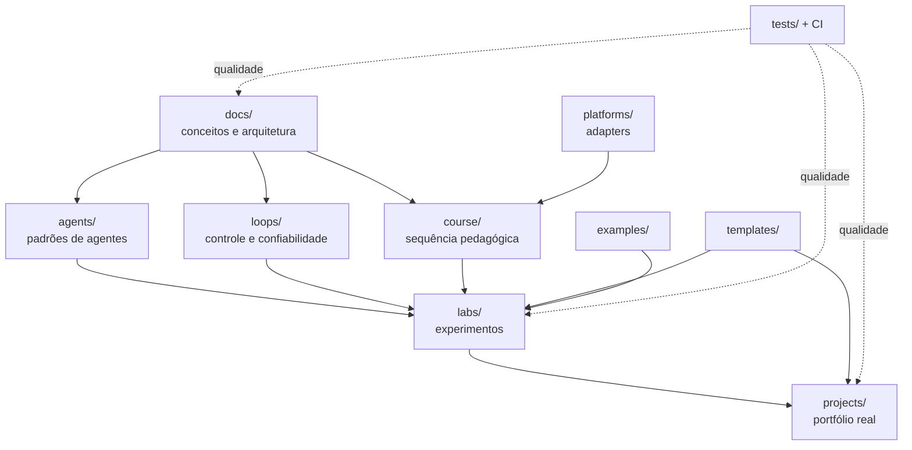

<p align="center">
  
</p>

<p align="center">
  <strong>Engenharia de agentes, do primeiro loop ao sistema multiagente em produção.</strong><br>
  Curso · Laboratório · Documentação · Framework · Portfólio
</p>

<p align="center">
  <a href="LICENSE"></a>
  <a href="ROADMAP.md"></a>
  <a href="CONTRIBUTING.md"></a>
  
</p>

<p align="center">
  
</p>

<p align="center"><em>Mapa visual canônico do ecossistema NEXUS — arquitetura, aprendizagem, governança e impacto.</em></p>

> [!IMPORTANT]
> A NEXUS ensina decisões de engenharia transferíveis entre ferramentas. APIs mudam; invariantes arquiteturais,
> modelos de ameaça, contratos e métodos de avaliação permanecem.

## Por que a NEXUS existe

Agentes não são apenas prompts com ferramentas. São sistemas distribuídos probabilísticos: recebem contexto não
confiável, tomam decisões sob incerteza, causam efeitos externos e precisam ser avaliados, observados e interrompidos.
A NEXUS transforma esse problema em uma trilha prática, rigorosa e independente de fornecedor.

### O método NEXUS



Cada módulo parte de um conceito, explicita contratos e riscos, implementa o mesmo padrão em plataformas diferentes,
compara trade-offs e termina em um artefato demonstrável.

## Arquitetura do conhecimento



Leia a [decisão arquitetural completa](docs/architecture/overview.md), as
[regras editoriais](docs/standards/content-standard.md), o [contrato dos agentes](AGENTS.md), o
[loop mestre de qualidade](loops/master-quality-loop.md) e a
[auditoria Premium Elite](docs/governance/PREMIUM_ELITE_AUDIT.md).

## Diferenciais

| Dimensão | Compromisso NEXUS |
|---|---|
| Engenharia | Contratos, estados, falhas, budgets, telemetria e testes antes do framework. |
| Multiplataforma | Um conceito, adapters independentes e uma matriz explícita de equivalência. |
| Segurança | Prompt injection, MCP, least privilege, aprovação humana, rollback e incidentes desde o início. |
| Evidência | Fontes primárias verificáveis, versões/datas e formatos ABNT/Vancouver. |
| Aprendizagem | Objetivos observáveis, laboratórios, rubricas, checklists e projetos de portfólio. |
| Longevidade | Markdown puro, Obsidian, IDs estáveis, links relativos e tradução desacoplada. |

## Currículo

| Fase | Módulos | Resultado |
|---|---|---|
| I — Fundamentos | 00–02 | Modelar agentes e contexto com contratos explícitos. |
| II — Tools, loops, memória e coordenação | 03–06 | Projetar ferramentas seguras, loops controláveis, memória governada e sistemas multiagente. |
| III — Avaliação, segurança e produção | 07–09 | Avaliar, proteger e operar agentes com readiness, rollout e rollback. |
| IV — Observabilidade, automação e capstone | 10–12 | Consolidar telemetria, automação confiável e projeto final. |

Comece pelo [mapa curricular](course/README.md). Cada módulo segue o
[contrato pedagógico](course/module-template.md) e inclui objetivos, pré-requisitos, projeto, checklist, laboratórios,
bibliografia e referências.

## Plataformas

Adapters planejados: ChatGPT, OpenAI Agents SDK, Codex, Claude, Claude Code, Gemini, Gemini CLI, Kimi, OpenClaw,
Hermes, CrewAI, LangGraph, AutoGen, n8n e Make. Inclusão na matriz não significa paridade nem endosso: cada adapter
declara status, recursos, limitações, versão verificada e fonte oficial.

Consulte a [matriz e o contrato de adapter](platforms/README.md).

## Estrutura

```text
.
├── agents/       # padrões, papéis, memória, handoffs e coordenação
├── course/       # sequência pedagógica e módulos
├── docs/         # conceitos, arquitetura, segurança, padrões e referências
├── examples/     # implementações mínimas comparáveis
├── labs/         # experimentos guiados e mensuráveis
├── loops/        # máquinas de estado, budgets e stop conditions
├── platforms/    # adapters e matriz de capacidades
├── projects/     # projetos integradores e capstone
├── templates/    # contratos, ADRs, ameaças e avaliações reutilizáveis
├── tests/        # validação estrutural e editorial
└── .github/      # CI, templates, ownership e dependências
```

## Tecnologias e formatos

- Markdown + YAML frontmatter, compatíveis com Obsidian.
- Mermaid para diagramas versionáveis.
- Python padrão para validadores sem dependências de runtime.
- GitHub Actions, Dependabot, CODEOWNERS e Conventional Commits.
- Adapters podem usar Python, TypeScript ou automação visual quando o módulo exigir.

## Começar

```bash
git clone https://github.com/matheusflorindo32/nexus-agent-engineering-academy.git
cd nexus-agent-engineering-academy
python tests/validate_repository.py
```

Depois, siga o [Módulo 00](course/modules/00-orientation/README.md) e registre decisões relevantes com o
[template de ADR](templates/adr.md).

## Roadmap

Foundation → Core Curriculum → Production Engineering → Ecosystem → Stable. Veja marcos, critérios e entregas no
[ROADMAP](ROADMAP.md).

## Contribuir

Contribuições de conteúdo, revisão científica, segurança, adapters, acessibilidade e tradução são bem-vindas.
Antes de começar, leia [CONTRIBUTING.md](CONTRIBUTING.md), o [Código de Conduta](CODE_OF_CONDUCT.md),
[SECURITY.md](SECURITY.md) e [AGENTS.md](AGENTS.md).

## Idiomas

- **Português (`pt-BR`)** — fonte canônica.
- **English (`en`)** — estrutura preparada; tradução rastreada pelo [manifesto](docs/i18n/manifest.yml).
- **Español (`es`)** — estrutura preparada; tradução rastreada pelo [manifesto](docs/i18n/manifest.yml).

IDs nunca são traduzidos. Veja a [política de internacionalização](docs/i18n/README.md).

## Licença

Código e documentação são licenciados sob [Apache License 2.0](LICENSE). Marcas e identidade visual não recebem
automaticamente direitos de uso além do necessário para atribuição e referência ao projeto.

---

<p align="center"><strong>NEXUS</strong> — aprenda a construir agentes que você consegue explicar, avaliar e parar.</p>
