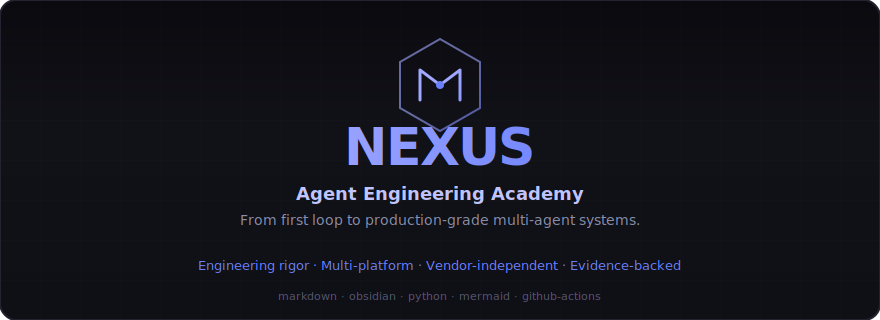

<div align="center">

<!-- HERO BANNER — substituir por SVG próprio depois -->


<br/><br/>

<!-- BADGES PREMIUM — ordenados por impacto visual -->
<a href="LICENSE"></a>
<a href="#roadmap"></a>
<a href="https://github.com/matheusflorindo32/nexus-agent-engineering-academy/actions"></a>
<a href="SECURITY.md"></a>
<a href="#"></a>
<a href="#ecosystem"></a>

<br/>

**`agent-engineering`** · **`loop-engineering`** · **`context-engineering`** · **`mcp`** · **`multi-agent-systems`**

<br/>

<a href="#quick-start"><kbd>🚀 Quick Start</kbd></a>
&nbsp;
<a href="#enterprise"><kbd>🏢 Enterprise</kbd></a>
&nbsp;
<a href="#curriculum"><kbd>📚 Currículo</kbd></a>
&nbsp;
<a href="CONTRIBUTING.md"><kbd>🤝 Contribuir</kbd></a>
&nbsp;
<a href="ROADMAP.md"><kbd>🗺️ Roadmap</kbd></a>

</div>

---

<!-- GANHO PRINCIPAL: problema que empresas sentem -->

## 🎯 Seus Agentes de IA Estão Quebrando em Produção. A NEXUS Ensina Por Quê.

> **"70% dos projetos de agentes de IA falham ao sair do PoC. Não por falta de prompts inteligentes — por falta de engenharia."**

A revolução agentic está sendo construída sobre areia movediça:

- 🔴 **Frameworks opacos** que escondem falhas até o bill chegar
- 🔴 **Segurança retrativa** — patch depois do vazamento
- 🔴 **Prompt engineers** sem noção de estados, budgets ou circuit breakers
- 🔴 **Vendor lock-in** que transforma experimento em dívida técnica
- 🔴 **Zero observabilidade** — você só sabe que quebrou quando o cliente reclama

A **NEXUS Agent Engineering Academy** é o único programa que trata agentes de IA como **sistemas distribuídos de missão crítica** — modelados, testados, instrumentados e auditáveis desde o primeiro commit.

---

<!-- PROVA DE VALOR: o que diferencia -->

## ⚡ NEXUS vs. O Mercado

<table>
<tr>
<th width="20%">Dimensão</th>
<th width="40%" align="center">🎓 NEXUS Academy</th>
<th width="40%" align="center">📉 Padrão do Mercado</th>
</tr>
<tr>
<td><b>Abordagem</b></td>
<td>✅ <b>Engenharia de sistemas</b> — estados, transições, contratos, falhas</td>
<td>❌ Prompt engineering em notebooks sem CI</td>
</tr>
<tr>
<td><b>Segurança</b></td>
<td>✅ <b>By design</b> — threat models, injection defense, least privilege desde Módulo 00</td>
<td>❌ Adicionada como afterthought depois do incidente</td>
</tr>
<tr>
<td><b>Portabilidade</b></td>
<td>✅ <b>9+ plataformas</b> com matriz de equivalência — seu código sobrevive a mudanças de vendor</td>
<td>❌ Lock-in em única API ou framework</td>
</tr>
<tr>
<td><b>Evidência</b></td>
<td>✅ <b>Fontes primárias</b>, ABNT/Vancouver, benchmarks reproduzíveis, rubricas de avaliação</td>
<td>❌ Tutorial sem fontes ou verificação</td>
</tr>
<tr>
<td><b>Observabilidade</b></td>
<td>✅ <b>Telemetria nativa</b> — traces, budgets, SLOs, runbooks desde o laboratório</td>
<td>❌ Print do console e esperança</td>
</tr>
<tr>
<td><b>Longevidade</b></td>
<td>✅ <b>Markdown puro + YAML</b> — seu conhecimento não morre com a plataforma</td>
<td>❌ Formatos proprietários, links quebram em 2 anos</td>
</tr>
</table>

---

<!-- ARQUITETURA CONCEITUAL — diagrama premium -->

## 🏛️ Arquitetura Conceitual

```mermaid
%%{init: {'theme': 'dark', 'themeVariables': { 'primaryColor': '#1a1f4b', 'primaryTextColor': '#e0e0ff', 'primaryBorderColor': '#4a5fff', 'lineColor': '#6a7fff', 'secondaryColor': '#0f0f16', 'tertiaryColor': '#ff4757'}}}%%
graph TB
    subgraph "<b>🎓 FASE I — FUNDAMENTOS</b>"
        I1["🧠 Agent Model<br/><small>Estados · Transições · Budgets</small>"]
        I2["💾 Context & Memory<br/><small>Pipeline estruturado · Versionamento</small>"]
        I3["📋 Tool Contracts<br/><small>Schema I/O · Sanitization · Allowlists</small>"]
    end

    subgraph "<b>🔄 FASE II — LOOPS & PROTOCOLS</b>"
        II1["🎛️ Loop Control<br/><small>State machines · Circuit breakers · Retry budgets</small>"]
        II2["🔗 MCP Protocol<br/><small>Model Context Protocol · Adapters seguros</small>"]
        II3["🧰 Portable Skills<br/><small>Packages versionados · Cross-platform</small>"]
    end

    subgraph "<b>🛡️ FASE III — PRODUÇÃO</b>"
        III1["📊 Evaluation<br/><small>Métricas · Benchmarks · A/B testing</small>"]
        III2["📡 Observability<br/><small>Traces · Logs · Dashboards · SLOs</small>"]
        III3["🔐 Security & Guardrails<br/><small>Injection defense · Sandboxing · Rollback</small>"]
    end

    subgraph "<b>🌐 FASE IV — SISTEMAS</b>"
        IV1["🤝 Multi-Agent<br/><small>Coordenação · Handoffs · Consenso</small>"]
        IV2["⚙️ Automation<br/><small>Workflows · Triggers · Scheduling</small>"]
        IV3["🏆 Capstone<br/><small>Sistema production-grade · Review de pares</small>"]
    end

    I1 --> I2 --> I3 --> II1 --> II2 --> II3 --> III1 --> III2 --> III3 --> IV1 --> IV2 --> IV3

    style I1 fill:#1a1f4b,stroke:#4a5fff,color:#e0e0ff,stroke-width:2px
    style I2 fill:#1a1f4b,stroke:#4a5fff,color:#e0e0ff,stroke-width:2px
    style I3 fill:#1a1f4b,stroke:#4a5fff,color:#e0e0ff,stroke-width:2px
    style II1 fill:#1a1f4b,stroke:#6a7fff,color:#e0e0ff,stroke-width:2px
    style II2 fill:#1a1f4b,stroke:#6a7fff,color:#e0e0ff,stroke-width:2px
    style II3 fill:#1a1f4b,stroke:#6a7fff,color:#e0e0ff,stroke-width:2px
    style III1 fill:#0f0f16,stroke:#8a8faa,color:#e0e0ff,stroke-width:2px
    style III2 fill:#0f0f16,stroke:#8a8faa,color:#e0e0ff,stroke-width:2px
    style III3 fill:#0f0f16,stroke:#ff4757,color:#ffe0e0,stroke-width:2px
    style IV1 fill:#0f0f16,stroke:#ff6b6b,color:#ffe0e0,stroke-width:2px
    style IV2 fill:#0f0f16,stroke:#ff6b6b,color:#ffe0e0,stroke-width:2px
    style IV3 fill:#0f0f16,stroke:#ff4757,color:#ffe0e0,stroke-width:3px
```



---

<!-- O MÉTODO — como vantagem competitiva -->

## 🔬 O Método NEXUS

Nosso ciclo pedagógico é uma **máquina de estados de aprendizagem** — cada transição é mensurável, cada artefato é versionado, cada evidência é auditável.

```mermaid
%%{init: {'theme': 'dark', 'themeVariables': { 'primaryColor': '#1a1f4b', 'primaryTextColor': '#e0e0ff', 'primaryBorderColor': '#4a5fff', 'lineColor': '#6a7fff'}}}%%
graph LR
    A["📐 CONCEITO<br/><small>Modelar como sistema de estados</small>"] --> B["🏗️ ARQUITETURA<br/><small>ADR · Diagramas · Threat model</small>"]
    B --> C["⚙️ IMPLEMENTAÇÃO<br/><small>Código · Testes · Telemetria</small>"]
    C --> D["⚖️ COMPARAÇÃO<br/><small>Multiplataforma · Benchmarks</small>"]
    D --> E["🛠️ PROJETO REAL<br/><small>Produção simulada · Review</small>"]
    E --> F["📊 AVALIAÇÃO<br/><small>Rubrica · Evidência · Portfólio</small>"]
    F -->|loop contínuo| A

    style A fill:#1a1f4b,stroke:#4a5fff,color:#e0e0ff,stroke-width:2px
    style B fill:#1a1f4b,stroke:#4a5fff,color:#e0e0ff,stroke-width:2px
    style C fill:#1a1f4b,stroke:#4a5fff,color:#e0e0ff,stroke-width:2px
    style D fill:#1a1f4b,stroke:#6a7fff,color:#e0e0ff,stroke-width:2px
    style E fill:#1a1f4b,stroke:#6a7fff,color:#e0e0ff,stroke-width:2px
    style F fill:#0f0f16,stroke:#ff4757,color:#ffe0e0,stroke-width:3px
```



| Fase | Artefato de Saída | Como Medimos |
|------|-------------------|--------------|
| **Conceito** | Diagrama de estados + contrato I/O | Cobertura de casos edge |
| **Arquitetura** | ADR + diagrama de sequência + threat model | Revisão de pares aprovada |
| **Implementação** | Módulo testado + métricas instrumentadas | CI pass + ≥80% cobertura |
| **Comparação** | Matriz de equivalência + benchmarks | Performance ±5% cross-platform |
| **Projeto Real** | Entrega funcional + review de pares | Rubrica ≥ "robusto" |
| **Avaliação** | Portfólio versionado + evidência | Rastreabilidade completa |

---

<!-- CURRÍCULO — vendido como produto, não como lista -->

## <a name="curriculum"></a>📚 Programa Executivo — 12 Módulos · 4 Fases · 155+ Horas

> **Não ensinamos a usar frameworks. Ensinamos a construir sistemas que frameworks apenas implementam.**

### 🎓 Fase I — Fundamentos *(27h)*
Modelar agentes, contexto e ferramentas com contratos explícitos.

| Módulo | Título | Carga | Evidência |
|:------:|--------|:-----:|-----------|
| `00` | **Orientation** | 3h | Ambiente validado + ADR |
| `01` | **The Agent Model** | 8h | Agent spec com estados e budgets |
| `02` | **Context & Tools** | 10h | Pipeline de contexto + ferramenta testada |
| `03` | **Tools** | 6h | Ferramenta segura com contrato I/O |

### 🔄 Fase II — Loops & Protocols *(36h)*
Loops controláveis, MCP e skills portáteis.

| Módulo | Título | Carga | Evidência |
|:------:|--------|:-----:|-----------|
| `04` | **Loop Control** | 12h | Loop com budgets, recovery e circuit breaker |
| `05` | **MCP Protocol** | 12h | Servidor MCP + adapter sanitizado |
| `06` | **Portable Skills** | 12h | Skill versionada, portável cross-platform |

### 🛡️ Fase III — Produção *(38h)*
Avaliar, observar, proteger e operar agentes confiáveis.

| Módulo | Título | Carga | Evidência |
|:------:|--------|:-----:|-----------|
| `07` | **Evaluation** | 12h | Eval suite reproduzível com benchmarks |
| `08` | **Observability & SRE** | 12h | SLOs, traces e runbook documentado |
| `09` | **Security & Guardrails** | 14h | Threat model + adversarial tests passando |

### 🌐 Fase IV — Sistemas *(56h)*
Multiagentes, automações e projeto capstone.

| Módulo | Título | Carga | Evidência |
|:------:|--------|:-----:|-----------|
| `10` | **Multi-Agent Systems** | 14h | Baseline e coordenação medida |
| `11` | **Automation** | 12h | Workflow idempotente em produção simulada |
| `12` | **Capstone** | 30h | Sistema multi-agente production-grade |

> **Critério de bloqueio:** Segurança e rastreabilidade são não-negociáveis. Um projeto perigoso não é aprovado por ser tecnicamente sofisticado.

---

<!-- ECOSISTEMA — matriz de plataformas -->

## <a name="ecosystem"></a>🌍 Ecossistema Multiplataforma

A NEXUS não escolhe um vencedor. Nós **mapeamos equivalências** e construímos adapters independentes para que seu investimento em engenharia de agentes seja **portável por design**.

| Categoria | Plataformas Suportadas |
|-----------|------------------------|
| **🧠 LLM Core** | OpenAI GPT · Anthropic Claude · Google Gemini · Moonshot Kimi |
| **🔧 Agent Frameworks** | OpenAI Agents SDK · LangGraph · CrewAI · AutoGen |
| **🎛️ Low-Code / No-Code** | n8n · Make · Zapier (webhooks) |
| **☁️ Infraestrutura** | GitHub Actions · Docker · Kubernetes · AWS Lambda · Cloudflare Workers |

> Cada adapter inclui: **contrato de I/O** · **matriz de equivalência** · **testes de integração** · **threat model específico**

---

<!-- QUEM DEVE USAR — personas -->

## 👤 Para Quem é a NEXUS?

<table>
<tr>
<td width="33%" align="center">

### 👨‍💻 Engenheiro de ML/AI
**Você constrói agentes que precisam funcionar.**

Aprenda a modelar estados, orquestrar falhas, instrumentar telemetria e provar que seu sistema funciona — não apenas que "funcionou uma vez".

</td>
<td width="33%" align="center">

### 🏢 CTO / VP de Engenharia
**Você precisa de agentes confiáveis, não de demos.**

Adote um padrão de engenharia que transforma experimentos em sistemas auditáveis, com segurança by design e zero vendor lock-in.

</td>
<td width="33%" align="center">

### 🎓 Educador / Pesquisador
**Você ensina ou estuda sistemas inteligentes.**

Use um currículo com rigor científico, fontes primárias, rubricas mensuráveis e evidência verificável — pronto para publicação e replicação.

</td>
</tr>
</table>

---

<!-- QUICK START -->

## <a name="quick-start"></a>🚀 Quick Start — 4 Comandos para Começar

```bash
# 1. Clone o repositório canônico
git clone https://github.com/matheusflorindo32/nexus-agent-engineering-academy.git
cd nexus-agent-engineering-academy

# 2. Configure o ambiente (Obsidian + Python + Mermaid)
python -m venv .venv
source .venv/bin/activate  # Windows: .venv\Scripts\activate
pip install -r requirements.txt

# 3. Abra no Obsidian (recomendado) ou editor Markdown de preferência
obsidian .  # ou code . / zeditor .

# 4. Inicie pelo Módulo 00 — Orientation
open course/00-orientation/README.md
```

**Pré-requisitos:** Python 3.11+ · Git · Editor Markdown (Obsidian recomendado) · Curiosidade técnica · Tolerância a ambiguidade

---

<!-- ENTERPRISE -->

## <a name="enterprise"></a>🏢 NEXUS para Enterprise

### Por que empresas estão adotando padrões de engenharia de agentes:

| Custo Escondido | Como a NEXUS Resolve |
|-----------------|----------------------|
| **Agente quebra em produção** → churn de cliente | Circuit breakers, budgets, rollback ensaiado desde Módulo 04 |
| **Vazamento de dados via prompt injection** → multa LGPD/GDPR | Threat modeling, sanitization, least privilege desde Módulo 00 |
| **Vendor lock-in** → reescrita de 6 meses de trabalho | Adapters com matriz de equivalência — migração em dias, não meses |
| **Zero observabilidade** → descobrir falhas pelo Twitter | Telemetria nativa, SLOs, traces — você vê antes do cliente |
| **Equipe sem padrão** → cada dev faz do seu jeito | Contratos explícitos, ADRs, revisão de pares — consistência escalável |
| **Conhecimento em cabeças** → pessoa sai, sistema morre | Markdown puro, YAML frontmatter, IDs estáveis — documentação é código |

### Estrutura do Repositório (Obsidian-Ready)

```text
nexus-agent-academy/
├── 📁 agents/           # Padrões, papéis, memória, handoffs e coordenação
├── 📁 course/           # Sequência pedagógica 00→11 (155h+)
│   ├── 00-orientation/
│   ├── 01-agent-model/
│   └── ...
├── 📁 docs/             # Conceitos, arquitetura, segurança, padrões
├── 📁 examples/         # Implementações mínimas comparáveis (one-file demos)
├── 📁 labs/             # Experimentos guiados com rubricas + checklists
├── 📁 loops/            # State machines, budgets, circuit breakers
├── 📁 platforms/        # Adapters multiplataforma com testes
├── 📁 projects/         # Projetos integradores e portfólio
├── 📁 templates/        # Contratos, ADRs, threat models, avaliações
├── 📁 tests/            # Validação estrutural, CI, regressão
├── 📄 README.md         # Este documento (pt-BR canônico)
├── 📄 ROADMAP.md        # Foundation → Core → Production → Ecosystem → Stable
├── 📄 CONTRIBUTING.md   # Guia de contribuição institucional
├── 📄 SECURITY.md       # Política de segurança + responsible disclosure
└── 📄 LICENSE           # Apache-2.0
```

---

<!-- ROADMAP VISUAL -->

## <a name="roadmap"></a>🗺️ Roadmap & Milestones

| Milestone | Versão | Status | O Que Entrega |
|-----------|:------:|:------:|---------------|
| **Foundation** | v0.1 | ✅ **Concluído** | Arquitetura modular, CI/CD, templates, módulo 00, governança |
| **Core Curriculum** | v0.2 | 🚧 **Em Progresso** | Módulos 01–05 com laboratórios e rubricas |
| **Production Engineering** | v0.3 | 📋 Planejado | Observabilidade, segurança, ambientes reproduzíveis, adversarial tests |
| **Ecosystem** | v0.4 | 📋 Planejado | Adapters 9+ plataformas, traduções EN/ES, trilhas corporativas |
| **Stable** | v1.0 | 📋 Futuro | Validação com turmas reais, revisão externa, certificação |

> Detalhes técnicos completos em [`ROADMAP.md`](ROADMAP.md).

---

<!-- CONTRIBUIÇÃO DE ELITE -->

## 🤝 Contribuição de Elite

A NEXUS é open source com barra de qualidade institucional. Buscamos contribuições rigorosas:

| Área | O Que Buscamos | Rigor Mínimo |
|------|----------------|--------------|
| 🔒 **Segurança** | Threat models, CVEs, fuzzing de adapters | Peer-reviewed + evidência |
| 📚 **Revisão Científica** | Fontes primárias, ABNT/Vancouver | Validação cruzada |
| 🌐 **Adapters** | Novas plataformas, matrizes de equivalência | CI pass + regression test |
| 🧪 **Laboratórios** | Experimentos mensuráveis, rubricas, datasets | Rubrica preenchida |
| 🛠️ **Infraestrutura** | CI/CD, Dependabot, pre-commit hooks | 100% pass rate |
| 🌍 **Tradução** | EN, ES, DE, FR, ZH, JA | Bilingue nativo + revisão técnica |

> Leia [`CONTRIBUTING.md`](CONTRIBUTING.md) antes de abrir um PR. **Não aceitamos "prompts legais" sem contrato de I/O.**

---

<!-- CITAÇÃO / FILOSOFIA -->

## 💬 Filosofia NEXUS

> *"We do not teach prompt engineering. We teach the engineering of systems that prompts merely activate."*

A engenharia de agentes de IA não é uma skill de moda. É a disciplina que separa **demos que impressionam** de **sistemas que duram**.

Nossos princípios são não-negociáveis:

| Princípio | Declaração |
|-----------|------------|
| **Contratos explícitos** | Nenhuma ferramenta, skill ou handoff sem interface formalizada |
| **Falha como domínio** | Modelagem de erro, budgets, circuit breakers e rollback desde o módulo 00 |
| **Segurança by design** | Prompt injection, least privilege, aprovação humana e MCP sanitization são obrigatórios |
| **Evidência verificável** | Fontes primárias, ABNT/Vancouver, benchmarks reproduzíveis |
| **Multiplataforma real** | Adapters independentes com matriz explícita de equivalência — nenhum vendor lock-in |
| **Longevidade estrutural** | Markdown puro, YAML frontmatter, IDs estáveis, observabilidade nativa |

---

<!-- FOOTER INSTITUCIONAL -->

<div align="center">

---

**NEXUS Agent Engineering Academy** — *Engineering rigor for the agentic era.*

[](LICENSE)
&nbsp;·&nbsp;
[🗺️ Roadmap](ROADMAP.md)
&nbsp;·&nbsp;
[🤝 Contributing](CONTRIBUTING.md)
&nbsp;·&nbsp;
[🔒 Security](SECURITY.md)
&nbsp;·&nbsp;
[⚖️ Code of Conduct](CODE_OF_CONDUCT.md)

---

**Built with intention. Validated with evidence. Designed to endure.**

<br/>

<sub>🇧🇷 Canonicamente em português brasileiro · Tradução EN em breve · Ecosystem milestone</sub>

</div>