# Currículo NEXUS

## Progressão

```mermaid
flowchart LR
    M00[00 Orientação] --> M01[01 Fundamentos]
    M01 --> M02[02 Contexto]
    M02 --> M03[03 Tools]
    M03 --> M04[04 Loops]
    M04 --> M05[05 MCP e Skills]
    M05 --> M06[06 Avaliação]
    M06 --> M07[07 Observabilidade e SRE]
    M07 --> M08[08 Segurança]
    M08 --> M09[09 Multiagentes e Produção]
    M09 --> M10[10 Observability Engineering]
    M10 --> M11[11 Automação]
    M11 --> M12[12 Capstone]
```

| Módulo | Carga sugerida | Evidência principal |
|---|---:|---|
| [00 — Orientação](modules/00-orientation/README.md) | 3 h | ambiente validado + ADR |
| [01 — Fundamentos](modules/01-agent-foundations/README.md) | 8 h | agent spec |
| [02 — Context Engineering](modules/02-context-engineering/README.md) | 10 h | pipeline de contexto avaliado |
| [03 — Tools](modules/03-tool-engineering/README.md) | 10 h | ferramenta segura e testada |
| [04 — Loop Engineering](modules/04-loop-engineering/README.md) | 12 h | loop com budgets e recovery |
| [05 — MCP e Skills](modules/05-mcp-skills/README.md) | 12 h | servidor/adaptação controlada |
| [06 — Avaliação](modules/06-evaluation/README.md) | 12 h | eval suite reproduzível |
| [07 — Observabilidade e SRE](modules/07-observability-sre/README.md) | 12 h | SLOs, traces e runbook |
| [08 — Segurança](modules/08-security/README.md) | 14 h | threat model + adversarial tests |
| [09 — Multiagentes](modules/09-multi-agent-systems/README.md) | 14 h | baseline e coordenação medida |
| [10 — Observability Engineering](modules/10-observability-engineering/README.md) | 14 h | pipeline de telemetria segura e correlacionada |
| [11 — Automação](modules/11-automation/README.md) | 12 h | workflow idempotente |
| [12 — Capstone](modules/12-capstone/README.md) | 30–60 h | sistema production-grade |

## Regra de unicidade

Cada número de módulo e de laboratório é um identificador exclusivo. Renumerações exigem atualização coordenada de diretórios, frontmatter, links, pré-requisitos, laboratórios e validador. O CI deve falhar diante de prefixos duplicados.

## Avaliação

Cada evidência recebe quatro níveis: **insuficiente**, **funcional**, **robusta** e **excelente**. Segurança e rastreabilidade são critérios de bloqueio: um projeto perigoso não é aprovado por ser tecnicamente sofisticado.

Autores devem usar o [contrato de módulo](module-template.md). Estudantes podem combinar módulos com [laboratórios](../labs/README.md) e [projetos](../projects/README.md).
