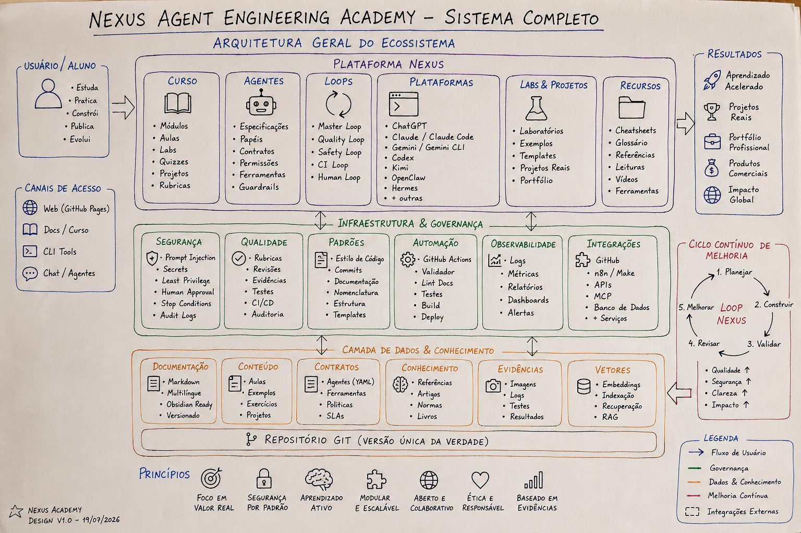
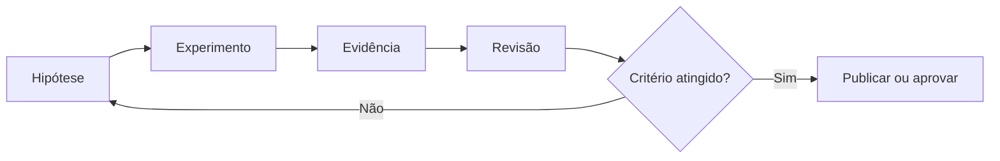

# 00 — Orientação e método de engenharia

> [!NOTE]
> Este módulo não começa ensinando uma ferramenta. Ele ensina como pensar, testar, registrar e interromper um sistema de IA com segurança.

## Missão do módulo

Ao final, você deverá conseguir entrar em qualquer projeto agentic, identificar seus componentes, executar uma verificação mínima e explicar uma decisão de engenharia de forma auditável.

## Objetivos

- Navegar a arquitetura NEXUS e rastrear seus contratos.
- Executar o validador local e registrar evidências reproduzíveis.
- Aplicar o ciclo hipótese–experimento–evidência–revisão.

## Pré-requisitos

Nenhum; este é o ponto de entrada do currículo.

## Mapa visual de aprendizagem



> [!TIP]
> Use este mapa como orientação inicial. O infográfico claro 3D do README é a visão institucional canônica; esta versão manuscrita foi mantida para apoiar aprendizagem, design thinking e explicações em aula.

## O problema real

Um agente pode parecer inteligente em uma demonstração e ainda ser inseguro, impossível de reproduzir ou difícil de manter. A NEXUS adota um princípio simples:

> Toda decisão relevante precisa deixar evidência suficiente para ser explicada, testada e revisada.

## O ciclo NEXUS



### Exemplo rápido

**Hipótese:** a estrutura do repositório permite localizar um conceito e sua aplicação em menos de cinco minutos.

**Experimento:** partir do índice de loops e encontrar o módulo, o laboratório e o template correspondente.

**Evidência:** links visitados, diagrama do caminho e tempo gasto.

**Revisão:** registrar ambiguidades e propor melhoria.

## Arquitetura que você precisa reconhecer

| Camada | Pergunta que responde | Exemplo |
|---|---|---|
| `docs/` | O que é e por que existe? | arquitetura, segurança, padrões |
| `course/` | Em qual ordem aprender? | módulos e progressão |
| `agents/` | Quem executa e com qual responsabilidade? | supervisor, revisor, pesquisador |
| `loops/` | Como o sistema decide continuar ou parar? | retries, budgets, circuit breaker |
| `platforms/` | Como o conceito aparece em cada ferramenta? | Codex, Claude Code, Gemini CLI |
| `labs/` | Como testar na prática? | experimentos guiados |
| `projects/` | Como provar competência? | entregas de portfólio |
| `templates/` | Como padronizar? | ADR, threat model, agent spec |

## Roteiro de aprendizagem

### Bloco 1 — Reconhecimento

1. Leia o README principal.
2. Identifique o currículo, a arquitetura, o sistema de agentes e o loop mestre.
3. Explique em uma frase a função de cada camada.

### Bloco 2 — Ambiente reproduzível

Execute:

```bash
git clone https://github.com/matheusflorindo32/nexus-agent-engineering-academy.git
cd nexus-agent-engineering-academy
python tests/validate_repository.py
```

Registre:

- sistema operacional;
- versão do Python;
- commit analisado;
- resultado do validador;
- qualquer bloqueio encontrado.

### Bloco 3 — Decisão arquitetural

Use [`templates/adr.md`](../../../templates/adr.md) para registrar uma decisão pequena, por exemplo:

- ambiente local escolhido;
- uso de Markdown puro;
- padrão de links relativos;
- idioma canônico;
- ferramenta principal do laboratório.

### Bloco 4 — Laboratório

Execute o [LAB-000](../../../labs/LAB-000-repository-orientation.md).

## Laboratório — desafio de 20 minutos

Escolha um conceito entre **loop**, **tool**, **MCP**, **avaliação** ou **segurança**. Encontre:

1. a definição conceitual;
2. o módulo de curso relacionado;
3. um laboratório ou exemplo;
4. um template aplicável;
5. uma fonte primária.

Entregue um diagrama Mermaid com esses cinco pontos.

## Quiz

1. Por que a NEXUS separa conceitos de adapters de plataforma?
2. Qual é a diferença entre uma demonstração e uma evidência reproduzível?
3. Em qual situação o loop deve parar mesmo sem atingir a nota desejada?
4. Por que IDs e links relativos são importantes para Obsidian e internacionalização?
5. Qual artefato registra uma decisão arquitetural e suas consequências?

<details>
<summary>Gabarito comentado</summary>

1. Para preservar conhecimento transferível mesmo quando APIs e interfaces mudam.
2. Evidência reproduzível contém procedimento, contexto, versão, resultado e critério verificável.
3. Quando existe risco, segredo, ação destrutiva, ausência de progresso, limite de iterações ou necessidade de aprovação humana.
4. Porque mantêm rastreabilidade, Graph View e paridade entre idiomas sem depender de nomes traduzidos.
5. ADR — Architecture Decision Record.

</details>

## Projeto — entrega obrigatória

- ADR preenchido;
- saída do validador;
- diagrama do desafio;
- checklist concluído;
- autoavaliação pela [rubrica transversal](../../rubrics/transversal-rubric.md).

## Checklist de conclusão

- [ ] Sei localizar conceito, adapter, laboratório, projeto e template.
- [ ] Executei o validador e registrei o contexto da execução.
- [ ] Meu ADR contém decisão, alternativas, consequências e critério de revisão.
- [ ] Nenhum segredo entrou no histórico Git.
- [ ] Produzi evidência verificável, não apenas uma descrição.
- [ ] Apliquei uma condição explícita de parada.

## Critérios de excelência

| Dimensão | Mínimo esperado |
|---|---|
| Clareza | outra pessoa entende o caminho sem ajuda verbal |
| Reprodutibilidade | comandos, versões e resultados estão registrados |
| Segurança | nenhum segredo ou instalação privilegiada desnecessária |
| Evidência | artefatos e links sustentam as afirmações |
| Reflexão | limitações e próximos passos estão explícitos |

## Referências essenciais

### ABNT

CHACON, Scott; STRAUB, Ben. *Pro Git*. 2. ed. [S. l.]: Apress, 2014. Disponível em: https://git-scm.com/book/en/v2. Acesso em: 19 jul. 2026.

KLEPPMANN, Martin. *Designing Data-Intensive Applications*. Sebastopol: O'Reilly Media, 2017.

### Fontes oficiais para consulta

- Git documentation: https://git-scm.com/docs
- GitHub Docs — About repositories: https://docs.github.com/en/repositories/creating-and-managing-repositories/about-repositories
- Mermaid documentation: https://mermaid.js.org/intro/
- Python documentation: https://docs.python.org/3/

> [!WARNING]
> As interfaces e versões mudam. Consulte sempre a documentação oficial atual e registre a data de acesso.

## Próximo passo

Siga para [01 — Fundamentos de agentes](../01-agent-foundations/README.md) somente após concluir o laboratório e obter nível **funcional** ou superior na rubrica.
