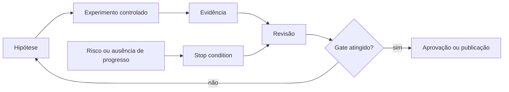

# 00 — Orientação e método de engenharia

> [!IMPORTANT]
> Este módulo é o ponto de entrada técnico do currículo. Pessoas sem familiaridade com terminal, Git ou Python devem concluir primeiro a [Trilha Zero](../../zero-track/README.md).

## Público real

- iniciantes técnicos que concluíram a Trilha Zero;
- estudantes com noções básicas de Git, terminal e Python;
- profissionais que desejam entender o método NEXUS antes de avançar.

## Resultado final

Ao concluir, a pessoa consegue entrar em um projeto agentic, localizar contratos, executar uma verificação mínima, registrar uma decisão e explicar quando interromper uma execução.

## Objetivos

- Navegar a arquitetura NEXUS e rastrear seus contratos.
- Executar o validador local e registrar evidências reproduzíveis.
- Aplicar o ciclo hipótese–experimento–evidência–revisão.
- Identificar riscos, stop conditions e pontos de aprovação humana.

## Pré-requisitos

- Trilha Zero concluída ou diagnóstico equivalente;
- Git, terminal e Python em nível introdutório;
- capacidade de criar arquivos Markdown e executar comandos locais.

## Diagnóstico inicial

Antes de começar, confirme que consegue:

1. executar `python --version`;
2. executar `git --version`;
3. clonar um repositório;
4. abrir um arquivo Markdown;
5. explicar por que segredos não devem entrar no Git.

Se três ou mais itens falharem, retorne à Trilha Zero.

## Por que este módulo existe

Projetos com agentes falham quando decisões, riscos e critérios de parada ficam implícitos. O método NEXUS exige que toda mudança relevante seja explicável, testável e revisável.

## Explicação em três camadas

### Camada 1 — simples

Você formula uma hipótese, faz um teste pequeno, observa o resultado e decide se deve continuar.

### Camada 2 — técnica

Cada experimento declara contexto, entrada, procedimento, versão, critério de sucesso, evidência e stop condition.

### Camada 3 — profissional

Mudanças são promovidas somente quando passam por gates técnicos, segurança, rastreabilidade e revisão humana proporcional ao risco.

## Mapa visual



## Glossário mínimo

| Termo | Significado operacional |
|---|---|
| hipótese | afirmação que pode ser testada |
| evidência | artefato que sustenta uma conclusão |
| gate | condição obrigatória para avançar |
| stop condition | regra que encerra a execução com segurança |
| ADR | registro de decisão arquitetural |
| baseline | solução simples usada para comparação |

## Arquitetura que você precisa reconhecer

| Camada | Pergunta que responde | Exemplo |
|---|---|---|
| `docs/` | o que é e por que existe? | arquitetura, segurança, padrões |
| `course/` | em qual ordem aprender? | módulos e progressão |
| `agents/` | quem executa e com qual responsabilidade? | supervisor e revisor |
| `loops/` | como continuar, recuperar ou parar? | retries e budgets |
| `platforms/` | como adaptar sem perder o conceito? | Codex e Gemini CLI |
| `labs/` | como testar na prática? | experimentos guiados |
| `projects/` | como provar competência? | entregas de portfólio |
| `templates/` | como padronizar? | ADR e threat model |

## Exemplo mínimo

**Hipótese:** é possível localizar um conceito, seu laboratório e seu template em menos de cinco minutos.

**Experimento:** partir do índice do curso e encontrar o módulo, o LAB e o template correspondente.

**Evidência:** links, tempo gasto e diagrama do caminho.

**Stop condition:** interromper se houver link quebrado, instrução contraditória ou risco de executar algo não compreendido.

## Demonstração executável

```bash
git clone https://github.com/matheusflorindo32/nexus-agent-engineering-academy.git
cd nexus-agent-engineering-academy
python tests/validate_repository.py
```

Registre:

- sistema operacional;
- versão do Python;
- SHA analisado;
- resultado;
- bloqueios encontrados;
- decisão tomada.

## Prática guiada

1. Leia o README principal.
2. Localize `course/`, `labs/`, `agents/`, `loops/` e `templates/`.
3. Execute o validador.
4. Abra [`templates/adr.md`](../../../templates/adr.md).
5. Registre uma decisão pequena e reversível.
6. Liste pelo menos uma stop condition.

## Prática independente

Escolha um conceito entre **loop**, **tool**, **MCP**, **avaliação** ou **segurança**. Encontre:

1. definição;
2. módulo;
3. laboratório ou exemplo;
4. template;
5. fonte primária.

Entregue um diagrama Mermaid e um parágrafo explicando o caminho.

## Laboratórios

- [LAB-000](../../../labs/LAB-000-repository-orientation.md) — orientação, validação e mapa de rastreabilidade.

## Projeto

Entregar:

- ADR preenchido;
- saída do validador;
- mapa de rastreabilidade;
- registro de uma stop condition;
- autoavaliação pela [rubrica transversal](../../rubrics/transversal-rubric.md).

## Erros comuns

- tratar leitura como evidência de aprendizagem;
- executar comandos sem registrar versão e contexto;
- escrever ADR como justificativa retroativa;
- avançar apesar de risco ou ambiguidade;
- usar “funcionou na minha máquina” como conclusão.

## Teste de segurança

A entrega é bloqueada se:

- houver segredo no histórico;
- a pessoa executar comando destrutivo sem compreender;
- a evidência não permitir reprodução;
- a decisão ignorar risco conhecido;
- a stop condition estiver ausente.

## Avaliação

| Dimensão | Insuficiente | Funcional | Robusta | Excelente |
|---|---|---|---|---|
| navegação | depende de ajuda constante | localiza artefatos principais | conecta camadas sem ajuda | explica arquitetura e trade-offs |
| evidência | descrição vaga | registra comando e resultado | inclui contexto, versão e limitações | permite reprodução independente |
| decisão | sem alternativas | ADR básico | consequências e revisão explícitas | decisão reversível e auditável |
| segurança | ignora riscos | evita segredos | aplica stop conditions | antecipa riscos e escalonamento |

Segurança e rastreabilidade são critérios de bloqueio.

## Quiz comentado

1. **Qual a diferença entre demonstração e evidência?**  
   Demonstração mostra que algo aconteceu; evidência permite verificar como, em qual contexto e com quais limitações.

2. **Quando parar mesmo sem atingir o objetivo?**  
   Diante de risco, segredo, ação destrutiva, ausência de progresso, budget excedido ou necessidade de aprovação humana.

3. **Por que separar conceito de adapter?**  
   Para preservar conhecimento transferível quando APIs e interfaces mudarem.

4. **O que um ADR deve registrar?**  
   Contexto, decisão, alternativas, consequências e critério de revisão.

## Checklist

- [ ] Localizo conceito, laboratório, projeto e template.
- [ ] Executei o validador e registrei o contexto.
- [ ] Meu ADR contém alternativas e consequências.
- [ ] Defini stop condition explícita.
- [ ] Nenhum segredo entrou no Git.
- [ ] Minha evidência pode ser reproduzida por outra pessoa.

## Acessibilidade

- diagramas possuem descrição textual;
- comandos são acompanhados de explicação;
- evidências podem ser entregues em Markdown, áudio transcrito ou vídeo legendado;
- não exigir distinção por cor como único sinal;
- fornecer alternativa textual para qualquer imagem.

## Autoavaliação

Responda:

- consigo explicar o método NEXUS sem repetir slogans?
- consigo reproduzir a validação em outro ambiente?
- consigo justificar por que devo parar?
- consigo mostrar evidência, e não apenas afirmar que concluí?

## Bibliografia

- CHACON, Scott; STRAUB, Ben. *Pro Git*. 2. ed. Apress, 2014.
- KLEPPMANN, Martin. *Designing Data-Intensive Applications*. O’Reilly, 2017.

## Referências

- [Git documentation](https://git-scm.com/docs)
- [GitHub Docs — About repositories](https://docs.github.com/en/repositories/creating-and-managing-repositories/about-repositories)
- [Mermaid documentation](https://mermaid.js.org/intro/)
- [Python documentation](https://docs.python.org/3/)

## Próximo passo

Avance para [01 — Fundamentos de Agent Engineering](../01-agent-foundations/README.md) somente após concluir o LAB-000 e atingir nível **funcional** ou superior.