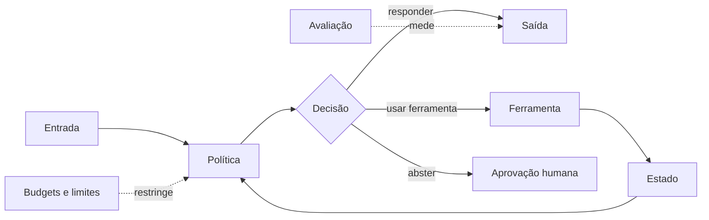

# 01 — Fundamentos de Agent Engineering

> [!IMPORTANT]
> Um agente não é definido por parecer inteligente. Ele é definido por possuir objetivo, estado, política de decisão,
> ferramentas, limites, critérios de parada e avaliação observável.

## Objetivos

Ao final, você deverá conseguir:

- diferenciar modelo, assistente, workflow e agente usando critérios testáveis;
- especificar objetivo, estado, ferramentas, política, budgets, recusas e saída;
- identificar quando um fluxo determinístico é superior a um agente;
- executar um agente mínimo local, sem API e sem efeito externo;
- comparar o comportamento com um baseline baseado em regras;
- produzir evidências suficientes para auditoria e reprodução.

## Pré-requisitos

- [Módulo 00](../00-orientation/README.md) concluído;
- Git e terminal em nível introdutório;
- Python 3.11+ recomendado;
- nenhuma chave de API é necessária.

## O problema real

O pedido “organize minha caixa de entrada” parece simples, mas esconde decisões relevantes:

- qual conta e qual período?
- “organizar” significa classificar, arquivar, excluir ou responder?
- quais mensagens são sensíveis?
- o agente pode causar efeitos externos?
- quando deve recusar ou solicitar aprovação?

Transformar esse pedido em código antes de explicitar o contrato cria risco operacional. A engenharia começa reduzindo a ambiguidade.

## Taxonomia operacional

| Sistema | Decide dinamicamente? | Usa ferramentas? | Mantém estado? | Pode causar efeitos? |
|---|---:|---:|---:|---:|
| Modelo | limitado à inferência | não necessariamente | contexto imediato | não diretamente |
| Assistente | parcialmente | opcional | sessão ou memória | geralmente limitado |
| Workflow | caminho predefinido | sim | explícito | previsível |
| Agente | escolhe ações dentro de uma política | sim | explícito | potencialmente alto |

> [!TIP]
> Quanto maior o efeito externo e a incerteza, maior deve ser o controle: permissões mínimas, aprovação humana, budgets,
> logs, rollback e stop conditions.

## Anatomia de um agente



Um contrato mínimo deve declarar:

1. objetivo e não objetivos;
2. entradas e saídas;
3. estado necessário;
4. ferramentas e permissões;
5. política de decisão;
6. budgets de tempo, passos e custo;
7. stop conditions;
8. modos de falha;
9. critérios de avaliação;
10. trilha de auditoria.

## Progressão NEXUS

Conceito: autonomia limitada → arquitetura: contrato de agente → implementação: agente read-only mínimo → comparação:
workflow determinístico versus agentic → projeto real: triagem com abstention.

## Implementação mínima

Execute o exemplo local:

```bash
python examples/minimal_readonly_agent.py --demo
```

O exemplo não usa rede, contas reais, modelos externos nem credenciais. Ele demonstra:

- classificação de uma entrada simulada;
- limite de passos;
- recusa diante de instruções destrutivas;
- registro estruturado da decisão;
- comparação com baseline determinístico.

Leia também o contrato em [`agents/specs/minimal-readonly-agent.yaml`](../../../agents/specs/minimal-readonly-agent.yaml).

## Quando não usar um agente

Prefira regras, scripts ou workflows quando:

- o caminho é conhecido e estável;
- erro tem custo alto e baixa tolerância;
- não há benefício mensurável de autonomia;
- a tarefa exige execução idêntica e auditável;
- a decisão pode ser expressa de forma simples e determinística.

A escolha por agente deve ser uma hipótese testável, não uma preferência estética.

## Laboratórios

- [LAB-101](../../../labs/LAB-101-agent-contract.md) — transformar um pedido ambíguo em agent spec e testar recusas.

## Projeto

Projete um agente de triagem read-only com:

- baseline não agentic;
- pelo menos cinco casos de teste;
- dois cenários de recusa;
- um cenário que exige aprovação humana;
- budget de passos;
- log de decisão;
- ameaça principal e mitigação correspondente.

## Quiz comentado

1. **Todo sistema que usa ferramentas é um agente?**  
   Não. Workflows determinísticos também usam ferramentas.

2. **Mais autonomia significa melhor desempenho?**  
   Não necessariamente. Pode aumentar variância, custo e risco.

3. **Qual é o papel da abstention?**  
   Interromper ou encaminhar decisões quando confiança, permissão ou contexto são insuficientes.

4. **Por que criar um baseline simples?**  
   Para verificar se a complexidade agentic gera ganho real.

5. **O que deve acontecer quando o budget termina?**  
   O agente deve parar de forma segura, registrar o estado e nunca improvisar permissões.

## Checklist

- [ ] Objetivo e não objetivos são observáveis.
- [ ] Entradas e saídas possuem contrato explícito.
- [ ] Permissões e stop conditions estão documentadas.
- [ ] Existe baseline mais simples para comparação.
- [ ] O agente consegue abster-se.
- [ ] Casos destrutivos são recusados.
- [ ] Nenhum segredo foi armazenado.
- [ ] A execução gera evidência reproduzível.

## Critérios de excelência

A entrega é excelente quando:

- o contrato é compreensível sem conhecimento tácito;
- o exemplo funciona localmente sem dependências externas;
- o baseline e o agente são comparados com os mesmos casos;
- recusas e aprovações humanas são demonstradas;
- riscos residuais são declarados;
- a nota na [rubrica transversal](../../rubrics/transversal-rubric.md) é pelo menos 32/40;
- segurança e rastreabilidade não apresentam bloqueios.

## Bibliografia

- RUSSELL, Stuart; NORVIG, Peter. *Artificial Intelligence: A Modern Approach*. 4. ed. Pearson, 2020.
- KLEPPMANN, Martin. *Designing Data-Intensive Applications*. O’Reilly, 2017.

## Referências

- [OpenAI Agents SDK — documentação oficial](https://openai.github.io/openai-agents-python/). Acesso em: 19 jul. 2026.
- [Anthropic — Building effective agents](https://www.anthropic.com/research/building-effective-agents). Acesso em: 19 jul. 2026.
- [NIST AI Risk Management Framework](https://www.nist.gov/itl/ai-risk-management-framework). Acesso em: 19 jul. 2026.
- [OWASP Top 10 for LLM Applications](https://owasp.org/www-project-top-10-for-large-language-model-applications/). Acesso em: 19 jul. 2026.
