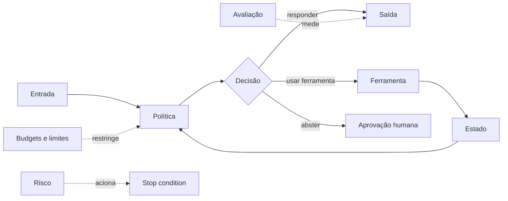

# 01 — Fundamentos de Agent Engineering

> [!IMPORTANT]
> Um agente não é definido por parecer inteligente. Ele é definido por objetivo, estado, política de decisão, ferramentas, limites, critérios de parada e avaliação observável.

## Público real

- estudantes que concluíram o Módulo 00;
- pessoas com Python introdutório;
- profissionais que precisam distinguir automação, workflow e agente;
- equipes que desejam criar contratos antes de adicionar autonomia.

## Resultado final

Ao concluir, a pessoa consegue especificar, implementar e avaliar um agente read-only local, compará-lo com um baseline determinístico e justificar quando não usar autonomia.

## Objetivos

- Diferenciar modelo, assistente, workflow e agente com critérios testáveis.
- Especificar objetivo, estado, ferramentas, política, budgets, recusas e saída.
- Identificar quando um fluxo determinístico é superior a um agente.
- Executar um agente mínimo local sem API ou efeito externo.
- Comparar comportamento com baseline.
- Produzir evidência suficiente para auditoria.

## Pré-requisitos

- [Módulo 00](../00-orientation/README.md) concluído;
- Git, terminal e Python em nível introdutório;
- capacidade de ler JSON e YAML;
- nenhuma chave de API necessária.

## Diagnóstico inicial

Explique, sem consultar o módulo:

1. a diferença entre script e workflow;
2. o que é uma stop condition;
3. por que um baseline simples é necessário;
4. por que um agente deve poder recusar;
5. por que permissões mínimas reduzem risco.

Se não conseguir responder três itens, revise a Trilha Zero e o Módulo 00.

## O problema real

Pedidos simples escondem decisões. “Organize minha caixa de entrada” pode significar classificar, arquivar, excluir ou responder. Antes de implementar, precisamos tornar explícitos:

- objetivo e não objetivos;
- contexto e limites;
- ferramentas e permissões;
- risco de efeito externo;
- quando recusar;
- quando pedir aprovação;
- como medir resultado.

## Explicação em três camadas

### Camada 1 — simples

Um agente observa uma situação, escolhe uma ação permitida e para quando atinge o objetivo ou encontra um limite.

### Camada 2 — técnica

Um agente combina entrada, estado, política, ferramentas, budgets, stop conditions, recusas, logs e avaliação.

### Camada 3 — profissional

Autonomia deve ser uma hipótese testável. Quanto maior a incerteza e o efeito externo, maior a necessidade de governança, permissões mínimas, aprovação humana, rollback e observabilidade.

## Taxonomia operacional

| Sistema | Decide dinamicamente? | Usa ferramentas? | Mantém estado? | Efeito externo |
|---|---:|---:|---:|---:|
| modelo | inferência limitada | não necessariamente | contexto imediato | indireto |
| assistente | parcialmente | opcional | sessão ou memória | geralmente limitado |
| workflow | caminho predefinido | sim | explícito | previsível |
| agente | escolhe ações dentro de política | sim | explícito | potencialmente alto |

## Anatomia de um agente



## Glossário mínimo

| Termo | Significado operacional |
|---|---|
| política | regra que limita decisões possíveis |
| ferramenta | capacidade externa ou função invocável |
| estado | informação necessária entre passos |
| budget | limite de passos, tempo, custo ou tentativas |
| abstention | decisão de não agir e encaminhar |
| baseline | solução mais simples usada para comparação |
| efeito externo | mudança fora do processo local |

## Contrato mínimo

Um agente deve declarar:

1. objetivo e não objetivos;
2. entradas e saídas;
3. estado necessário;
4. ferramentas e permissões;
5. política de decisão;
6. budgets;
7. stop conditions;
8. modos de falha;
9. critérios de avaliação;
10. trilha de auditoria.

## Exemplo mínimo

Missão: classificar uma mensagem sintética como `informativa`, `ação necessária` ou `recusar`.

Ferramentas permitidas:

- leitura da mensagem sintética;
- classificação local;
- registro de decisão.

Ferramentas proibidas:

- enviar resposta;
- excluir conteúdo;
- acessar conta real;
- abrir rede.

## Demonstração executável

```bash
python examples/minimal_readonly_agent.py --demo
```

Leia também:

- [`agents/specs/minimal-readonly-agent.yaml`](../../../agents/specs/minimal-readonly-agent.yaml);
- [LAB-101](../../../labs/LAB-101-agent-contract.md).

A demonstração deve mostrar:

- decisão;
- ferramenta usada;
- budget restante;
- recusa quando aplicável;
- comparação com baseline;
- log estruturado.

## Quando não usar um agente

Prefira regras, scripts ou workflows quando:

- o caminho é conhecido e estável;
- o erro tem alto custo e baixa tolerância;
- não há ganho mensurável de autonomia;
- a tarefa exige resultado idêntico;
- uma regra simples resolve o problema;
- o sistema não pode explicar ou interromper a decisão.

## Prática guiada

1. Execute o exemplo mínimo.
2. Leia o agent spec.
3. Liste objetivo, não objetivos, ferramentas e budgets.
4. Identifique uma recusa.
5. Compare com o baseline.
6. Registre uma limitação residual.

## Prática independente

Escolha uma missão read-only, por exemplo:

- classificar tickets sintéticos;
- priorizar tarefas simuladas;
- detectar campos ausentes;
- sugerir rota de revisão.

Produza:

- agent spec;
- baseline;
- cinco casos de teste;
- duas recusas;
- uma aprovação humana;
- log de decisão.

## Laboratórios

- [LAB-101](../../../labs/LAB-101-agent-contract.md) — transformar pedido ambíguo em agent spec e testar recusas.

## Projeto

Projete um agente de triagem read-only com:

- baseline não agentic;
- cinco casos de teste;
- dois cenários de recusa;
- um cenário de aprovação humana;
- budget de passos;
- log estruturado;
- ameaça principal e mitigação;
- risco residual declarado.

## Erros comuns

- chamar qualquer chatbot de agente;
- adicionar ferramentas sem limitar permissões;
- usar confiança sem critério mensurável;
- confundir log com auditoria completa;
- não comparar com baseline;
- considerar mais autonomia como melhoria automática;
- permitir ação quando o contexto é insuficiente.

## Testes negativos obrigatórios

O projeto deve demonstrar:

- entrada com campo desconhecido;
- instrução destrutiva;
- budget excedido;
- contexto insuficiente;
- solicitação fora do escopo;
- ferramenta não permitida.

## Teste de segurança

A entrega é bloqueada se:

- houver credencial real;
- existir efeito externo não autorizado;
- o agente improvisar ferramenta ou permissão;
- recusas não forem testadas;
- o budget puder ser ignorado;
- o log expuser dado sensível.

## Avaliação

| Dimensão | Insuficiente | Funcional | Robusta | Excelente |
|---|---|---|---|---|
| contrato | implícito | objetivo e ferramentas explícitos | inclui budgets, falhas e recusas | contrato auditável e versionado |
| implementação | não reproduz | exemplo local funciona | testes positivos e negativos | comportamento determinístico e explicado |
| baseline | ausente | comparação simples | mesmos casos e métricas | ganho e custo de autonomia demonstrados |
| segurança | permissões amplas | read-only | menor privilégio e stop conditions | ameaça, mitigação e risco residual |
| evidência | afirmações | logs básicos | artefatos reproduzíveis | auditoria clara e revisão independente |

Segurança e rastreabilidade são critérios de bloqueio.

## Quiz comentado

1. **Todo sistema com ferramenta é agente?**  
   Não. Workflows determinísticos também usam ferramentas.

2. **Mais autonomia significa melhor desempenho?**  
   Não. Pode aumentar variância, custo e risco.

3. **Qual o papel da abstention?**  
   Interromper ou encaminhar quando confiança, contexto ou permissão são insuficientes.

4. **Por que criar baseline?**  
   Para verificar se a complexidade agentic gera ganho real.

5. **O que acontece quando o budget termina?**  
   O agente para, registra o estado e não improvisa permissões.

## Checklist

- [ ] Objetivo e não objetivos são observáveis.
- [ ] Entradas e saídas possuem contrato.
- [ ] Ferramentas seguem allowlist.
- [ ] Budgets e stop conditions foram testados.
- [ ] Existe baseline comparável.
- [ ] O agente consegue recusar.
- [ ] Casos destrutivos são bloqueados.
- [ ] Nenhum segredo foi armazenado.
- [ ] Logs não expõem dados sensíveis.
- [ ] A execução produz evidência reproduzível.

## Acessibilidade

- diagramas possuem descrição textual;
- conceitos são apresentados em linguagem simples e técnica;
- códigos devem ter comentários essenciais;
- resultados não dependem exclusivamente de cor;
- atividades aceitam evidência textual, vídeo legendado ou áudio transcrito.

## Autoavaliação

- consigo explicar por que esta solução precisa ser agentic?
- consigo mostrar quando o baseline é melhor?
- consigo demonstrar recusa, budget e stop condition?
- consigo explicar o risco residual?
- outra pessoa consegue reproduzir minha execução?

## Bibliografia

- RUSSELL, Stuart; NORVIG, Peter. *Artificial Intelligence: A Modern Approach*. 4. ed. Pearson, 2020.
- KLEPPMANN, Martin. *Designing Data-Intensive Applications*. O’Reilly, 2017.

## Referências

- [OpenAI Agents SDK — documentação oficial](https://openai.github.io/openai-agents-python/)
- [Anthropic — Building effective agents](https://www.anthropic.com/research/building-effective-agents)
- [NIST AI Risk Management Framework](https://www.nist.gov/itl/ai-risk-management-framework)
- [OWASP Top 10 for LLM Applications](https://owasp.org/www-project-top-10-for-large-language-model-applications/)

## Próximo passo

Avance para [02 — Context Engineering](../02-context-engineering/README.md) somente após concluir o LAB-101, demonstrar recusas e atingir nível **funcional** ou superior.