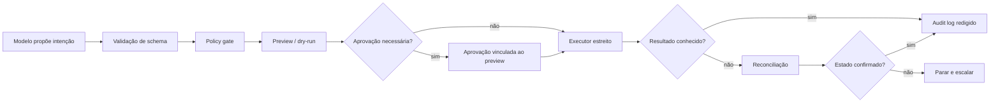

# 03 — Tool Engineering

> [!IMPORTANT]
> Uma tool não é apenas uma função disponível ao modelo. É uma fronteira de autoridade entre uma decisão probabilística e um efeito real.

## Público real

Este módulo é indicado para estudantes que já concluíram os módulos 00–02 e conseguem:

- ler JSON e contratos simples;
- executar testes locais;
- distinguir política, tarefa, evidência e estado;
- explicar por que contexto não pode ampliar permissões.

Quem ainda não domina terminal, Git, Python básico, JSON, APIs e segurança introdutória deve concluir a [Trilha Zero](../../zero-track/README.md).

## Resultado final observável

Ao final, você deverá entregar uma ferramenta de escrita reversível que:

- rejeita entradas fora do contrato;
- obtém identidade e escopo fora do modelo;
- gera preview verificável;
- exige aprovação quando necessário;
- usa idempotência;
- trata timeout e efeito desconhecido;
- reconcilia estado antes de repetir;
- produz logs úteis e redigidos;
- passa em testes benignos e adversariais.

## Missão

Projetar ferramentas estreitas, observáveis e interrompíveis, nas quais o modelo propõe intenção, mas código determinístico valida identidade, escopo, autorização, parâmetros e efeitos.

## Objetivos

- Projetar tools como fronteiras explícitas de autoridade.
- Validar entradas, aprovações, efeitos e reconciliação fora do modelo.
- Demonstrar idempotência, observabilidade e parada segura sob falha.
- Distinguir validação, autenticação, autorização e aprovação humana.
- Explicar quando uma tool deve recusar, parar ou escalar.

## Pré-requisitos

- [Módulo 02](../02-context-engineering/README.md) concluído;
- schemas, APIs e testes automatizados em nível introdutório;
- nenhuma chave de API é obrigatória;
- nenhuma conta paga é necessária.

## Diagnóstico inicial

Antes de avançar, responda sem consultar material:

1. Qual é a diferença entre validação e autorização?
2. Quem deve escolher a credencial usada por uma tool?
3. Quando um timeout torna o retry inseguro?
4. O que é idempotência?
5. Por que aprovação deve estar ligada ao preview?

Resultado recomendado:

- 0–2 respostas sólidas: revisar Z04–Z06 e o Módulo 02;
- 3–4 respostas sólidas: avançar com prática guiada;
- 5 respostas sólidas: iniciar pela prática independente.

## Explicação em três camadas

### Camada 1 — simples

Uma tool é uma porta. O modelo pode pedir para abrir a porta, mas não deve decidir sozinho quem pode entrar, o que pode levar, quanto pode gastar ou qual ambiente será alterado.

### Camada 2 — profissional

A tool converte intenção em efeito sob um contrato. Esse contrato precisa limitar parâmetros, identidade, escopo, efeitos, retry, timeout, aprovação e observabilidade.

### Camada 3 — engenharia

Uma tool segura separa quatro planos:

1. **intenção** — proposta pelo modelo;
2. **política** — aplicada por código confiável;
3. **execução** — realizada por adapter estreito;
4. **reconciliação** — confirma o efeito real antes de qualquer retry.

## Glossário

| Termo | Definição operacional |
|---|---|
| schema | contrato estrutural da entrada ou saída |
| autenticação | prova de identidade |
| autorização | permissão para agir naquele escopo |
| approval | consentimento humano para um efeito específico |
| dry-run | simulação sem produzir o efeito |
| idempotência | repetição da mesma solicitação sem efeito adicional |
| reconciliação | consulta ao estado real após resultado ambíguo |
| least privilege | somente a menor permissão necessária |
| effect unknown | não é possível afirmar se o efeito ocorreu |
| rollback | reversão de um efeito já confirmado |

## Mapa visual



## Tool como contrato

Toda ferramenta deve declarar:

- objetivo único;
- não objetivos;
- schema de entrada e saída;
- identidade e escopo obtidos fora do modelo;
- efeitos possíveis;
- idempotência;
- timeout;
- política de retry;
- erros tipados;
- preview;
- condição de aprovação;
- reconciliação;
- rollback quando aplicável;
- logs permitidos e proibidos;
- stop conditions.

## Classificação de efeitos

| Classe | Exemplo | Regra mínima |
|---|---|---|
| leitura | listar arquivos permitidos | escopo restrito e sem segredo |
| escrita reversível | criar rascunho | preview, idempotência e rollback |
| escrita externa | enviar mensagem | aprovação contextual e reconciliação |
| destrutiva | excluir ou sobrescrever | aprovação explícita, backup e reconciliação |
| financeira/legal | compra, contratação, aceite | bloqueio humano obrigatório |

## Autoridade não vem do prompt

O modelo nunca deve escolher:

- credencial;
- usuário autenticado;
- tenant;
- diretório raiz;
- limite financeiro;
- destinatário permitido;
- ambiente de produção;
- política de aprovação.

Esses valores vêm do runtime, configuração assinada ou policy engine.

## Schemas estreitos

Prefira enums, limites e formatos explícitos. Evite parâmetros livres como `command`, `url`, `path` ou `payload` quando o escopo puder ser representado por opções seguras.

```json
{
  "action": "archive",
  "message_ids": ["msg-001"],
  "reason": "resolved",
  "dry_run": true
}
```

O executor deve rejeitar:

- campos extras;
- IDs fora do escopo;
- listas vazias quando não permitidas;
- ações incompatíveis;
- valores ambíguos;
- caminhos relativos perigosos;
- dados sensíveis não necessários.

## Idempotência e estado

Uma operação é idempotente quando repetir a mesma solicitação não produz efeito adicional.

Para escritas externas:

- usar chave de idempotência;
- persistir estado da tentativa;
- distinguir `accepted`, `completed`, `failed` e `unknown`;
- não repetir efeito quando o resultado anterior for ambíguo;
- reconciliar com o sistema externo antes de novo envio.

## Preview e aprovação

O preview deve mostrar:

- efeito pretendido;
- recursos afetados;
- identidade usada;
- irreversibilidade;
- custo estimado;
- dados que sairão do ambiente;
- rollback disponível;
- hash do contrato apresentado.

A aprovação deve estar ligada ao hash do preview. Mudança de parâmetros invalida a aprovação.

## Erros tipados

Distinguir pelo menos:

- `VALIDATION_ERROR`;
- `AUTHENTICATION_ERROR`;
- `AUTHORIZATION_ERROR`;
- `CONFLICT`;
- `RATE_LIMITED`;
- `TIMEOUT_SAFE_TO_RETRY`;
- `TIMEOUT_EFFECT_UNKNOWN`;
- `DEPENDENCY_FAILURE`;
- `HUMAN_APPROVAL_REQUIRED`;
- `RECONCILIATION_REQUIRED`.

## Retry seguro

- leitura: retry limitado com backoff;
- escrita idempotente: retry com a mesma chave;
- escrita não idempotente: somente após reconciliação;
- efeito desconhecido: parar e escalar;
- validação, autenticação ou autorização: nunca repetir automaticamente.

## Demonstração executável

Execute:

```bash
python examples/safe_tool_boundary.py --demo
```

Depois execute os testes existentes do repositório:

```bash
python tests/run_quality_gates.py
```

Registre:

- versão do Python;
- commit analisado;
- entrada usada;
- resultado esperado;
- resultado observado;
- qualquer diferença ou risco encontrado.

## Prática guiada

Projete uma tool chamada `create_draft` que:

1. aceita somente `recipient_id`, `subject`, `body_summary`, `dry_run` e `idempotency_key`;
2. obtém o usuário autenticado do runtime;
3. rejeita destinatários fora da allowlist;
4. produz preview antes da escrita;
5. exige aprovação quando o destinatário é externo;
6. redige dados sensíveis no log;
7. reconcilia após timeout ambíguo.

## Prática independente

Projete outra tool de escrita reversível, diferente da prática guiada. Entregue:

- contrato;
- threat model resumido;
- schema;
- matriz de efeitos;
- preview;
- política de aprovação;
- política de retry;
- estratégia de reconciliação;
- testes positivos e negativos;
- risco residual.

## Teste adversarial obrigatório

A tool deve rejeitar, registrar e permanecer dentro do escopo diante de:

- campo extra;
- ID fora da allowlist;
- path traversal;
- prompt injection tentando ampliar permissão;
- duplicidade;
- timeout após possível efeito;
- aprovação reutilizada após mudança de parâmetros;
- segredo na entrada ou saída;
- tentativa de selecionar credencial ou tenant pelo modelo.

## Stop conditions

A execução deve parar quando:

- identidade ou escopo não puderem ser confirmados;
- aprovação estiver ausente ou inválida;
- efeito anterior permanecer desconhecido;
- reconciliação falhar;
- budget de tentativas terminar;
- houver risco de segredo em log;
- rollback necessário não estiver disponível;
- política e intenção entrarem em conflito.

## Erros comuns

- confiar no prompt como mecanismo de autorização;
- permitir parâmetros livres demais;
- confundir validação com autorização;
- repetir escrita após timeout ambíguo;
- registrar payload integral;
- aprovar sem preview;
- usar aprovação antiga após alteração de parâmetros;
- tratar rollback como substituto de prevenção;
- esconder estado `unknown` como `failed`.

## Laboratório

Execute o [LAB-301](../../../labs/LAB-301-safe-tool-boundary.md).

## Projeto

Criar uma ferramenta de escrita reversível com:

- schema estreito;
- policy gate;
- dry-run;
- aprovação vinculada ao preview;
- idempotency key;
- timeout e erros tipados;
- reconciliação;
- rollback documentado;
- audit log redigido;
- testes benignos e adversariais.

## Avaliação

A entrega será classificada em quatro níveis:

| Nível | Evidência |
|---|---|
| insuficiente | contrato incompleto, autoridade vinda do contexto ou teste inseguro |
| funcional | schema, policy gate, preview e happy path demonstrados |
| robusta | idempotência, aprovação, timeout, reconciliação e testes negativos comprovados |
| excelente | ameaças, risco residual, logs redigidos, acessibilidade e decisão arquitetural plenamente auditáveis |

Segurança, autorização e rastreabilidade são critérios de bloqueio.

## Quiz comentado

1. **Por que a credencial não pode ser escolhida pelo modelo?**  
   Porque identidade e autoridade pertencem ao runtime confiável, não ao contexto probabilístico.

2. **Quando um timeout impede retry automático?**  
   Quando a operação pode ter produzido efeito e não existe idempotência ou reconciliação conclusiva.

3. **Qual a diferença entre validação e autorização?**  
   Validação verifica formato; autorização verifica se a identidade pode executar o efeito naquele escopo.

4. **Por que aprovação deve estar ligada ao preview?**  
   Para impedir que parâmetros mudem depois do consentimento.

5. **O que fazer quando o efeito externo é desconhecido?**  
   Parar, reconciliar no sistema externo e escalar; nunca repetir cegamente.

## Checklist

- [ ] O modelo não escolhe identidade, escopo ou credencial.
- [ ] Schema rejeita campos extras e valores amplos.
- [ ] Ação sensível possui preview e aprovação.
- [ ] Aprovação é invalidada por mudança de parâmetros.
- [ ] Retry é proibido para efeito ambíguo não idempotente.
- [ ] Logs não contêm segredos.
- [ ] Existe reconciliação e condição explícita de parada.
- [ ] Testes adversariais passaram.
- [ ] O risco residual está documentado.
- [ ] A demonstração pode ser reproduzida por outra pessoa.

## Acessibilidade

- todos os diagramas devem possuir explicação textual equivalente;
- comandos devem estar em blocos copiáveis;
- cores não podem ser o único indicador de risco;
- tabelas precisam de cabeçalhos claros;
- atividades devem oferecer alternativa textual à demonstração visual;
- feedback deve indicar causa, impacto e próxima ação.

## Autoavaliação

Antes de avançar, explique com suas palavras:

1. onde a autoridade é definida;
2. como a tool limita parâmetros;
3. quando retry é seguro;
4. como a aprovação é validada;
5. como o sistema reconcilia estado;
6. qual risco ainda permanece.

## Critérios de excelência

| Dimensão | Evidência |
|---|---|
| contrato | schema, erros, efeitos e não objetivos documentados |
| segurança | least privilege e nenhuma autoridade vinda do contexto |
| confiabilidade | idempotência, timeout, retry e reconciliação |
| experiência | preview claro e aprovação contextual |
| auditoria | logs úteis, correlacionáveis e redigidos |
| testes | casos benignos, hostis e falhas ambíguas |
| acessibilidade | conteúdo compreensível sem depender de cor ou imagem |

## Referências

- JSON Schema 2020-12, especificação oficial.
- OWASP API Security Top 10.
- OWASP LLM Prompt Injection Prevention Cheat Sheet.
- RFC 9110 — HTTP Semantics.
- NEWMAN, Sam. *Building Microservices*. 2. ed. O’Reilly, 2021.

> [!WARNING]
> Bibliotecas e APIs mudam. Registre versão e data de acesso e siga a política de fontes do projeto.

## Próximo passo

Avance ao [Módulo 04 — Loop Engineering](../04-loop-engineering/README.md) somente após demonstrar uma ferramenta que possa ser explicada, testada, interrompida e reconciliada sob o mesmo contrato.
