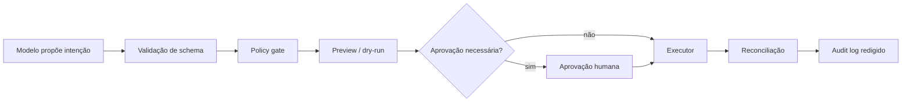

# 03 — Tool Engineering

> [!IMPORTANT]
> Uma tool não é apenas uma função disponível ao modelo. É uma fronteira de autoridade entre uma decisão probabilística e um efeito real.

## Missão

Projetar ferramentas estreitas, observáveis e interrompíveis, nas quais o modelo propõe intenção, mas código determinístico valida identidade, escopo, autorização, parâmetros e efeitos.

## Objetivos

- Projetar tools como fronteiras explícitas de autoridade.
- Validar entradas, aprovações, efeitos e reconciliação fora do modelo.
- Demonstrar idempotência, observabilidade e parada segura sob falha.

## Pré-requisitos

[Módulo 02](../02-context-engineering/README.md); schemas, APIs e testes automatizados.

## Arquitetura de referência



## Tool como contrato

Toda ferramenta deve declarar:

- objetivo único;
- schema de entrada e saída;
- identidade e escopo obtidos fora do modelo;
- efeitos possíveis;
- idempotência;
- timeout;
- política de retry;
- erros tipados;
- pré-visualização;
- condição de aprovação;
- reconciliação;
- logs permitidos e proibidos.

## Classificação de efeitos

| Classe | Exemplo | Regra mínima |
|---|---|---|
| leitura | listar arquivos permitidos | escopo restrito e sem segredo |
| escrita reversível | criar rascunho | preview e rollback |
| escrita externa | enviar mensagem | aprovação conforme contexto |
| destrutiva | excluir ou sobrescrever | aprovação explícita e reconciliação |
| financeira/legal | compra, contratação, aceite | bloqueio humano obrigatório |

## Idempotência

Uma operação é idempotente quando repetir a mesma solicitação não produz efeito adicional. Para escritas externas:

- usar chave de idempotência;
- persistir estado da tentativa;
- distinguir `accepted`, `completed`, `failed` e `unknown`;
- não repetir efeito quando o resultado anterior for ambíguo;
- reconciliar com o sistema externo antes de novo envio.

## Autoridade não vem do prompt

O modelo nunca deve escolher:

- credencial;
- usuário autenticado;
- tenant;
- diretório raiz;
- limite financeiro;
- destinatário permitido;
- ambiente de produção;
- política de aprovação.

Esses valores vêm do runtime, configuração assinada ou policy engine.

## Schemas estreitos

Prefira enums, limites e formatos explícitos. Evite parâmetros como `command`, `url`, `path` ou `payload` livres quando o escopo puder ser representado por opções seguras.

Exemplo conceitual:

```json
{
  "action": "archive",
  "message_ids": ["msg-001"],
  "reason": "resolved",
  "dry_run": true
}
```

O executor deve rejeitar campos extras, IDs fora do escopo e ações incompatíveis.

## Preview e aprovação

O preview deve mostrar:

- efeito pretendido;
- recursos afetados;
- identidade usada;
- irreversibilidade;
- custo estimado;
- dados que sairão do ambiente;
- rollback disponível.

A aprovação deve estar ligada ao hash do preview. Mudança de parâmetros invalida a aprovação.

## Erros tipados

Distinguir pelo menos:

- `VALIDATION_ERROR`;
- `AUTHORIZATION_ERROR`;
- `CONFLICT`;
- `RATE_LIMITED`;
- `TIMEOUT_SAFE_TO_RETRY`;
- `TIMEOUT_EFFECT_UNKNOWN`;
- `DEPENDENCY_FAILURE`;
- `HUMAN_APPROVAL_REQUIRED`.

## Retry seguro

- leitura: retry limitado com backoff;
- escrita idempotente: retry com a mesma chave;
- escrita não idempotente: somente após reconciliação;
- efeito desconhecido: parar e escalar;
- erro de validação ou autorização: nunca repetir automaticamente.

## Logs e segredos

Logs devem registrar decisão, versão, tool, duração, resultado e correlação. Nunca registrar token, senha, chave privada, conteúdo sensível integral ou credencial em URL.

## Testes obrigatórios

- happy path;
- campo ausente;
- campo extra;
- valor fora do enum;
- ID fora do escopo;
- tentativa de path traversal;
- duplicidade;
- timeout antes e depois do efeito;
- falha de aprovação;
- prompt injection tentando ampliar permissão;
- segredo em entrada ou saída;
- reconciliação após estado desconhecido.

## Laboratório

Execute o [LAB-301](../../../labs/LAB-301-safe-tool-boundary.md).

## Projeto obrigatório

Criar uma ferramenta de escrita reversível com:

- schema estreito;
- policy gate;
- dry-run;
- aprovação vinculada ao preview;
- idempotency key;
- timeout e erros tipados;
- audit log redigido;
- testes benignos e adversariais.

## Quiz

1. Por que a credencial não pode ser escolhida pelo modelo?
2. Quando um timeout impede retry automático?
3. Qual a diferença entre validação e autorização?
4. Por que aprovação deve estar ligada ao preview?
5. O que fazer quando o efeito externo é desconhecido?

<details>
<summary>Gabarito comentado</summary>

1. Porque identidade e autoridade pertencem ao runtime confiável, não ao contexto probabilístico.
2. Quando a operação pode ter produzido efeito e não existe idempotência ou reconciliação.
3. Validação verifica formato; autorização verifica se a identidade pode executar o efeito no escopo.
4. Para impedir que parâmetros mudem depois da aprovação.
5. Parar, reconciliar no sistema externo e escalar; não repetir cegamente.

</details>

## Checklist

- [ ] O modelo não escolhe identidade, escopo ou credencial.
- [ ] Schema rejeita campos extras e valores amplos.
- [ ] Ação sensível possui preview e aprovação.
- [ ] Aprovação é invalidada por mudança de parâmetros.
- [ ] Retry é proibido para efeito ambíguo não idempotente.
- [ ] Logs não contêm segredos.
- [ ] Existe reconciliação e condição explícita de parada.
- [ ] Testes adversariais passaram.

## Critérios de excelência

| Dimensão | Evidência |
|---|---|
| contrato | schema, erros e efeitos documentados |
| segurança | least privilege e nenhuma autoridade vinda do contexto |
| confiabilidade | idempotência, timeout, retry e reconciliação |
| experiência | preview claro e aprovação contextual |
| auditoria | logs úteis, correlacionáveis e redigidos |
| testes | casos benignos, hostis e falhas ambíguas |

## Referências

- JSON Schema 2020-12, especificação oficial.
- OWASP API Security Top 10.
- OWASP LLM Prompt Injection Prevention Cheat Sheet.
- RFC 9110 — HTTP Semantics.
- NEWMAN, Sam. *Building Microservices*. 2. ed. O’Reilly, 2021.

> [!WARNING]
> Bibliotecas e APIs mudam. Registre versão e data de acesso e siga a política de fontes do projeto.

## Próximo passo

Avance ao módulo de loops somente após demonstrar uma ferramenta que possa ser explicada, testada, interrompida e reconciliada.
