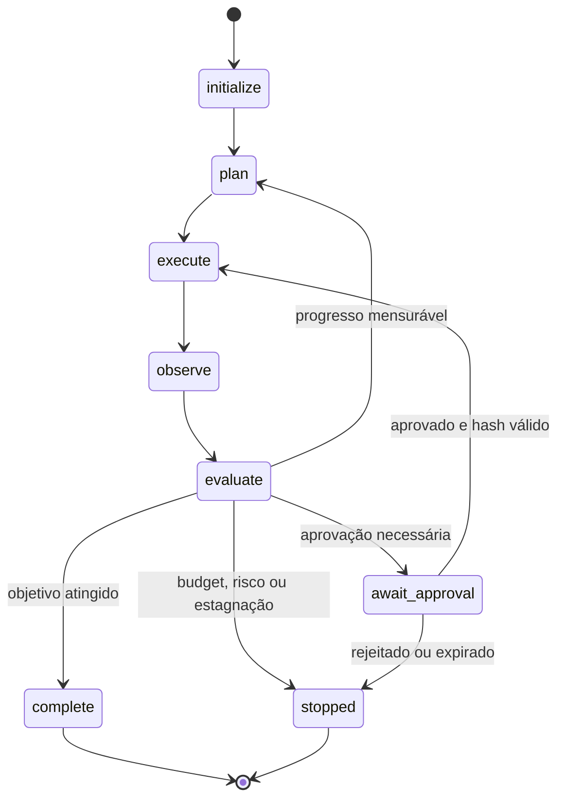

# 04 — Loop Engineering

> [!IMPORTANT]
> Um loop confiável continua apenas enquanto existe progresso mensurável, autoridade válida, orçamento disponível e risco aceitável.

## Objetivos

Ao final, você deverá conseguir:

- modelar um loop como máquina de estados explícita;
- definir budgets multidimensionais e stop conditions;
- distinguir retry, replay e retomada;
- detectar estagnação por critério mensurável;
- implementar circuit breaker e operator stop;
- criar checkpoint versionado;
- retomar sem duplicar efeitos;
- produzir relatório terminal auditável.

## Pré-requisitos

- [Módulo 03 — Tool Engineering](../03-tool-engineering/README.md) concluído;
- JSON, funções e exceções em nível introdutório;
- compreensão de idempotência, autorização e efeitos externos;
- Git e terminal em nível suficiente para executar testes locais.

Quem ainda não domina esses pontos deve concluir a [Trilha Zero](../../zero-track/README.md).

## Para quem é este módulo

Este módulo atende estudantes que já conseguem explicar contratos de tools e querem controlar execução iterativa, custos, falhas e retomada com segurança.

## Resultado final observável

Você entregará um loop local, determinístico e retomável que:

- termine em todos os cenários testados;
- detecte no-progress;
- imponha budgets;
- bloqueie retries inseguros;
- use circuit breaker;
- serialize checkpoint;
- retome sem duplicidade;
- registre razão de parada e risco residual.

## Diagnóstico inicial

Responda antes de estudar:

1. Qual a diferença entre retry, replay e retomada?
2. Quando uma resposta diferente não representa progresso?
3. O que fazer após timeout com efeito desconhecido?
4. Por que `max_steps` sozinho é insuficiente?
5. O que precisa existir em um checkpoint?

Repita o diagnóstico ao concluir o módulo.

## Missão do módulo

Construir um loop explicável, testável, interrompível, retomável e auditável, sem depender de comportamento implícito ou memória informal.

## Explicação em três camadas

### Camada simples

Um loop é uma sequência controlada de passos. Ele precisa saber onde está, o que já fez, quanto ainda pode gastar, se está progredindo e quando parar.

### Camada operacional

Um loop seguro possui estados, transições, budgets, critério de progresso, stop conditions, retry controlado, checkpoint e relatório terminal.

### Camada de engenharia

Loop Engineering transforma execução iterativa em máquina de estados finita, observável e recuperável. O objetivo é controlar variância, custo, efeitos e terminação.

## Glossário essencial

| Termo | Definição operacional |
|---|---|
| estado | situação atual da execução |
| transição | mudança válida entre estados |
| budget | limite de passos, tempo, falhas ou efeitos |
| progresso | alteração mensurável em critério relevante |
| estagnação | repetição sem avanço verificável |
| stop condition | condição explícita de parada ou suspensão |
| retry | nova tentativa da mesma operação elegível |
| replay | reprodução de sequência anterior |
| retomada | restauração de estado após checkpoint |
| checkpoint | registro suficiente para continuar com segurança |
| circuit breaker | bloqueio temporário após padrão de falhas |
| reconciliação | verificação do estado real antes de repetir efeito |

## Mapa visual



Descrição textual: o loop inicia, planeja, executa, observa e avalia. A avaliação conclui, solicita aprovação, retorna ao planejamento apenas com progresso ou para de forma segura.

## O problema real

Loops implícitos geram:

- não terminação;
- efeitos duplicados;
- estagnação mascarada;
- custo crescente sem ganho;
- falha sem diagnóstico;
- retomada insegura;
- retry de efeito ambíguo.

## Contrato mínimo de execução

```json
{
  "run_id": "run-001",
  "state": "evaluate",
  "step": 3,
  "budgets": {
    "max_steps": 8,
    "max_failures": 2,
    "max_no_progress": 2,
    "max_tool_calls": 6,
    "max_external_effects": 1
  },
  "progress_fingerprint": "sha256:...",
  "effects": [],
  "checkpoint_version": 1
}
```

O contrato deve ser serializável, versionado e suficiente para retomar sem reconstruir decisões críticas a partir de texto livre.

## Budgets multidimensionais

| Budget | Protege contra |
|---|---|
| `max_steps` | execução longa ou não terminação |
| `max_tool_calls` | custo e superfície de ataque |
| `max_failures` | repetição sem diagnóstico |
| `max_no_progress` | estagnação |
| `max_elapsed_ms` | bloqueio temporal |
| `max_external_effects` | mutações excessivas |

Budgets são limites de segurança, não metas de consumo.

## Progresso mensurável

Conta como progresso:

- requisito pendente passa a atendido;
- cobertura de evidência aumenta;
- teste falho passa;
- bloqueio é removido;
- artefato novo e válido é produzido.

Não conta:

- reformular a mesma resposta;
- repetir busca sem novas fontes;
- alternar tools sem mudar resultado;
- aumentar texto sem aumentar evidência;
- gerar arquivos equivalentes.

Use `progress_fingerprint` derivado apenas dos campos relevantes. Fingerprint invariável pelo limite configurado deve produzir `no_progress`.

## Stop conditions

```text
objective_complete
budget_exhausted
no_progress
unsafe_request
approval_required
approval_rejected
approval_expired
non_retryable_failure
circuit_open
operator_stop
```

Toda parada registra:

- razão tipada;
- último estado válido;
- budget consumido e restante;
- efeitos concluídos;
- erros observados;
- próximo passo seguro.

## Retry, replay e retomada

- **retry:** repete uma operação elegível;
- **replay:** reproduz uma sequência e pode duplicar efeitos;
- **retomada:** restaura estado, reconcilia efeitos e continua do ponto seguro.

Retry exige:

1. falha transitória;
2. idempotência ou chave de idempotência;
3. ausência de efeito ambíguo;
4. limite de tentativas;
5. backoff quando necessário;
6. reconciliação antes de nova mutação.

Falhas de autorização, schema, política e conteúdo inseguro não recebem retry automático.

## Circuit breaker

Estados:

- `closed` — chamadas permitidas;
- `open` — chamadas bloqueadas;
- `half_open` — uma probe controlada testa recuperação.

```yaml
failure_threshold: 3
cooldown_seconds: 30
half_open_probes: 1
successes_to_close: 1
```

Abrir o circuito deve ser observável e preservar a causa da falha.

## Checkpoint e retomada

Checkpoint seguro registra:

- versão do schema;
- estado atual;
- budgets restantes;
- decisões aprovadas;
- efeitos concluídos;
- chaves de idempotência;
- hashes de previews;
- erros e métricas;
- versão dos artefatos.

Antes de retomar, reconcilie efeitos externos. Retomada não é replay.

## Demonstração executável

```bash
python examples/deterministic_loop.py --self-test
```

A demonstração deve provar:

- sucesso antes do limite;
- parada por estagnação;
- falha não recuperável;
- budget zero;
- circuit breaker;
- checkpoint e retomada sem duplicidade.

## Prática guiada

1. desenhe cinco estados e suas transições;
2. defina três budgets;
3. escolha um critério de progresso;
4. defina duas stop conditions;
5. modele falha transitória e não recuperável;
6. escreva o relatório terminal esperado.

## Prática independente

Projete um loop para uma fila simulada read-only com:

- budget de passos e falhas;
- no-progress;
- circuit breaker;
- checkpoint;
- relatório terminal;
- teste de retomada.

## Testes negativos obrigatórios

- budget zero;
- estado desconhecido;
- transição inválida;
- fingerprint invariável;
- timeout com efeito desconhecido;
- checkpoint incompatível;
- retry sem idempotência;
- circuit breaker aberto;
- aprovação expirada;
- operator stop.

## Laboratório

Execute o [LAB-401](../../../labs/LAB-401-stop-conditions.md).

## Projeto obrigatório

Construa um loop retomável que:

1. use máquina de estados explícita;
2. declare budgets multidimensionais;
3. detecte no-progress por fingerprint;
4. implemente circuit breaker;
5. serialize checkpoint versionado;
6. reconcilie efeitos antes de retry;
7. produza relatório terminal tipado;
8. execute suíte adversarial reproduzível.

## Avaliação

A avaliação combina:

- diagnóstico antes/depois;
- execução da demonstração;
- LAB-401;
- projeto obrigatório;
- testes negativos;
- defesa curta das decisões;
- rubrica específica e rubrica transversal.

Segurança, terminação e rastreabilidade são critérios de bloqueio.

### Rubrica específica

| Nível | Evidência |
|---|---|
| insuficiente | loop pode não terminar, não possui budgets ou duplica efeitos |
| funcional | termina em cenários básicos e registra razão de parada |
| robusta | cobre falhas, estagnação, checkpoint e retry seguro |
| excelente | prova terminação, retomada sem duplicidade, auditabilidade e acessibilidade |

## Erros comuns

- usar apenas `max_steps`;
- considerar texto diferente como progresso;
- misturar retry com retomada;
- retomar sem reconciliar efeitos;
- esconder falha em exceção genérica;
- permitir transição não declarada;
- apagar causa ao abrir circuit breaker;
- registrar segredo no checkpoint.

## Stop conditions para o estudante

Pare e peça revisão quando:

- houver efeito externo não simulado;
- checkpoint contiver credencial;
- não for possível provar terminação;
- retry puder duplicar ação;
- código exigir desabilitar teste;
- ambiente divergir da documentação.

## Acessibilidade

- diagramas possuem descrição textual;
- estados não dependem apenas de cor;
- comandos são copiáveis;
- tabelas possuem cabeçalhos claros;
- exemplos funcionam sem interface gráfica;
- vídeos futuros exigem legenda e transcrição.

## Checklist

- [ ] Todo caminho alcança estado terminal permitido.
- [ ] Estados e transições são explícitos.
- [ ] Budgets são multidimensionais e persistidos.
- [ ] Progresso é mensurável.
- [ ] Estagnação produz parada tipada.
- [ ] Retry exige elegibilidade e idempotência.
- [ ] Retomada reconcilia efeitos.
- [ ] Circuit breaker foi testado.
- [ ] Checkpoint não contém segredo.
- [ ] Relatório terminal é auditável.
- [ ] LAB-401 foi concluído.
- [ ] Risco residual foi documentado.

## Autoavaliação

- [ ] Consigo explicar cada estado e transição.
- [ ] Sei distinguir retry, replay e retomada.
- [ ] Consigo justificar cada budget.
- [ ] Meu loop termina em sucesso, falha e estagnação.
- [ ] Outra pessoa consegue reproduzir a execução.

## Quiz comentado

1. Por que `max_steps` sozinho é insuficiente?  
   Porque não limita separadamente falhas, tempo, chamadas, efeitos e estagnação.

2. Qual a diferença entre retry e retomada?  
   Retry repete operação elegível; retomada restaura estado e reconcilia efeitos.

3. Quando saída diferente não representa progresso?  
   Quando não altera critério relevante, evidência, teste, bloqueio ou artefato válido.

4. Por que checkpoint registra efeitos concluídos?  
   Para impedir replay e duplicidade após reinício.

5. O que ocorre com circuit breaker aberto?  
   Novas chamadas são bloqueadas até cooldown e probe controlada.

## Critérios Premium Elite

| Dimensão | Padrão exigido |
|---|---|
| terminação | 100% dos cenários chegam a estado permitido |
| segurança | nenhum retry de efeito ambíguo ou não idempotente |
| retomada | zero efeitos duplicados após checkpoint |
| observabilidade | razão, budgets, transições e efeitos auditáveis |
| resiliência | circuit breaker e reconciliação testados |
| reprodutibilidade | suíte local sem API, rede ou segredo |
| acessibilidade | conteúdo não depende apenas de elementos visuais |

## Referências

- NYGARD, Michael T. *Release It!*. 2. ed. Pragmatic Bookshelf, 2018.
- KLEPPMANN, Martin. *Designing Data-Intensive Applications*. O'Reilly Media, 2017.
- AWS Builders’ Library — Timeouts, retries and backoff with jitter.
- Microsoft Azure Architecture Center — Circuit Breaker pattern.
- Martin Fowler — Circuit Breaker.

> [!WARNING]
> Parâmetros reais dependem do impacto, latência, consistência e modelo de falha do sistema externo. Registre versão e data das fontes.

## Próximo passo

Avance para [05 — Memory Engineering](../05-memory-engineering/README.md) somente após concluir o LAB-401, obter nível funcional ou superior e não apresentar bloqueios de segurança.
