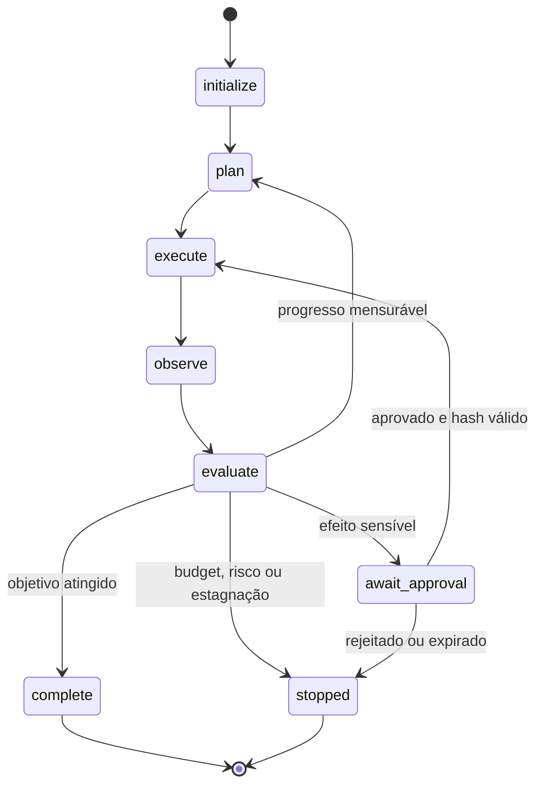

# 04 — Loop Engineering

> [!IMPORTANT]
> Um loop confiável não é aquele que insiste até obter uma resposta. É aquele que sabe continuar, aguardar, concluir e parar com justificativa auditável.

## Objetivos

- Modelar o loop agentic como máquina de estados explícita.
- Implementar budgets multidimensionais, stop conditions, checkpoint, retry e circuit breaker.
- Demonstrar terminação em cenários de sucesso, estagnação, falha e necessidade de aprovação humana.
- Produzir relatório de término tipado com evidências, custos e razão de parada.

## Pré-requisitos

[Módulo 03](../03-tool-engineering/README.md); exceções, funções puras, JSON e testes básicos.

## O problema real

Loops implícitos criam quatro riscos recorrentes:

1. **não terminação** — o sistema continua sem limite verificável;
2. **efeitos duplicados** — retry repete uma ação externa;
3. **estagnação mascarada** — etapas parecem diferentes, mas não produzem progresso;
4. **falha sem diagnóstico** — o sistema para sem explicar estado, custo ou causa.

A NEXUS exige que qualquer loop declare estados, transições, budgets, falhas e condições de parada antes de ser conectado a ferramentas externas.

## Modelo de estados NEXUS



Estados terminais permitidos:

- `complete` — objetivo e critérios atingidos;
- `await_approval` — execução suspensa com decisão humana pendente;
- `stopped` — parada segura e explicada.

Nenhum caminho pode permanecer indefinidamente em `plan`, `execute`, `observe` ou `evaluate`.

## Contrato mínimo de execução

```json
{
  "run_id": "run-001",
  "state": "evaluate",
  "step": 3,
  "budgets": {
    "max_steps": 8,
    "max_failures": 2,
    "max_no_progress": 2,
    "max_tool_calls": 6
  },
  "progress_fingerprint": "sha256:...",
  "effects": [],
  "checkpoint_version": 1
}
```

O contrato precisa ser serializável e suficiente para retomar o loop sem reconstruir decisões críticas a partir de memória informal.

## Budgets multidimensionais

Um único `max_steps` é insuficiente. O loop deve controlar pelo menos:

| Budget | Protege contra |
|---|---|
| `max_steps` | execução longa ou não terminação |
| `max_tool_calls` | custo e ampliação de superfície de ataque |
| `max_failures` | repetição de falhas sem diagnóstico |
| `max_no_progress` | estagnação com saídas cosmeticamente diferentes |
| `max_elapsed_ms` | bloqueio temporal |
| `max_external_effects` | excesso de mutações |

Budgets são limites de segurança, não metas de consumo.

## Detecção de progresso

Progresso deve ser definido por mudança mensurável no estado relevante. Exemplos:

- redução do número de requisitos não satisfeitos;
- aumento de cobertura de evidência;
- teste anteriormente falho passa;
- novo artefato válido é produzido;
- bloqueio é removido.

Não contam como progresso:

- reformular a mesma resposta;
- repetir busca sem novas fontes;
- gerar arquivos equivalentes;
- alternar ferramentas sem alterar resultado;
- aumentar texto sem aumentar evidência.

Uma implementação prática usa um `progress_fingerprint` derivado apenas dos campos relevantes. Se o fingerprint permanecer igual por `max_no_progress` avaliações, o loop deve parar.

## Stop conditions

Condições mínimas:

```text
objective_complete
budget_exhausted
no_progress
unsafe_request
approval_required
approval_rejected
approval_expired
non_retryable_failure
circuit_open
operator_stop
```

Cada parada deve produzir:

- razão tipada;
- último estado válido;
- budget consumido e restante;
- efeitos já realizados;
- erros observados;
- próximo passo seguro.

## Retry seguro

Retry só é permitido quando:

1. a falha é classificada como transitória;
2. a operação é idempotente ou possui chave de idempotência;
3. não há efeito ambíguo pendente;
4. existe limite de tentativas;
5. backoff e jitter são aplicados quando apropriado;
6. o resultado é reconciliado antes de nova mutação.

Falhas de autorização, schema, política e conteúdo inseguro não devem ser tratadas com retry automático.

## Circuit breaker

Estados:

- `closed` — chamadas permitidas;
- `open` — chamadas bloqueadas após limiar de falhas;
- `half_open` — uma probe controlada testa recuperação.

O contrato deve declarar:

```yaml
failure_threshold: 3
cooldown_seconds: 30
half_open_probes: 1
successes_to_close: 1
```

Abrir o circuito deve ser observável e não pode apagar a causa das falhas.

## Checkpoint e retomada

Um checkpoint seguro registra:

- versão do schema;
- estado atual;
- budgets restantes;
- decisões aprovadas;
- efeitos concluídos;
- chaves de idempotência;
- hashes de previews;
- erros e métricas;
- versão dos artefatos usados.

Ao retomar, o sistema deve reconciliar efeitos externos antes de executar novamente. Retomada não é sinônimo de replay.

## Relatório de término

```json
{
  "run_id": "run-001",
  "terminal_state": "stopped",
  "reason": "no_progress",
  "steps": 5,
  "tool_calls": 3,
  "external_effects": 0,
  "last_progress_step": 2,
  "recoverable": true,
  "recommended_next_action": "revisar critério de recuperação"
}
```

## Implementação de referência

Execute:

```bash
python examples/deterministic_loop.py --self-test
```

O exemplo deve provar:

- sucesso antes do limite;
- parada por estagnação;
- parada por falha não recuperável;
- abertura de circuit breaker;
- checkpoint e retomada sem efeito duplicado.

## Laboratórios

- [LAB-401](../../../labs/LAB-401-stop-conditions.md) — provar stop conditions com falhas injetadas.

## Projeto

Construir um loop retomável que:

1. use máquina de estados explícita;
2. declare budgets multidimensionais;
3. detecte no-progress por fingerprint;
4. implemente circuit breaker;
5. serialize checkpoint versionado;
6. reconcilie efeitos antes de retry;
7. produza relatório terminal tipado;
8. execute uma suíte adversarial reproduzível.

## Quiz

1. Por que `max_steps` sozinho não controla um loop adequadamente?
2. Qual é a diferença entre retry e retomada?
3. Quando uma saída diferente não representa progresso?
4. Por que um checkpoint precisa registrar efeitos já concluídos?
5. O que deve acontecer quando o circuit breaker está `open`?

<details>
<summary>Gabarito comentado</summary>

1. Porque não limita separadamente falhas, tempo, chamadas, efeitos e estagnação.
2. Retry repete uma operação elegível; retomada restaura estado e reconcilia efeitos antes de continuar.
3. Quando não altera nenhum critério relevante, evidência, teste, bloqueio ou artefato válido.
4. Para impedir replay e duplicidade após reinício.
5. Novas chamadas devem ser bloqueadas até o cooldown e uma probe controlada em `half_open`.

</details>

## Checklist

- [ ] Todo caminho alcança `complete`, `await_approval` ou `stopped`.
- [ ] Budgets são multidimensionais e persistidos.
- [ ] Estagnação é detectada por critério mensurável.
- [ ] Checkpoint não duplica efeitos.
- [ ] Retry exige idempotência e classificação de falha.
- [ ] Circuit breaker possui limiar, cooldown e probe.
- [ ] Toda parada gera relatório tipado.
- [ ] Testes cobrem sucesso, falha, estagnação e retomada.

## Critérios de excelência

| Dimensão | Padrão Premium Elite |
|---|---|
| Terminação | 100% dos cenários terminam em estado permitido |
| Segurança | nenhum retry de efeito ambíguo ou não idempotente |
| Retomada | zero efeitos duplicados após checkpoint |
| Observabilidade | razão, budgets, transições e efeitos são auditáveis |
| Resiliência | circuit breaker e reconciliação testados |
| Reprodutibilidade | suíte local executa sem API, rede ou segredo |

## Bibliografia

NYGARD, Michael T. *Release It!*. 2. ed. Raleigh: Pragmatic Bookshelf, 2018.

KLEPPMANN, Martin. *Designing Data-Intensive Applications*. Sebastopol: O'Reilly Media, 2017.

## Referências

- AWS Builders’ Library — Timeouts, retries and backoff with jitter: https://aws.amazon.com/builders-library/timeouts-retries-and-backoff-with-jitter/
- Microsoft Azure Architecture Center — Circuit Breaker pattern: https://learn.microsoft.com/azure/architecture/patterns/circuit-breaker
- Martin Fowler — Circuit Breaker: https://martinfowler.com/bliki/CircuitBreaker.html

> [!WARNING]
> Exemplos locais demonstram invariantes arquiteturais. Parâmetros reais dependem do impacto, latência, consistência e modelo de falha do sistema externo.

## Próximo passo

Conclua o LAB-401 e obtenha nível funcional ou superior na rubrica antes de avançar para protocolos e MCP.
