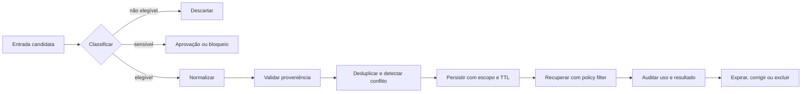

# 05 — Memory Engineering

> [!IMPORTANT]
> Memória não é um histórico infinito. É um subsistema governado que decide o que pode ser lembrado, por qual finalidade, por quanto tempo, em qual escopo e com qual evidência.

## Para quem é este módulo

Este módulo é destinado a estudantes que já conseguem:

- explicar estados, checkpoints e retomada;
- distinguir política, evidência e efeito externo;
- trabalhar com JSON, hashing e testes locais;
- compreender menor privilégio, proveniência e stop conditions.

Quem ainda não domina esses pontos deve concluir a [Trilha Zero](../../zero-track/README.md) e revisar o [Módulo 04](../04-loop-engineering/README.md).

## Resultado final observável

Ao final, você deverá entregar uma memória local, governada e auditável que:

- separe contexto, estado e memória persistente;
- aplique política antes de qualquer escrita;
- preserve sujeito, escopo, fonte, versão e sensibilidade;
- impeça vazamento entre usuários, projetos e tenants;
- aplique TTL, correção, supersessão e exclusão;
- detecte duplicidade, conflito e instrução incorporada;
- recupere apenas dados válidos e relevantes;
- compare desempenho com e sem memória;
- gere relatório de auditoria reproduzível.

## Diagnóstico inicial

Antes de começar, responda sem consultar o material:

1. Histórico de conversa é memória confiável por padrão?
2. Qual a diferença entre estado de execução e memória episódica?
3. Como impedir vazamento entre projetos?
4. Quando um registro deve ser substituído, superseded ou colocado em quarentena?
5. Como provar que memória melhorou a tarefa?
6. O que significa excluir quando backups ainda retêm cópias?

Registre as respostas e repita o diagnóstico ao concluir o módulo.

## Missão do módulo

Construir um subsistema de memória que aumente utilidade sem transformar erros, instruções maliciosas, dados sensíveis ou conteúdo fora de escopo em autoridade persistente.

## Objetivos

- Separar contexto transitório, estado do loop e memória persistente.
- Definir políticas explícitas de gravação, recuperação, atualização, retenção e esquecimento.
- Implementar isolamento por sujeito, escopo, tenant e finalidade.
- Preservar proveniência, versão, confiança e sensibilidade.
- Demonstrar benefício líquido em comparação com baseline sem memória.
- Bloquear contaminação, conflito silencioso, retenção indevida e leakage.

## Pré-requisitos

- [Módulo 04](../04-loop-engineering/README.md) concluído em nível funcional ou superior;
- JSON, hashing e testes locais;
- noções de menor privilégio, proveniência e política de dados;
- nenhuma chave de API é necessária.

## Explicação em três camadas

### Camada 1 — explicação simples

Memória é um caderno controlado. Nem tudo deve ser escrito, nem tudo deve ser lembrado para sempre e cada anotação precisa indicar de onde veio.

### Camada 2 — explicação operacional

Uma memória segura possui política de escrita, identidade, escopo, proveniência, sensibilidade, TTL, versionamento, deduplicação, conflito, recuperação filtrada e exclusão verificável.

### Camada 3 — explicação de engenharia

Memory Engineering transforma persistência em um subsistema de governança. O objetivo não é maximizar lembrança, mas controlar utilidade, risco, retenção, autoridade, isolamento e auditabilidade ao longo do tempo.

## Glossário essencial

| Termo | Definição operacional |
|---|---|
| contexto | informação temporária usada na tarefa atual |
| estado | dados necessários para continuar a execução atual |
| memória episódica | registro de eventos passados |
| memória semântica | fatos ou preferências consolidadas |
| memória procedural | regras e procedimentos versionados |
| proveniência | origem verificável do registro |
| TTL | prazo de validade do item |
| supersessão | nova versão substitui a anterior mantendo histórico |
| tombstone | marca auditável de remoção lógica |
| leakage | recuperação fora do sujeito, escopo ou tenant correto |
| contaminação | promoção indevida de conteúdo não confiável |

## Mapa visual



Descrição textual: candidatos são classificados; itens proibidos são descartados, itens sensíveis exigem bloqueio ou aprovação, e itens elegíveis passam por normalização, proveniência, conflito, persistência, recuperação filtrada, auditoria e ciclo de expiração ou exclusão.

## O problema real

Memória introduz riscos que persistem além de uma única execução:

1. contaminação por conteúdo falso ou malicioso;
2. vazamento entre usuários, projetos ou tenants;
3. conflito silencioso entre versões;
4. retenção excessiva;
5. recuperação irrelevante;
6. falsa autoridade sem proveniência;
7. exclusão incompleta;
8. aumento de custo sem ganho mensurável;
9. reidentificação de dados supostamente anônimos.

## Taxonomia NEXUS

| Camada | Finalidade | Persistência típica | Exemplo |
|---|---|---:|---|
| contexto de trabalho | resolver a etapa atual | segundos/minutos | trechos selecionados |
| estado de execução | retomar o loop | duração da execução | budgets e checkpoint |
| memória episódica | registrar eventos | dias/meses | decisão aprovada |
| memória semântica | fatos consolidados | variável | preferência explícita |
| memória procedural | como executar | versionada | política ou playbook |
| artefato externo | fonte canônica | conforme origem | documento, banco, ticket |

Memória não substitui a fonte canônica. Quando existe sistema de registro, a memória deve apontar para ele e preservar versão, data e proveniência.

## Contrato mínimo

```json
{
  "memory_id": "mem-001",
  "subject": "user:123",
  "tenant": "tenant:alpha",
  "scope": "project:nexus",
  "purpose": "language_preference",
  "type": "semantic",
  "content": "prefere respostas em pt-BR",
  "source": {
    "kind": "explicit_user_statement",
    "reference": "conversation:abc#turn-12"
  },
  "confidence": 1.0,
  "sensitivity": "low",
  "created_at": "2026-07-21T12:00:00Z",
  "expires_at": null,
  "write_policy": "explicit-only",
  "version": 1,
  "integrity_hash": "sha256:..."
}
```

Campos obrigatórios:

- identidade, tenant, sujeito e escopo;
- finalidade declarada;
- tipo e conteúdo normalizado;
- proveniência e confiança;
- sensibilidade;
- timestamps e expiração;
- política que autorizou a escrita;
- versão e hash de integridade.

## Política de escrita

Uma escrita só deve ocorrer quando:

1. existe finalidade declarada;
2. o sujeito, tenant e escopo são conhecidos;
3. a fonte é rastreável;
4. a política permite persistência;
5. o conteúdo não promove instrução não confiável;
6. TTL, correção e exclusão estão definidos;
7. conflito e duplicidade foram tratados;
8. a minimização de dados foi aplicada.

Dados proibidos, credenciais, segredos, conteúdo ilegal ou informação sem finalidade legítima devem ser bloqueados.

## Recuperação segura

A recuperação deve aplicar política antes de relevância. Filtre por:

- tenant, sujeito e escopo;
- finalidade compatível;
- tipo permitido;
- validade temporal;
- sensibilidade;
- consentimento ou base autorizadora aplicável;
- proveniência mínima;
- limite de itens e tokens;
- conflito e supersessão;
- isolamento entre conteúdo e instruções.

```text
retrieve(query, tenant, subject, scope, purpose, allowed_types, now, token_budget)
→ candidates
→ policy filter
→ validity filter
→ conflict resolution
→ relevance rank
→ bounded context package
```

Memória recuperada entra no contexto como dado delimitado e não confiável, nunca como instrução do sistema.

## Conflitos e atualização

Políticas permitidas:

- `append` — eventos independentes;
- `replace` — nova declaração explícita substitui a anterior;
- `supersede` — mantém histórico e marca versão anterior;
- `merge` — apenas estruturas compatíveis;
- `quarantine` — conflito exige revisão;
- `reject` — escrita incompatível é bloqueada.

A política deve ser determinística. Não é aceitável “escolher a lembrança mais convincente”.

## Retenção, correção e exclusão

Todo sistema precisa oferecer:

- TTL por classe e finalidade;
- correção e supersessão;
- exclusão por `memory_id`, sujeito, escopo e tenant;
- tombstone auditável quando necessário;
- exportação legível;
- remoção de índices derivados;
- política para logs, caches e backups;
- relatório honesto sobre o que foi removido e o que ainda permanece.

Exclusão lógica não deve ser apresentada como exclusão física quando backups ou logs ainda retêm dados.

## Privacidade e minimização

Antes de persistir, pergunte:

1. Este dado é necessário para a finalidade?
2. Pode ser substituído por categoria menos específica?
3. Pode expirar mais cedo?
4. Pode ser mantido na fonte canônica sem duplicação?
5. Existe risco de reidentificação?
6. O usuário consegue revisar, corrigir ou remover?

Memória útil deve ser a menor quantidade de informação capaz de melhorar a tarefa.

## Exemplo mínimo

Um sistema local recebe preferências explícitas e eventos simulados. Ele:

1. aceita apenas tipos permitidos;
2. rejeita campos extras;
3. bloqueia segredo e instrução maliciosa;
4. isola tenant, sujeito e escopo;
5. aplica TTL;
6. detecta duplicidade e conflito;
7. recupera apenas itens válidos;
8. compara resultado com baseline sem memória.

## Demonstração executável

```bash
python examples/governed_memory_store.py --self-test
```

A demonstração deve provar:

- isolamento entre tenants, sujeitos e escopos;
- TTL e expiração;
- deduplicação;
- supersessão;
- conflito em quarentena;
- bloqueio de instrução maliciosa;
- exclusão auditável;
- recuperação limitada;
- zero dependências externas.

> [!WARNING]
> Se o exemplo não existir ou não executar no ambiente documentado, registre o bloqueio. Não substitua evidência por descrição.

## Prática guiada

1. Defina três tipos de memória.
2. Escolha uma finalidade explícita para cada tipo.
3. Modele tenant, sujeito e escopo.
4. Defina TTL e política de atualização.
5. Crie um caso de duplicidade e um de conflito.
6. Defina como exclusão será comprovada.
7. Compare uma tarefa com e sem memória.

## Prática independente

Projete uma memória para um assistente de estudo local contendo:

- preferências explícitas;
- progresso por curso;
- itens expirados;
- conflito entre duas preferências;
- isolamento entre dois usuários;
- exportação e exclusão;
- relatório de benefício e risco.

## Testes negativos obrigatórios

- campo desconhecido;
- tenant ausente;
- sujeito fora do escopo;
- TTL expirado;
- segredo na entrada;
- instrução incorporada;
- conflito não resolvido;
- tentativa de recuperar memória de outro usuário;
- exclusão parcial;
- backup ainda retendo dado;
- memória irrelevante reduzindo qualidade;
- reidentificação por combinação de atributos.

## Laboratório

Execute o [LAB-501](../../../labs/LAB-501-governed-memory.md).

## Projeto obrigatório

Construa um subsistema de memória que:

1. declare taxonomia e políticas;
2. preserve fonte, versão e hash;
3. isole tenant, sujeito e escopo;
4. implemente TTL, correção e exclusão;
5. detecte duplicidade e conflito;
6. trate memória como dado não confiável;
7. compare tarefa com e sem memória;
8. gere relatório de auditoria reproduzível;
9. declare riscos residuais e limitações.

## Avaliação

A avaliação combina:

- diagnóstico antes e depois;
- execução do autoteste;
- LAB-501;
- projeto obrigatório;
- testes negativos;
- defesa técnica curta explicando política, isolamento e exclusão;
- comparação quantitativa com baseline sem memória.

A aprovação exige nível funcional ou superior, leakage rate igual a zero na suíte local e ausência de bloqueios de segurança ou privacidade.

## Rubrica específica

| Nível | Evidência |
|---|---|
| insuficiente | escrita sem política, vazamento de escopo ou exclusão não verificável |
| funcional | isolamento, TTL e recuperação básica funcionam |
| robusta | conflitos, supersessão, exclusão, auditoria e testes adversariais são cobertos |
| excelente | benefício líquido é provado, privacidade é minimizada e outra pessoa reproduz a entrega |

Segurança, privacidade, isolamento e rastreabilidade são critérios de bloqueio.

## Erros comuns

- salvar todo o histórico;
- usar relevância antes de política;
- tratar memória como autoridade;
- misturar usuários ou projetos;
- ignorar TTL;
- resolver conflito silenciosamente;
- afirmar exclusão completa sem verificar backups;
- persistir dado sensível sem necessidade;
- medir apenas quantidade recuperada;
- não comparar com baseline sem memória.

## Stop conditions para o estudante

Pare o exercício e peça revisão quando:

- não souber quem é o titular ou qual o escopo;
- houver dado sensível sem finalidade clara;
- a exclusão não puder ser explicada;
- o teste indicar vazamento entre sujeitos;
- a memória contiver instrução maliciosa;
- houver conflito sem política determinística;
- o benefício não superar o baseline.

## Acessibilidade

- tabelas possuem cabeçalhos claros;
- diagramas possuem descrição textual;
- conceitos não dependem apenas de cor;
- comandos podem ser copiados como texto;
- abreviações são explicadas;
- exemplos usam dados sintéticos;
- alternativas textuais devem existir para qualquer recurso visual futuro.

## Autoavaliação

Consigo explicar e demonstrar:

- [ ] por que histórico não é memória confiável por padrão;
- [ ] diferença entre contexto, estado e memória;
- [ ] política de escrita e recuperação;
- [ ] isolamento por tenant, sujeito e escopo;
- [ ] proveniência, TTL e sensibilidade;
- [ ] conflito, supersessão e quarentena;
- [ ] exclusão lógica versus física;
- [ ] benefício líquido sobre baseline sem memória;
- [ ] riscos residuais.

## Checklist

- [ ] Cada registro possui tenant, sujeito, escopo, finalidade, fonte e versão.
- [ ] Escrita é autorizada por política explícita.
- [ ] Dados sensíveis possuem tratamento definido.
- [ ] Recuperação aplica política antes do ranking.
- [ ] Memória entra no contexto como dado não confiável.
- [ ] TTL, correção, supersessão e exclusão são testados.
- [ ] Conflitos não são resolvidos silenciosamente.
- [ ] Existe baseline sem memória.
- [ ] Leakage rate é zero na suíte local.
- [ ] Limitações de backups, logs e exclusão estão documentadas.

## Critérios de excelência

| Dimensão | Padrão Premium Elite |
|---|---|
| governança | 100% das escritas explicadas por política e fonte |
| isolamento | zero recuperação fora de tenant, sujeito e escopo |
| segurança | zero promoção de instrução não confiável |
| qualidade | benefício mensurável sobre baseline sem memória |
| privacidade | minimização, TTL, correção e exclusão verificáveis |
| reprodutibilidade | autoteste local sem rede, API ou segredo |
| honestidade | limitações e riscos residuais explícitos |

## Bibliografia

KLEPPMANN, Martin. *Designing Data-Intensive Applications*. Sebastopol: O'Reilly Media, 2017.

NIST. *Privacy Framework: A Tool for Improving Privacy through Enterprise Risk Management*. Version 1.0, 2020.

## Referências

- NIST Privacy Framework: https://www.nist.gov/privacy-framework
- OWASP Top 10 for LLM Applications: https://owasp.org/www-project-top-10-for-large-language-model-applications/
- RFC 8785 — JSON Canonicalization Scheme: https://www.rfc-editor.org/rfc/rfc8785

> [!WARNING]
> Produção exige revisão jurídica, controles de acesso, criptografia, backups, residência de dados e resposta a incidentes compatíveis com o domínio. Este módulo não declara conformidade legal automática.

## Próximo passo

Conclua o LAB-501 e valide benefício, isolamento, exclusão e ausência de leakage antes de avançar para [06 — Multi-Agent Systems](../06-multi-agent-systems/README.md).