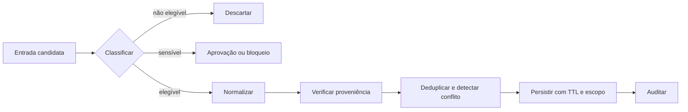

# 05 — Memory Engineering

> [!IMPORTANT]
> Memória não é um histórico infinito. É um subsistema governado que decide o que pode ser lembrado, por quanto tempo, para qual finalidade e com qual evidência.

## Objetivos

- Separar contexto transitório, estado do loop e memória persistente.
- Definir políticas explícitas de gravação, recuperação, atualização, retenção e esquecimento.
- Evitar contaminação por instruções, duplicidade, conflito, vazamento entre usuários e retenção indevida.
- Medir quando a memória melhora a tarefa e quando apenas aumenta custo ou risco.

## Pré-requisitos

[Módulo 04](../04-loop-engineering/README.md); JSON, hashing, testes locais e noções de least privilege.

## O problema real

Sistemas com memória falham de formas diferentes de sistemas sem memória. Um erro pode persistir, reaparecer em tarefas futuras, atravessar sessões ou influenciar decisões sem que o operador saiba de onde veio.

Riscos recorrentes:

1. **contaminação** — conteúdo não confiável é promovido a fato;
2. **vazamento de escopo** — informação de um usuário ou projeto aparece em outro;
3. **conflito silencioso** — registros incompatíveis coexistem sem política de precedência;
4. **retenção excessiva** — dados permanecem além da finalidade;
5. **recuperação irrelevante** — memória aumenta tokens e reduz a qualidade;
6. **falsa autoridade** — lembrança sem proveniência é tratada como evidência.

## Taxonomia NEXUS

| Camada | Finalidade | Persistência típica | Exemplo |
|---|---|---:|---|
| contexto de trabalho | resolver a etapa atual | segundos/minutos | trechos selecionados |
| estado de execução | retomar o loop | duração da execução | budgets e checkpoint |
| memória episódica | registrar eventos passados | dias/meses | decisão aprovada |
| memória semântica | fatos consolidados | variável | preferência validada |
| memória procedural | como executar | versionada | política ou playbook |
| artefato externo | fonte canônica | conforme sistema de origem | documento, banco, ticket |

Memória não substitui a fonte canônica. Quando existe um sistema de registro, a memória deve apontar para ele e registrar versão, data e proveniência.

## Contrato mínimo

```json
{
  "memory_id": "mem-001",
  "subject": "user:123",
  "scope": "project:nexus",
  "type": "semantic",
  "content": "prefere respostas em pt-BR",
  "source": {
    "kind": "explicit_user_statement",
    "reference": "conversation:abc#turn-12"
  },
  "confidence": 1.0,
  "created_at": "2026-07-19T12:00:00Z",
  "expires_at": null,
  "sensitivity": "low",
  "write_policy": "explicit-only",
  "version": 1
}
```

Campos obrigatórios:

- identidade e escopo;
- tipo de memória;
- conteúdo normalizado;
- proveniência;
- confiança;
- sensibilidade;
- timestamps e expiração;
- política que autorizou a escrita;
- versão e hash de integridade.

## Pipeline de escrita



Uma escrita só deve ocorrer quando:

1. existe finalidade declarada;
2. o escopo é conhecido;
3. a fonte é rastreável;
4. o conteúdo não contém instruções executáveis promovidas indevidamente;
5. a política permite persistência;
6. TTL, exclusão e atualização estão definidos;
7. conflito e duplicidade foram tratados.

## Recuperação segura

A recuperação deve ser filtrada antes de ser inserida no contexto. Use pelo menos:

- correspondência de `subject` e `scope`;
- tipo permitido para a tarefa;
- validade temporal;
- sensibilidade compatível;
- score mínimo de relevância;
- limite de itens e tokens;
- proveniência visível;
- isolamento entre conteúdo e instruções.

```text
retrieve(query, subject, scope, allowed_types, now, token_budget)
→ candidates
→ policy filter
→ relevance rank
→ conflict resolution
→ bounded context package
```

Nunca concatene memória recuperada diretamente às instruções do sistema. Ela deve entrar como dados delimitados e não confiáveis.

## Conflitos e atualização

Políticas permitidas:

- `append` — eventos independentes;
- `replace` — nova declaração explícita substitui a anterior;
- `supersede` — mantém histórico e marca a versão anterior;
- `merge` — apenas para estruturas compatíveis;
- `quarantine` — conflito exige revisão.

A política deve ser determinística. "Escolher a lembrança mais convincente" não é um critério aceitável.

## Esquecimento e governança

Todo sistema precisa oferecer:

- TTL por classe;
- exclusão por `memory_id`, sujeito e escopo;
- tombstone auditável quando necessário;
- exportação legível;
- correção e supersessão;
- bloqueio de escrita para dados proibidos;
- política de minimização.

Exclusão lógica não deve ser apresentada como exclusão física quando backups ou logs ainda retêm o dado.

## Métricas

| Métrica | Pergunta |
|---|---|
| precision@k | quantas memórias recuperadas eram relevantes? |
| task lift | a memória melhorou o resultado? |
| stale rate | quantos itens estavam expirados ou superados? |
| conflict rate | quantos conflitos foram detectados? |
| leakage rate | houve item fora de sujeito/escopo? |
| write acceptance | quantas candidatas foram legitimamente persistidas? |
| deletion completeness | a exclusão atingiu todos os índices declarados? |
| token overhead | qual custo contextual foi adicionado? |

A aprovação exige demonstrar benefício líquido em relação ao baseline sem memória.

## Implementação de referência

```bash
python examples/governed_memory_store.py --self-test
```

O exemplo local prova:

- isolamento de sujeito e escopo;
- TTL;
- deduplicação por conteúdo normalizado;
- supersessão explícita;
- recuperação limitada;
- bloqueio de instrução maliciosa;
- exclusão auditável;
- zero dependências externas.

## Laboratório

- [LAB-501](../../../labs/LAB-501-governed-memory.md) — construir e atacar uma memória governada.

## Projeto

Construa um subsistema de memória que:

1. declare taxonomia e políticas;
2. mantenha fonte e hash;
3. isole sujeitos e escopos;
4. implemente TTL e exclusão;
5. detecte duplicidade e conflito;
6. trate memória como dado não confiável;
7. compare tarefa com e sem memória;
8. gere relatório de auditoria reproduzível.

## Quiz

1. Por que histórico de chat não é automaticamente memória confiável?
2. Qual é a diferença entre estado de execução e memória episódica?
3. Como evitar vazamento entre projetos?
4. Quando uma memória deve ser superseded em vez de apagada?
5. Por que relevância sem política não basta para recuperação?

<details>
<summary>Gabarito comentado</summary>

1. Porque contém conteúdo não validado, instruções, erros e dados sem política de retenção.
2. Estado permite retomar a execução atual; memória episódica registra eventos para uso futuro.
3. Aplicando filtros obrigatórios de sujeito e escopo antes do ranking.
4. Quando o histórico da decisão precisa permanecer auditável.
5. Porque um item relevante ainda pode estar expirado, sensível, fora de escopo ou contaminado.

</details>

## Checklist

- [ ] Cada registro possui sujeito, escopo, tipo, fonte e versão.
- [ ] Escrita é autorizada por política explícita.
- [ ] Dados sensíveis possuem tratamento definido.
- [ ] Recuperação aplica política antes do ranking.
- [ ] Memória entra no prompt como dado não confiável.
- [ ] TTL, correção, supersessão e exclusão são testados.
- [ ] Conflitos não são resolvidos silenciosamente.
- [ ] Existe baseline sem memória.
- [ ] Leakage rate é zero na suíte local.

## Critérios de excelência

| Dimensão | Padrão Premium Elite |
|---|---|
| Governança | 100% das escritas explicadas por política e fonte |
| Isolamento | zero recuperação fora de sujeito e escopo |
| Segurança | zero promoção de instrução não confiável |
| Qualidade | benefício mensurável sobre baseline sem memória |
| Privacidade | retenção mínima, TTL e exclusão verificáveis |
| Reprodutibilidade | autoteste local sem rede, API ou segredo |

## Bibliografia

KLEPPMANN, Martin. *Designing Data-Intensive Applications*. Sebastopol: O'Reilly Media, 2017.

NIST. *Privacy Framework: A Tool for Improving Privacy through Enterprise Risk Management*. Version 1.0, 2020.

## Referências

- NIST Privacy Framework: https://www.nist.gov/privacy-framework
- OWASP Top 10 for LLM Applications — Prompt Injection and Sensitive Information Disclosure: https://owasp.org/www-project-top-10-for-large-language-model-applications/
- RFC 8785 — JSON Canonicalization Scheme: https://www.rfc-editor.org/rfc/rfc8785

> [!WARNING]
> O exemplo demonstra invariantes de arquitetura. Produção exige revisão jurídica, controles de acesso, criptografia, backups, residência de dados e política de incidentes compatíveis com o domínio.

## Próximo passo

Conclua o LAB-501 e valide benefício, isolamento e exclusão antes de conectar memória a um agente real.