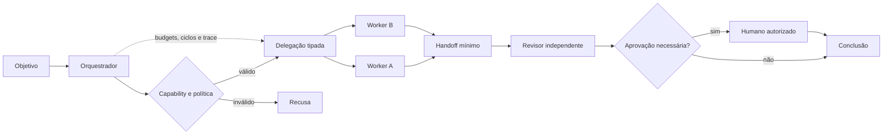

# 06 — Multi-Agent Systems

> [!IMPORTANT]
> Mais agentes não significam mais inteligência. Um sistema multiagente só é justificável quando a decomposição melhora verificavelmente especialização, isolamento, paralelismo ou separação de funções.

## Para quem é este módulo

Este módulo é destinado a estudantes que já conseguem:

- explicar contratos, permissões, memória e stop conditions;
- distinguir agente, workflow e máquina de estados;
- interpretar JSON, logs e testes básicos em Python;
- reconhecer riscos de prompt injection, vazamento de contexto e efeito externo;
- registrar evidências reproduzíveis em Markdown e JSON.

Quem ainda não domina esses pontos deve concluir a [Trilha Zero](../../zero-track/README.md) e revisar os módulos 01 a 05.

## Resultado final observável

Ao final, você deverá entregar um sistema local supervisor–workers que:

- registre agentes por contratos explícitos;
- roteie apenas para capacidades autorizadas;
- use handoffs mínimos, tipados e versionados;
- imponha budgets globais e por agente;
- detecte ciclos e auto-delegação;
- isole tenant, projeto, memória e contexto;
- separe propor, executar, revisar e aprovar;
- tolere falhas parciais sem perder estado válido;
- compare seu desempenho com uma alternativa mais simples;
- produza trace e relatório terminal auditáveis.

## Diagnóstico inicial

Antes de estudar, responda sem consultar o material:

1. Quando múltiplos agentes são realmente necessários?
2. Qual a diferença entre delegação e handoff?
3. Como impedir ampliação de privilégio por um worker?
4. Por que votação entre agentes semelhantes pode criar falsa confiança?
5. Como provar que o custo de coordenação vale a pena?

Registre as respostas. Repita o diagnóstico ao final e compare evolução, lacunas e incertezas.

## Objetivos

- Diferenciar agente único, workflow determinístico e sistema multiagente.
- Justificar decomposição com evidência, não preferência estética.
- Definir papéis, capacidades, limites de autoridade e critérios de seleção.
- Projetar delegação, handoff, escalonamento e encerramento auditáveis.
- Isolar contexto e memória para reduzir vazamento e contaminação.
- Prevenir ciclos, auto-delegação, consenso falso e escalada indevida.
- Medir qualidade, custo, latência, retrabalho, conflitos e segurança.

## Pré-requisitos

- [Módulo 05 — Memory Engineering](../05-memory-engineering/README.md) concluído;
- contratos de agente e tool;
- memória governada;
- noções de least privilege, idempotência e stop conditions;
- Python 3.11+ recomendado;
- nenhuma chave de API é necessária.

## Explicação em três camadas

### Camada 1 — explicação simples

Um sistema multiagente divide uma tarefa entre papéis diferentes. Cada agente deve saber:

- o que pode fazer;
- o que não pode fazer;
- quais dados pode receber;
- quando deve devolver o controle;
- quando deve parar.

### Camada 2 — explicação operacional

O orquestrador registra agentes, valida capacidades, cria delegações, controla budgets, transfere contexto mínimo, detecta ciclos, preserva evidências e encerra a execução com razão tipada.

### Camada 3 — explicação de engenharia

Multi-Agent Systems transforma decomposição de trabalho em um grafo governado de responsabilidades. O desafio principal não é comunicação entre agentes, mas autoridade, isolamento, terminação, consistência, reconciliação e responsabilidade auditável.

## Glossário essencial

| Termo | Definição operacional |
|---|---|
| agente | executor com objetivo, política, estado, tools e limites |
| orquestrador | componente confiável que registra, roteia, valida e encerra |
| supervisor | agente ou controlador que decompõe e acompanha trabalho |
| worker | agente especializado com autoridade limitada |
| delegação | concessão explícita e temporária de objetivo e autoridade |
| handoff | transferência mínima, tipada e rastreável de contexto |
| capability | capacidade registrada e autorizada |
| separation of duties | separação entre propor, executar, revisar e aprovar |
| coordination overhead | custo adicional criado pela coordenação |
| cycle detection | identificação de delegações repetidas ou sem progresso |
| arbitration | decisão explícita diante de conflito |
| trace | sequência auditável de decisões, acessos e efeitos |

## Quando usar múltiplos agentes

Use múltiplos agentes somente quando pelo menos uma condição puder ser demonstrada:

1. **especialização real** — papéis exigem políticas, ferramentas ou critérios distintos;
2. **isolamento** — dados ou permissões não podem coexistir no mesmo contexto;
3. **paralelismo útil** — tarefas independentes reduzem tempo total sem aumentar reconciliação de forma desproporcional;
4. **separação de funções** — quem propõe não deve aprovar ou executar;
5. **redução mensurável de complexidade** — o controlador fica mais simples e verificável.

Evite multiagentes quando um workflow, função ou máquina de estados resolver o problema com menor custo e menor superfície de falha.

## Mapa visual



Descrição textual: o orquestrador valida capacidade e política antes de delegar. Workers recebem escopo mínimo, devolvem artefatos tipados, passam por revisão e, quando necessário, por aprovação humana.

## Padrões arquiteturais

| Padrão | Uso apropriado | Risco dominante |
|---|---|---|
| supervisor–workers | decomposição e controle central | supervisor como gargalo |
| pipeline especializado | sequência estável entre papéis | erro propagado entre etapas |
| debate/revisor | crítica independente | consenso falso e custo |
| router–specialists | seleção por tipo de tarefa | roteamento incorreto |
| blackboard | colaboração por estado compartilhado | contaminação e concorrência |
| swarm restrito | exploração paralela limitada | explosão de custo e ciclos |

## Contrato mínimo de agente

```yaml
agent_id: evidence_reviewer
role: revisar suporte e proveniência
inputs:
  schema: review_request.v1
outputs:
  schema: review_report.v1
allowed_tools:
  - local_reference_index
permissions:
  read: [task_context, cited_sources]
  write: [review_report]
forbidden:
  - alterar artefato final
  - delegar para agente não registrado
  - acessar memória de outro tenant
budgets:
  max_steps: 6
  max_handoffs: 2
  max_tool_calls: 4
termination:
  success: report_valid
  stop: [budget_exhausted, unsafe_request, cycle_detected]
```

Personalidade, estilo ou descrição vaga não substituem autoridade formal.

## Registro de capacidades

O orquestrador deve manter um registro imutável durante a execução contendo:

- `agent_id`;
- versão do contrato;
- schemas aceitos;
- tools permitidas;
- permissões;
- tenant e projeto autorizados;
- budgets;
- política de delegação;
- stop conditions;
- versão do runtime.

Agentes não registrados devem ser recusados.

## Delegação segura

Uma delegação válida contém:

- identificador único;
- origem e destino;
- objetivo limitado;
- schema de entrada e saída;
- contexto mínimo necessário;
- prazo ou budget;
- autoridade concedida;
- critérios de sucesso;
- política de falha;
- cadeia de responsabilidade.

```json
{
  "delegation_id": "del-104",
  "from": "supervisor",
  "to": "evidence_reviewer",
  "objective": "verificar cinco afirmações",
  "context_refs": ["claim-set-7", "source-index-2"],
  "authority": ["read_sources", "write_review"],
  "max_handoffs": 1,
  "return_schema": "review_report.v1"
}
```

O agente delegado não pode ampliar seu próprio escopo, budget, tools, memória ou autoridade.

## Handoff seguro

Handoff não é copiar toda a conversa. Deve transferir somente:

- resumo factual;
- decisões confirmadas;
- incertezas;
- referências para artefatos;
- restrições e políticas;
- efeitos já realizados;
- próximo resultado esperado.

Todo handoff deve possuir hash, versão, origem, destino e classificação de sensibilidade.

## Autoridade e separação de funções

A NEXUS recomenda separar:

- **planner** — propõe plano;
- **executor** — realiza ações autorizadas;
- **reviewer** — verifica resultado e políticas;
- **approver humano** — decide efeitos sensíveis.

Um agente não deve:

- aprovar a própria ampliação de privilégio;
- revisar sozinho o efeito que executou;
- alterar o registro de capacidades;
- escolher credenciais, tenant ou ambiente;
- remover evidência desfavorável do trace.

## Isolamento de contexto e memória

Cada mensagem ou artefato deve declarar:

```text
tenant_id
project_id
run_id
agent_id
delegation_id
classification
provenance
```

O receptor recebe apenas o contexto necessário. Memória compartilhada exige namespace, política de escrita, TTL, proveniência e trilha de auditoria. Estado privado de um agente não deve ser exportado automaticamente.

## Prevenção de ciclos

Controles mínimos:

- `max_handoffs` global e por agente;
- grafo acíclico por padrão;
- detecção de aresta repetida;
- fingerprint do objetivo e do estado;
- budget de custo, tempo e tokens;
- stop condition `cycle_detected`;
- supervisor sem auto-delegação;
- proibição de delegação sem redução verificável de trabalho.

## Conflitos e arbitragem

Quando agentes discordam, preserve:

- propostas separadas;
- evidências de cada posição;
- grau de independência entre agentes;
- critérios de decisão;
- responsável pela arbitragem;
- decisão final e justificativa.

Não use votação simples quando agentes compartilham modelo, dados, prompt ou viés. Diversidade aparente não equivale a independência.

## Falhas parciais e recuperação

O orquestrador deve distinguir:

- agente indisponível;
- saída inválida;
- tarefa não suportada;
- política violada;
- timeout;
- conflito de estado;
- efeito ambíguo;
- resultado insuficiente.

Falha de um worker não exige reiniciar toda a execução. Preserve artefatos válidos, mantenha idempotência e produza plano de recuperação explícito.

## Budgets compartilhados

Defina, no mínimo:

- `max_agents`;
- `max_handoffs`;
- `max_parallel_tasks`;
- `max_total_steps`;
- `max_total_tool_calls`;
- `max_elapsed_ms`;
- `max_coordination_overhead`;
- `max_external_effects`.

Budgets globais têm precedência sobre budgets locais.

## Observabilidade e responsabilidade

Registre:

- grafo real de delegações;
- versões de contratos;
- latência e custo por agente;
- handoffs;
- tools chamadas;
- mudanças de autoridade tentadas;
- acessos a contexto e memória;
- conflitos e arbitragem;
- falhas, retries e recuperação;
- efeitos externos;
- razão terminal;
- responsável humano quando houver aprovação.

Métricas essenciais:

| Métrica | Interpretação |
|---|---|
| task success rate | resultado correto por execução |
| handoff efficiency | handoffs úteis / handoffs totais |
| coordination overhead | custo de coordenação / custo total |
| rework rate | tarefas repetidas por falha de contrato |
| authority violations | tentativas de exceder privilégios |
| context leakage rate | dados indevidos entregues a outro agente |
| cycle rate | execuções interrompidas por ciclo |
| arbitration rate | conflitos que exigiram decisão externa |

## Exemplo mínimo

Considere três papéis locais:

1. `planner` cria uma lista de verificações;
2. `researcher` consulta apenas um índice local simulado;
3. `reviewer` valida evidência e proveniência.

O orquestrador deve impedir que o researcher aprove sua própria saída, que o reviewer execute tools proibidas e que qualquer agente delegue para si mesmo.

## Demonstração executável

Execute:

```bash
python examples/governed_multi_agent_orchestrator.py --self-test
```

A demonstração deve provar:

- roteamento apenas para agentes registrados;
- isolamento por tenant e projeto;
- delegação com autoridade limitada;
- rejeição de ampliação de privilégio;
- detecção de ciclo e auto-delegação;
- limite de handoffs;
- validação de schema;
- falha parcial sem perda do estado válido;
- revisão independente antes de conclusão;
- relatório terminal auditável.

> [!WARNING]
> Se o exemplo não existir ou não executar no ambiente documentado, registre o bloqueio. Não substitua evidência por descrição.

## Prática guiada

1. escolha um problema que aparentemente peça três agentes;
2. desenhe a alternativa com um único agente ou workflow;
3. declare a hipótese de vantagem multiagente;
4. registre três agentes com contratos mínimos;
5. defina um handoff válido e um inválido;
6. configure budgets globais;
7. injete uma falha parcial;
8. registre o trace esperado.

## Prática independente

Projete uma equipe local para revisar um pequeno relatório técnico:

- um agente propõe;
- um agente verifica fontes;
- um agente revisa segurança;
- uma pessoa aprova a publicação.

Compare com um workflow determinístico usando os mesmos casos de teste.

## Testes negativos obrigatórios

- agente não registrado;
- capability inexistente;
- schema inválido;
- tentativa de ampliar privilégio;
- acesso a outro tenant;
- handoff contendo contexto excessivo;
- auto-delegação;
- ciclo A → B → A;
- budget global esgotado;
- reviewer tentando executar efeito externo;
- consenso de agentes correlacionados;
- falha parcial após artefato válido;
- efeito ambíguo sem reconciliação;
- trace incompleto.

## Stop conditions para o estudante

Pare o exercício e peça revisão quando:

- o grafo puder entrar em ciclo sem limite;
- um agente escolher a própria autoridade;
- não houver isolamento por tenant e projeto;
- o sistema não puder reconstruir quem fez cada decisão;
- existir efeito ambíguo sem reconciliação;
- dados sensíveis aparecerem em handoff ou log;
- multiagentes não apresentarem vantagem sobre a alternativa simples.

## Acessibilidade

- diagramas devem possuir descrição textual;
- tabelas devem ter cabeçalhos claros;
- não use somente cor para indicar papéis ou risco;
- exemplos devem ser copiáveis em texto;
- siglas devem ser expandidas na primeira ocorrência;
- instruções devem funcionar com navegação por teclado e leitor de tela no futuro portal;
- vídeos futuros devem possuir legenda e transcrição.

## Laboratório

Execute o [LAB-601](../../../labs/LAB-601-governed-multi-agent-coordination.md).

## Projeto obrigatório

Construa um sistema supervisor–workers que:

1. registre agentes por contrato;
2. roteie tarefas por capacidade declarada;
3. aplique escopo e least privilege;
4. transfira contexto mínimo por handoff;
5. limite ciclos, custo e delegações;
6. separe produção, revisão e aprovação;
7. tolere falha parcial;
8. gere trace completo e relatório terminal;
9. compare com agente único ou workflow;
10. documente risco residual.

## Avaliação

A avaliação combina:

- diagnóstico inicial e final;
- autoteste da implementação de referência;
- LAB-601;
- projeto obrigatório;
- testes negativos;
- comparação com baseline simples;
- defesa técnica de dez minutos;
- autoavaliação pela [rubrica transversal](../../rubrics/transversal-rubric.md).

Segurança, isolamento, terminação e rastreabilidade são critérios de bloqueio.

## Rubrica específica

| Nível | Evidência |
|---|---|
| insuficiente | multiagentes sem justificativa, contratos vagos, ciclos ou vazamento |
| funcional | papéis e handoffs básicos funcionam com controle mínimo |
| robusta | autoridade, isolamento, falhas parciais, budgets e trace são testados |
| excelente | vantagem sobre baseline é demonstrada com segurança, acessibilidade e auditoria completas |

## Quiz

1. Qual evidência justifica adotar múltiplos agentes?
2. Por que handoff não deve copiar toda a conversa?
3. Como impedir que um worker amplie autoridade?
4. Por que votação entre agentes pode produzir falsa confiança?
5. Qual métrica revela excesso de coordenação?

<details>
<summary>Gabarito comentado</summary>

1. Melhoria mensurável de especialização, isolamento, paralelismo, separação de funções ou complexidade.
2. Porque aumenta custo, vazamento, prompt injection e ambiguidade de autoridade.
3. Autoridade imutável no contrato, validação no orquestrador e rejeição de capacidades não concedidas.
4. Porque agentes semelhantes podem compartilhar modelo, dados e vieses, tornando votos correlacionados.
5. `coordination overhead`, complementada por handoffs, latência e retrabalho.

</details>

## Checklist

- [ ] Multiagentes demonstram vantagem sobre alternativa mais simples.
- [ ] Todo agente possui contrato, schema, budgets e permissões.
- [ ] Delegações têm objetivo, autoridade e retorno tipado.
- [ ] Handoffs transferem somente contexto necessário.
- [ ] Grafo de delegação possui controle de ciclos e auto-delegação.
- [ ] Papéis de propor, executar, revisar e aprovar estão separados.
- [ ] Falhas parciais preservam artefatos válidos.
- [ ] Contexto e memória são isolados por tenant e projeto.
- [ ] Budgets globais têm precedência sobre budgets locais.
- [ ] Telemetria permite reconstruir decisões, acessos e efeitos.
- [ ] Testes adversariais cobrem autoridade, ciclo, vazamento, schema e falha parcial.
- [ ] Risco residual está documentado.

## Autoavaliação

Consigo explicar e demonstrar:

- por que multiagentes são necessários neste caso;
- como cada agente recebe autoridade;
- como handoffs são limitados;
- como ciclos são detectados;
- como falhas parciais são tratadas;
- como o sistema impede vazamento;
- como o custo de coordenação é medido;
- quem responde por cada decisão e efeito.

## Critérios de excelência

| Dimensão | Padrão Premium Elite |
|---|---|
| Justificativa | ganho demonstrado frente a agente único ou workflow |
| Governança | 100% dos agentes e delegações possuem contrato válido |
| Segurança | zero ampliação de privilégio e zero vazamento entre escopos |
| Terminação | ciclos e budgets encerram de forma determinística |
| Resiliência | falha parcial não duplica efeitos nem perde estado válido |
| Eficiência | coordination overhead é medido e limitado |
| Evidência | trace, métricas e relatório permitem auditoria completa |
| Acessibilidade | conteúdo possui alternativas textuais e estrutura navegável |

## Bibliografia

WOOLDRIDGE, Michael. *An Introduction to MultiAgent Systems*. 2. ed. Wiley, 2009.

HUEBSCHER, Markus C.; MCCANN, Julie A. A survey of autonomic computing. *ACM Computing Surveys*, v. 40, n. 3, 2008.

## Referências

- NIST — AI Risk Management Framework: https://www.nist.gov/itl/ai-risk-management-framework
- OWASP — Agentic AI Threats and Mitigations: https://genai.owasp.org/
- Microsoft — Multi-agent reference architecture: https://learn.microsoft.com/azure/architecture/ai-ml/guide/multi-agent-system

> [!WARNING]
> Frameworks podem facilitar mensagens e roteamento, mas não substituem contratos de autoridade, isolamento, terminação, avaliação, privacidade e resposta a incidentes.

## Próximo passo

Conclua o LAB-601, compare contra uma arquitetura mais simples e obtenha nível funcional ou superior antes de avançar para [07 — Evaluation Engineering](../07-evaluation-engineering/README.md).