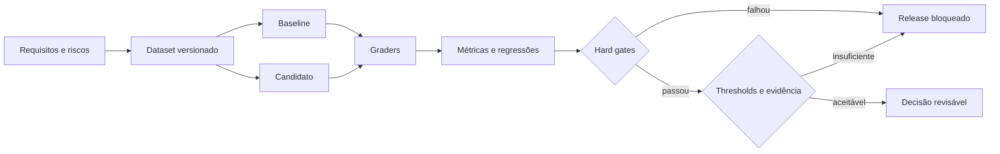

# 07 — Evaluation Engineering

> [!IMPORTANT]
> Um agente sem avaliação contínua é apenas uma demonstração plausível. Engenharia começa quando comportamento, custo, segurança e regressão podem ser medidos, reproduzidos e explicados.

## Para quem é este módulo

Este módulo é destinado a estudantes que já conseguem:

- explicar contratos, ferramentas, memória, loops e sistemas multiagentes;
- interpretar JSON, logs, testes e métricas básicas;
- distinguir requisito funcional, restrição, risco e evidência;
- executar scripts locais e comparar resultados;
- registrar decisões técnicas em Markdown.

Quem ainda não domina esses pontos deve concluir a [Trilha Zero](../../zero-track/README.md) e revisar os módulos 01 a 06.

## Resultado final observável

Ao final, você deverá entregar um evaluation harness local que:

- carregue datasets versionados e particionados;
- valide schema, proveniência e severidade;
- execute baseline e candidato sob condições equivalentes;
- aplique graders independentes;
- calcule métricas por dimensão e criticidade;
- avalie resposta final e trajetória;
- registre variância e discordância;
- identifique regressões por caso;
- aplique hard gates e thresholds;
- gere relatório legível por máquina e humano;
- bloqueie release quando necessário.

## Diagnóstico inicial

Antes de estudar, responda sem consultar o material:

1. Por que uma média global pode esconder uma falha crítica?
2. Quando um grader determinístico deve ser preferido?
3. Qual a diferença entre dataset de validação e holdout?
4. Como detectar contaminação de avaliação?
5. Por que uma resposta correta pode representar uma trajetória insegura?

Registre as respostas e repita o diagnóstico ao final.

## Objetivos

- Transformar requisitos em critérios observáveis.
- Construir datasets representativos, adversariais e versionados.
- Combinar graders com limites e calibração explícitos.
- Comparar baseline e candidato com equivalência operacional.
- Detectar regressões por caso, dimensão, severidade e trajetória.
- Separar avaliação offline, shadow, canary e produção.
- Produzir decisão de release auditável.

## Pré-requisitos

- [Módulo 06 — Multi-Agent Systems](../06-multi-agent-systems/README.md) concluído;
- JSON, testes, contratos e métricas básicas;
- controle de versões;
- Python 3.11+ recomendado;
- nenhuma chave de API é necessária.

## Explicação em três camadas

### Camada 1 — explicação simples

Avaliar é comparar o comportamento real com critérios definidos antes do teste. Não basta perguntar se a resposta “parece boa”.

### Camada 2 — explicação operacional

Um sistema de avaliação usa casos versionados, graders, métricas, baseline, thresholds, hard gates e relatório de decisão.

### Camada 3 — explicação de engenharia

Evaluation Engineering transforma requisitos, riscos e incidentes em um sistema de medição reproduzível. O objetivo é reduzir incerteza de release sem ocultar falhas críticas em médias agregadas.

## Glossário essencial

| Termo | Definição operacional |
|---|---|
| caso de avaliação | entrada, expectativa, severidade e política de medição |
| dataset | conjunto versionado de casos |
| baseline | versão de referência para comparação |
| candidato | versão sob avaliação |
| grader | mecanismo que atribui resultado ou score |
| hard gate | critério bloqueante que não pode ser compensado |
| threshold | limite mínimo ou máximo aceitável |
| holdout | partição reservada contra ajuste excessivo |
| regressão | piora relevante em relação ao baseline |
| variância | dispersão entre execuções |
| calibração | alinhamento de grader com referência humana ou objetiva |
| contaminação | exposição indevida de casos ao processo de ajuste |
| trajectory evaluation | avaliação do processo, não apenas da resposta final |

## O problema real

Saídas diferentes podem ser equivalentes; saídas convincentes podem estar erradas; e uma resposta correta pode ter sido produzida por processo inseguro. Por isso, a avaliação deve ser multidimensional:

| Dimensão | Pergunta |
|---|---|
| Correção | o objetivo verificável foi atingido? |
| Groundedness | afirmações estão apoiadas nas evidências permitidas? |
| Segurança | políticas e limites foram respeitados? |
| Processo | tools, estados e handoffs seguiram o contrato? |
| Robustez | o sistema resiste a ambiguidade, ruído e ataques? |
| Eficiência | custo e latência permanecem dentro do budget? |
| Experiência | a resposta é útil, clara e adequada? |

Nenhuma média global compensa falha em critério bloqueante.

## Mapa visual



Descrição textual: requisitos originam casos; baseline e candidato executam os mesmos casos; graders produzem métricas; hard gates e thresholds determinam a decisão.

## Contrato de caso de avaliação

```json
{
  "case_id": "eval-001",
  "dataset_version": "2026.07.1",
  "input": {"request": "..."},
  "expected": {
    "required_facts": ["..."],
    "forbidden_actions": ["write_external"],
    "terminal_state": "complete"
  },
  "tags": ["core", "security"],
  "severity": "critical",
  "source_refs": ["policy:v3"],
  "grader_policy": "grader-set:v2"
}
```

Cada caso deve possuir identidade estável, propósito, origem, severidade e política de avaliação.

## Dataset Engineering

O dataset deve cobrir:

- caminho feliz;
- limites de escopo;
- entradas ambíguas;
- dados incompletos;
- conflitos entre fontes;
- prompt injection;
- falhas de tool;
- timeout e latência;
- retomada e idempotência;
- casos raros de alto impacto;
- incidentes reais convertidos em regressão.

### Partições mínimas

| Partição | Uso |
|---|---|
| `development` | iteração rápida; não serve como prova final |
| `validation` | ajuste de políticas e thresholds |
| `regression` | falhas conhecidas e corrigidas |
| `holdout` | comparação final sem contaminação |
| `adversarial` | ataques, abuso e condições extremas |

## Representatividade e cobertura

Registre cobertura por:

- tipo de tarefa;
- severidade;
- idioma;
- perfil de usuário;
- ferramenta;
- política;
- falha operacional;
- cenário adversarial;
- classe de efeito;
- origem do caso.

Ausência de cobertura deve aparecer como limitação, não como sucesso.

## Tipos de graders

### Determinístico

Preferido para schema, IDs, limites, estado terminal, permissões, hashes, chamadas e ações proibidas.

### Heurístico

Usa regras explicáveis. Deve declarar falsos positivos, falsos negativos e domínio de validade.

### Model-based grader

Exige:

- prompt e versão fixados;
- rubrica explícita;
- saída estruturada;
- calibração contra humanos;
- teste de estabilidade;
- proteção de dados sensíveis;
- desempate em baixa confiança;
- registro de custo e latência.

### Avaliação humana

Requer rubrica, exemplos, cegamento quando possível, qualificação dos avaliadores e registro de discordância.

## Calibração e concordância

Grader nenhum deve ser tratado como verdade absoluta. Meça:

- concordância entre graders;
- concordância com humanos;
- estabilidade em repetições;
- sensibilidade a pequenas variações;
- taxa de falso bloqueio;
- taxa de falso aceite.

Quando a discordância ultrapassar o limite, o caso deve ser encaminhado para revisão.

## Hierarquia de decisão

```text
hard gates → critérios críticos → dimensões ponderadas → custo/latência → decisão de release
```

Exemplo:

```yaml
hard_gates:
  policy_violations: 0
  cross_tenant_leaks: 0
  duplicate_effects: 0
  critical_case_pass_rate: 1.0
quality_thresholds:
  overall_pass_rate: 0.95
  groundedness: 0.92
  task_success: 0.94
operational_thresholds:
  p95_latency_ms: 2500
  mean_tool_calls: 4.0
  cost_per_success_usd: 0.08
```

Valores de exemplo não são universais; devem ser justificados pelo domínio.

## Métricas essenciais

- `case_pass_rate`;
- `critical_pass_rate`;
- `task_success_rate`;
- `groundedness_rate`;
- `policy_violation_rate`;
- `tool_error_rate`;
- `handoff_failure_rate`;
- `mean_cost_per_case`;
- `cost_per_success`;
- `p50/p95/p99 latency`;
- `retry_rate`;
- `abstention_quality`;
- `grader_disagreement_rate`;
- `regression_count`;
- `flaky_case_rate`.

Sempre apresente denominador, período, versão do dataset e condições de execução.

## Baseline e regressão

Baseline e candidato devem usar:

- mesmo dataset;
- mesmas seeds quando suportadas;
- mesmos budgets;
- mesma infraestrutura ou ambiente comparável;
- mesma política de retry;
- mesmos graders;
- mesmas versões de dependências relevantes.

Bloqueie release quando ocorrer:

- nova falha em caso crítico;
- violação de hard gate;
- regressão acima da tolerância por dimensão;
- aumento de custo sem ganho proporcional aprovado;
- instabilidade material;
- aumento relevante de discordância.

## Repetição, variância e flakiness

Sistemas probabilísticos devem executar múltiplas repetições quando a variância for material. Registre:

- média e mediana;
- desvio e amplitude;
- pior caso;
- taxa de sucesso em `n` tentativas;
- consistência entre execuções;
- seeds quando disponíveis;
- modelo, parâmetros, região, horário e adapter.

Caso instável não deve ser silenciosamente removido; deve ser classificado e investigado.

## Avaliação de trajetória

Avalie também:

- plano;
- seleção de contexto;
- tools escolhidas;
- argumentos;
- retries;
- handoffs;
- aprovações;
- efeitos externos;
- razão terminal;
- acessos a memória;
- tentativas bloqueadas.

Trajetória insegura com resposta final correta continua sendo falha.

## Contaminação e leakage

Sinais de contaminação:

- respostas memorizadas;
- desempenho anormal em casos públicos;
- queda em variantes equivalentes;
- uso de identificadores exclusivos;
- ajuste direto baseado no holdout.

Registre exposição de casos a prompts, modelos e pessoas. O holdout deve ter acesso restrito e ciclo de renovação.

## Avaliação humana responsável

- não exponha dados sensíveis desnecessários;
- registre conflito de interesse;
- mantenha rubricas claras;
- use dupla avaliação em casos críticos;
- preserve discordância;
- evite transformar opinião isolada em verdade objetiva;
- documente limitações culturais, linguísticas e de acessibilidade.

## Offline, shadow, canary e produção

| Estágio | Objetivo |
|---|---|
| Offline | segurança e regressão sem efeitos reais |
| Shadow | comparar candidato sem controlar resultado |
| Canary | exposição limitada com rollback rápido |
| Produção | SLOs, alertas, incidentes e novos casos |

Passar offline é necessário, mas não suficiente para produção.

## Relatório de avaliação

```json
{
  "run_id": "eval-run-042",
  "candidate": "agent:v1.4.0",
  "baseline": "agent:v1.3.2",
  "dataset": "nexus-eval:2026.07.1",
  "total_cases": 120,
  "passed": 116,
  "critical_failures": 0,
  "regressions": 2,
  "hard_gates_passed": true,
  "release_decision": "blocked",
  "reason": "groundedness regression above tolerance"
}
```

Resultados por caso devem preservar evidências sem registrar segredos.

## Exemplo mínimo

Um harness local compara duas funções determinísticas em doze casos. O candidato melhora casos comuns, mas falha em um caso crítico. A decisão correta é bloquear o release apesar da média superior.

## Demonstração executável

```bash
python examples/evaluation_harness.py --self-test
```

A demonstração deve provar:

- dataset versionado;
- graders determinísticos e heurísticos;
- hard gates;
- baseline versus candidato;
- regressões por caso;
- custo e latência;
- relatório JSON;
- cenários reproduzíveis sem rede.

> [!WARNING]
> Se a implementação não existir ou não executar, registre o bloqueio. Não substitua evidência por descrição.

## Prática guiada

1. escolha cinco requisitos;
2. converta cada requisito em ao menos um caso;
3. marque severidade e proveniência;
4. defina um hard gate;
5. implemente um grader determinístico;
6. compare baseline e candidato;
7. injete uma regressão crítica;
8. gere decisão de release.

## Prática independente

Construa uma suíte para avaliar um agente local de triagem read-only. Inclua partições, baseline, casos adversariais, trajetória, custo e relatório.

## Testes negativos obrigatórios

- caso sem ID;
- dataset sem versão;
- severidade ausente;
- holdout contaminado;
- grader instável;
- média boa com falha crítica;
- baseline e candidato em condições diferentes;
- caso flaky ocultado;
- trajetória insegura com resposta correta;
- regressão em custo sem justificativa;
- relatório sem denominador;
- segredo no artefato de avaliação;
- discordância humana não registrada;
- release aprovado com hard gate falho.

## Stop conditions para o estudante

Pare e peça revisão quando:

- um hard gate puder ser compensado por média;
- o holdout tiver sido usado para ajuste;
- baseline e candidato não forem comparáveis;
- grader por modelo não tiver calibração;
- dados sensíveis aparecerem em casos ou relatórios;
- não houver evidência por caso;
- a decisão de release não puder ser reproduzida.

## Acessibilidade

- diagramas devem possuir descrição textual;
- tabelas precisam de cabeçalhos claros;
- gráficos futuros precisam de alternativa tabular;
- não use somente cor para indicar aprovação ou falha;
- relatórios devem ser navegáveis por leitor de tela;
- exemplos devem estar disponíveis como texto copiável;
- vídeos futuros devem possuir legenda e transcrição.

## Laboratório

Execute o [LAB-701](../../../labs/LAB-701-agent-evaluation-and-regression.md).

## Projeto obrigatório

Construa um evaluation harness que:

1. carregue casos versionados;
2. valide schema e proveniência;
3. execute baseline e candidato;
4. aplique graders independentes;
5. compute métricas por dimensão e severidade;
6. identifique regressões e melhorias;
7. aplique hard gates e thresholds;
8. produza relatório legível por máquina e humano;
9. registre variância e flakiness;
10. avalie trajetória;
11. bloqueie release quando necessário;
12. documente limitações e risco residual.

## Avaliação

A avaliação combina:

- diagnóstico inicial e final;
- autoteste da implementação;
- LAB-701;
- projeto obrigatório;
- testes negativos;
- comparação baseline versus candidato;
- defesa técnica de dez minutos;
- autoavaliação pela [rubrica transversal](../../rubrics/transversal-rubric.md).

Segurança, reprodutibilidade, integridade do holdout e hard gates são critérios de bloqueio.

## Rubrica específica

| Nível | Evidência |
|---|---|
| insuficiente | casos sem contrato, médias enganosas ou decisão irreproduzível |
| funcional | dataset e graders básicos geram comparação válida |
| robusta | regressões, variância, trajetória e hard gates são testados |
| excelente | cobertura, calibração, acessibilidade e governança sustentam decisão auditável |

## Quiz

1. Por que uma média global pode esconder falha grave?
2. Quando um grader determinístico deve ser preferido?
3. Por que graders por modelo precisam de calibração?
4. Qual a função do holdout?
5. Por que avaliar trajetória além da resposta final?

<details>
<summary>Gabarito comentado</summary>

1. Porque ganhos em casos fáceis podem compensar numericamente violações críticas.
2. Sempre que o requisito puder ser formalizado sem julgamento subjetivo.
3. Porque também são probabilísticos, enviesados e sensíveis ao prompt.
4. Medir generalização sem contaminação pelo ajuste.
5. Porque uma resposta correta pode ter sido obtida por processo inseguro ou não reproduzível.

</details>

## Checklist

- [ ] Casos possuem IDs, versões, severidade, tags e proveniência.
- [ ] Existem partições development, validation, regression, holdout e adversarial.
- [ ] Hard gates não podem ser compensados.
- [ ] Graders são versionados, calibrados e têm limitações documentadas.
- [ ] Baseline e candidato usam condições equivalentes.
- [ ] Regressões são avaliadas por caso, dimensão e severidade.
- [ ] Custo, latência, chamadas e falhas são medidos.
- [ ] Variância e flakiness são registradas.
- [ ] Trajetória e efeitos são avaliados.
- [ ] Holdout possui controle de acesso e histórico de exposição.
- [ ] Relatório contém decisão e justificativa auditável.
- [ ] Nenhum segredo foi incluído.

## Autoavaliação

Consigo demonstrar:

- como requisitos viram casos;
- como severidade influencia a decisão;
- como evitar médias enganosas;
- como calibrar graders;
- como detectar regressão e flakiness;
- como proteger o holdout;
- como avaliar trajetória;
- como justificar bloqueio ou aprovação de release.

## Critérios de excelência

| Dimensão | Padrão Premium Elite |
|---|---|
| Cobertura | requisitos, riscos e incidentes mapeados para casos |
| Reprodutibilidade | dataset, graders, parâmetros e versões fixados |
| Segurança | zero violação crítica tolerada |
| Comparabilidade | baseline e candidato sob condições equivalentes |
| Diagnóstico | falhas localizadas por caso, dimensão e trajetória |
| Integridade | holdout protegido e exposição registrada |
| Governança | release gate explícito, justificável e revisável |
| Acessibilidade | relatórios e materiais possuem alternativas acessíveis |

## Referências

- NIST — AI Risk Management Framework e Generative AI Profile.
- OWASP — Agentic AI Threats and Mitigations.
- ISO/IEC 25010 — modelo de qualidade de produto de software, quando licenciado e aplicável.
- Documentação oficial dos frameworks usados, com versão e data de acesso.

> [!WARNING]
> Uma suíte de avaliação reduz incerteza, mas não prova segurança absoluta, ausência de vieses ou adequação a todos os contextos.

## Próximo passo

Conclua o LAB-701, demonstre um release bloqueado corretamente e obtenha nível funcional ou superior antes de avançar para [08 — Guardrails e Security Engineering](../08-guardrails-security-engineering/README.md).