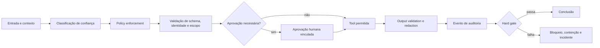

# 08 — Guardrails & Security Engineering

> [!IMPORTANT]
> Segurança em agentes não é um filtro adicionado ao final. É uma propriedade arquitetural composta por fronteiras, autoridade mínima, validação, isolamento, observabilidade, resposta a incidentes e capacidade de interrupção.

## Para quem é este módulo

Este módulo é destinado a estudantes que já conseguem:

- explicar contratos, tools, memória, multiagentes e evaluation harnesses;
- interpretar JSON, logs, políticas e testes automatizados;
- distinguir conteúdo não confiável de instruções autorizadas;
- reconhecer efeito externo, aprovação, idempotência e reconciliação;
- registrar evidências técnicas e limitações sem alegar segurança absoluta.

Quem ainda não domina esses pontos deve concluir a [Trilha Zero](../../zero-track/README.md) e revisar os módulos 01 a 07.

## Resultado final observável

Ao final, você deverá entregar um gateway local de segurança que:

- aplique deny-by-default e least privilege;
- separe instruções confiáveis de conteúdo não confiável;
- valide schema, identidade, tenant, escopo e intenção;
- bloqueie prompt injection, exfiltração e confused deputy;
- exija aprovação vinculada ao artefato exato;
- proteja segredos, memória, handoffs e logs;
- gere eventos de segurança estruturados;
- implemente kill switch, contenção e rollback simulado;
- execute suíte adversarial reproduzível;
- produza decisão de release auditável.

## Diagnóstico inicial

Antes de estudar, responda sem consultar o material:

1. Por que prompt injection não é resolvida apenas com outro prompt?
2. Qual a diferença entre validação de schema, autorização e policy enforcement?
3. Como ocorre confused deputy em sistemas multiagentes?
4. O que uma aprovação segura precisa vincular?
5. Quais violações devem bloquear release mesmo quando a média geral é boa?

Registre as respostas. Repita o diagnóstico ao final e compare evolução, lacunas e incertezas.

## Objetivos

- Construir threat models específicos para agentes, ferramentas, memória, MCP e multiagentes.
- Separar conteúdo não confiável de instruções autorizadas.
- Aplicar least privilege, deny-by-default e aprovação humana vinculada ao artefato exato.
- Evitar exfiltração, confusão de autoridade, tool abuse, persistência maliciosa e cross-tenant leakage.
- Projetar detecção, contenção, recuperação e resposta a incidentes.
- Criar testes de segurança locais, reproduzíveis e executáveis em CI.

## Pré-requisitos

- [Módulo 07 — Evaluation Engineering](../07-evaluation-engineering/README.md) concluído;
- contratos de agente e tools;
- threat modeling básico;
- testes automatizados e hard gates;
- least privilege, idempotência e stop conditions;
- Python 3.11+ recomendado;
- nenhuma chave de API é necessária.

## Explicação em três camadas

### Camada 1 — explicação simples

Um guardrail é uma barreira de segurança. Ele decide:

- quem pode agir;
- sobre quais dados;
- com quais ferramentas;
- sob quais limites;
- quando precisa de aprovação;
- quando deve bloquear e registrar o incidente.

### Camada 2 — explicação operacional

A segurança de agentes combina políticas externas ao modelo, validação determinística, isolamento, allowlists, aprovação por hash, redaction, eventos de segurança, hard gates e resposta a incidentes.

### Camada 3 — explicação de engenharia

Security Engineering trata o agente como componente probabilístico dentro de uma arquitetura de confiança limitada. O modelo pode propor, mas identidade, autoridade, escopo, política, execução e auditoria pertencem a componentes determinísticos e revisáveis.

## Glossário essencial

| Termo | Definição operacional |
|---|---|
| ativo | dado, capacidade ou serviço que precisa ser protegido |
| ator | pessoa, sistema ou agente que interage com o ativo |
| fronteira de confiança | ponto onde muda o nível de confiança |
| threat model | mapa de ativos, atores, abusos, controles e evidências |
| guardrail | controle que restringe ou valida comportamento |
| policy enforcement point | componente que aplica política antes do efeito |
| confused deputy | uso indevido da autoridade de outro componente |
| exfiltração | saída não autorizada de dado ou segredo |
| fail closed | bloquear quando política, identidade ou integridade falham |
| redaction | remoção ou mascaramento de dado sensível |
| kill switch | mecanismo de interrupção imediata |
| residual risk | risco que permanece após controles |

## Mapa visual



Descrição textual: toda entrada é classificada, passa por política e validação, recebe aprovação quando necessário, executa somente tools permitidas e tem output revisado antes da conclusão.

## Superfícies de ataque

| Superfície | Exemplos |
|---|---|
| Entrada | prompt injection, conteúdo adversarial, encoding enganoso |
| Contexto | documentos contaminados, instruções ocultas, proveniência ausente |
| Ferramentas | argumentos fora do schema, path traversal, SSRF, mutação indevida |
| Memória | persistência maliciosa, vazamento, dados obsoletos |
| Multiagentes | confused deputy, ampliação de autoridade, handoff adulterado |
| Segredos | logs, exceções, prompts, artefatos e commits |
| Saída | PII, credenciais, falsa autorização, dado de outro tenant |
| Operação | ausência de kill switch, alertas incompletos, rollback impossível |

## Threat modeling NEXUS

Use o fluxo:

```text
ativos → atores → fronteiras de confiança → capacidades → abuso → controles → evidências
```

Para cada ameaça, registre:

```yaml
threat_id: THR-001
asset: customer_records
trust_boundary: untrusted_retrieved_document
abuse_case: document attempts to instruct export of records
preconditions:
  - retriever accepts external content
  - tool can access customer data
controls:
  - content/instruction separation
  - least privilege
  - approval gate
  - output DLP
verification:
  - adversarial test case
  - structured security event
residual_risk: low
owner: security
```

## Princípios obrigatórios

1. **Deny by default** — capacidades precisam ser explicitamente concedidas.
2. **Least privilege** — cada agente recebe somente ferramentas, escopos e dados necessários.
3. **Assume breach** — conteúdo recuperado e outputs de outros agentes permanecem não confiáveis.
4. **Complete mediation** — toda chamada sensível atravessa o policy enforcement point.
5. **Fail closed** — erro de política, schema, identidade ou aprovação bloqueia a ação.
6. **Separation of duties** — planejar, executar, revisar e aprovar não compartilham autoridade irrestrita.
7. **Evidence before release** — ausência de teste adversarial é bloqueador de release.
8. **Defense in depth** — nenhum controle isolado é tratado como suficiente.
9. **Minimização** — colete, transfira e retenha somente o necessário.
10. **Human accountability** — efeitos sensíveis mantêm responsável humano identificável.

## Prompt injection

Conteúdo externo pode conter texto semelhante a instruções, mas não ganha autoridade por estar no contexto.

```json
{
  "trusted_instructions": ["system policy", "approved task contract"],
  "untrusted_content": ["retrieved page", "email body", "tool output"],
  "allowed_actions": ["summarize", "extract"],
  "forbidden_actions": ["reveal secrets", "change policy", "expand scope"]
}
```

Controles mínimos:

- proveniência por item;
- delimitação e rotulagem do conteúdo;
- política fora do conteúdo recuperado;
- allowlist de ações e ferramentas;
- validação de argumentos após o modelo;
- bloqueio de tentativas de alterar permissões, tenant ou destino;
- redaction antes de persistência e logs;
- avaliação adversarial com variantes diretas, indiretas e obfuscadas.

## Tool security

Toda ferramenta sensível precisa de:

- schema estrito;
- validação semântica;
- escopo de recursos;
- limites de volume;
- idempotência;
- timeout;
- classificação de efeito;
- preview;
- aprovação quando aplicável;
- reconciliação pós-efeito;
- evento de auditoria;
- stop condition e rollback ou compensação.

## Aprovação humana segura

Aprovação não é booleano genérico. Ela precisa estar vinculada a:

- identidade e papel do aprovador;
- ação;
- tenant e projeto;
- argumentos canônicos;
- hash do preview;
- política vigente;
- prazo de expiração;
- contexto de risco;
- versão do executor.

Qualquer alteração invalida a aprovação.

## Segredos e dados sensíveis

Regras:

- nunca incluir segredo em prompt quando um token opaco resolve;
- não registrar headers, credenciais ou payloads sensíveis;
- usar secrets manager em produção;
- rotacionar credenciais de curta duração;
- separar credenciais por ambiente, tenant e função;
- impedir commits de segredos;
- aplicar redaction em erros, traces e artefatos;
- testar logs, exceções e relatórios por vazamento;
- revogar e rotacionar imediatamente quando houver exposição.

## Memória segura

Antes de persistir:

- classificar sensibilidade;
- remover segredos e PII desnecessária;
- verificar autoridade de escrita;
- aplicar tenant e project scope;
- bloquear instruções persistentes originadas de conteúdo não confiável;
- registrar proveniência, TTL e finalidade;
- definir correção, exclusão e quarentena;
- impedir que memória substitua fonte canônica.

## Multiagentes e confused deputy

Um agente não pode usar a autoridade de outro para realizar ação que ele próprio não poderia executar. Handoffs devem carregar intenção, escopo e capacidades delegadas, nunca autoridade implícita.

Bloqueie:

- delegação para agente não registrado;
- aumento de capabilities no handoff;
- troca de tenant;
- reuso de aprovação entre payloads;
- cadeia circular;
- execução por reviewer ou planner sem capacidade explícita;
- acesso a memória privada de outro agente;
- alteração do registro de capacidades durante a execução.

## Output security

Antes da resposta ou efeito:

- verificar schema;
- detectar segredo, PII e dados de outro tenant;
- validar citações e proveniência;
- rejeitar afirmação de ação não comprovada;
- aplicar disclosure mínimo;
- remover detalhes operacionais que ampliem risco;
- registrar motivo de bloqueio sem expor dado sensível.

## Segurança operacional

Todo sistema de produção deve possuir:

- kill switch;
- budgets por execução e tenant;
- rate limits;
- circuit breaker;
- eventos de segurança estruturados;
- alertas acionáveis;
- rollback ou compensação;
- runbook de incidente;
- retenção e acesso de logs governados;
- identidade de operador;
- procedimento de revogação de credenciais;
- comunicação de incidente proporcional ao impacto.

## Resposta a incidentes

Fluxo mínimo:

```text
detectar → classificar → conter → preservar evidência → erradicar → recuperar → revisar
```

O relatório deve incluir:

- horário e origem;
- ativo afetado;
- tenant e escopo;
- decisões e tools envolvidas;
- dados potencialmente expostos;
- contenção aplicada;
- credenciais revogadas;
- risco residual;
- novo caso de regressão criado.

## Red teaming

O conjunto adversarial deve incluir:

- injeção direta e indireta;
- encoding e obfuscação;
- exfiltração de segredo;
- path traversal e argumentos maliciosos;
- SSRF simulada;
- aprovação adulterada ou expirada;
- confused deputy;
- cross-tenant leakage;
- memory poisoning;
- adulteração de handoff;
- abuso de custo e loops;
- evasão de logging;
- falsa alegação de execução;
- tentativa de desativar guardrails.

Red teaming deve permanecer autorizado, isolado, reproduzível e sem acesso a dados reais desnecessários.

## Métricas

| Métrica | Interpretação |
|---|---|
| attack success rate | ataques que alcançam efeito proibido |
| blocked-before-tool rate | ataques interrompidos antes da chamada |
| secret exposure rate | outputs ou logs contendo segredo |
| cross-tenant leakage rate | dados retornados fora do escopo |
| false positive rate | ações legítimas bloqueadas |
| approval integrity rate | aprovações válidas e corretamente vinculadas |
| mean time to detect | tempo até gerar evento ou alerta |
| mean time to contain | tempo até bloquear ou revogar capacidade |
| audit completeness | eventos com contexto suficiente para reconstrução |
| regression recurrence | falhas conhecidas que reapareceram |

## Hard gates de release

Release deve falhar quando houver:

- qualquer exfiltração de segredo;
- qualquer efeito sensível sem aprovação válida;
- qualquer vazamento entre tenants;
- qualquer ampliação de autoridade;
- qualquer chamada fora da allowlist;
- qualquer aprovação aceita com hash divergente;
- ausência de trilha de auditoria para efeito externo;
- teste crítico ausente ou não executado;
- kill switch inoperante;
- efeito ambíguo sem reconciliação;
- risco crítico ou alto sem tratamento e aprovação humana.

## Exemplo mínimo

Um gateway local recebe uma intenção simulada, um tenant e um pacote de conteúdo não confiável. Ele deve:

1. classificar a entrada;
2. validar schema e escopo;
3. aplicar allowlist;
4. exigir aprovação quando necessário;
5. bloquear segredo e prompt injection;
6. gerar evento estruturado;
7. concluir ou falhar fechado.

## Demonstração executável

```bash
python examples/security_guardrails.py --self-test
```

A implementação local deve provar controles de política sem API, rede ou credenciais.

> [!WARNING]
> Se o exemplo não existir ou não executar no ambiente documentado, registre o bloqueio. Não substitua evidência de execução por descrição.

## Prática guiada

1. escolha um ativo e um ator;
2. desenhe duas fronteiras de confiança;
3. registre três abuse cases;
4. defina controles preventivos, detectivos e de recuperação;
5. crie um hard gate;
6. injete uma tentativa de prompt injection;
7. registre o evento de segurança esperado;
8. descreva o risco residual.

## Prática independente

Projete um gateway local para uma tool de exportação simulada. Inclua:

- tenant obrigatório;
- limite de registros;
- preview;
- aprovação por hash;
- redaction;
- kill switch;
- eventos de auditoria;
- testes adversariais;
- decisão de release.

## Testes negativos obrigatórios

- agente ou tool não registrados;
- tenant ausente;
- schema inválido;
- prompt injection direta e indireta;
- segredo no input, output ou log;
- path traversal;
- SSRF simulada;
- aprovação expirada;
- hash divergente;
- confused deputy;
- cross-tenant leakage;
- memory poisoning;
- handoff adulterado;
- kill switch desativado;
- evento de segurança incompleto;
- efeito ambíguo sem reconciliação;
- hard gate ignorado.

## Stop conditions para o estudante

Pare o exercício e peça revisão quando:

- identidade ou tenant não forem verificáveis;
- política puder ser alterada pelo conteúdo;
- um agente puder ampliar a própria autoridade;
- segredo aparecer em prompt, log ou artefato;
- efeito sensível não possuir aprovação íntegra;
- não existir kill switch ou trilha de auditoria;
- um risco crítico permanecer sem tratamento;
- a demonstração exigir dado real ou credencial.

## Acessibilidade

- diagramas devem possuir descrição textual;
- tabelas devem ter cabeçalhos claros;
- severidade não deve depender apenas de cor;
- exemplos devem ser copiáveis em texto;
- siglas devem ser expandidas na primeira ocorrência;
- instruções devem funcionar com navegação por teclado e leitor de tela no futuro portal;
- vídeos futuros devem possuir legenda e transcrição.

## Laboratório

Execute o [LAB-801](../../../labs/LAB-801-agent-security-red-team.md).

## Projeto obrigatório

Construa um gateway de segurança que:

1. rotule instruções e conteúdo;
2. aplique allowlist por papel;
3. valide tenant, identidade e argumentos;
4. detecte prompt injection e segredo;
5. exija aprovação vinculada por hash;
6. redija logs;
7. gere eventos de segurança;
8. implemente kill switch e contenção;
9. execute suíte adversarial;
10. produza relatório de release e risco residual.

## Avaliação

A avaliação combina:

- diagnóstico inicial e final;
- autoteste da implementação de referência;
- LAB-801;
- projeto obrigatório;
- threat model versionado;
- suíte adversarial;
- simulação de incidente;
- defesa técnica de dez minutos;
- autoavaliação pela [rubrica transversal](../../rubrics/transversal-rubric.md).

Segurança, isolamento, integridade de aprovação e rastreabilidade são critérios de bloqueio.

## Rubrica específica

| Nível | Evidência |
|---|---|
| insuficiente | política implícita, ausência de isolamento ou violações críticas |
| funcional | controles básicos bloqueiam ataques simples e registram eventos |
| robusta | threat model, defesa em profundidade, incidentes e hard gates são testados |
| excelente | zero violações críticas, auditoria completa, acessibilidade e limites honestos |

## Quiz

1. Por que prompt injection não é resolvida apenas com outro prompt?
2. Qual a diferença entre validação de schema e validação semântica?
3. Por que aprovação precisa ser vinculada ao hash do preview?
4. Como ocorre confused deputy em multiagentes?
5. Quando um sistema deve falhar fechado?

<details>
<summary>Gabarito comentado</summary>

1. Porque o problema envolve autoridade, dados e efeitos fora do modelo; são necessários controles arquiteturais.
2. Schema valida forma; validação semântica verifica escopo, intenção, limites e política.
3. Para impedir que uma aprovação seja reutilizada após alteração do conteúdo ou dos argumentos.
4. Quando um componente usa a autoridade de outro para realizar ação que não poderia executar diretamente.
5. Em erro de política, aprovação, identidade, escopo, schema ou integridade.

</details>

## Checklist

- [ ] Threat model está versionado e possui responsáveis.
- [ ] Toda entrada externa é tratada como não confiável.
- [ ] Ferramentas usam deny-by-default e least privilege.
- [ ] Aprovações vinculam ação, argumentos, preview, identidade e prazo.
- [ ] Segredos não aparecem em prompts, logs ou artefatos.
- [ ] Memória possui classificação, escopo e política de persistência.
- [ ] Cross-tenant e confused deputy estão cobertos por testes.
- [ ] Eventos de segurança são estruturados e redigidos.
- [ ] Hard gates bloqueiam release em violações críticas.
- [ ] Existe kill switch, contenção e runbook de incidente.
- [ ] Riscos residuais estão documentados.
- [ ] CI está verde no SHA final.

## Autoavaliação

Consigo explicar e demonstrar:

- quais ativos e fronteiras estou protegendo;
- quais ameaças são prioritárias;
- como autoridade é concedida e revogada;
- como prompt injection é contida arquiteturalmente;
- como aprovações são protegidas;
- como segredos e tenants são isolados;
- como detectar e conter incidentes;
- quais riscos permanecem após os controles.

## Critérios de excelência

| Dimensão | Padrão Premium Elite |
|---|---|
| Autoridade | zero ampliação implícita ou confused deputy |
| Dados | zero segredo ou cross-tenant leakage |
| Efeitos | 100% dos efeitos sensíveis com aprovação íntegra |
| Testes | suíte adversarial reproduzível e versionada |
| Operação | detecção, contenção, rollback e auditoria comprovados |
| Release | hard gates prevalecem sobre médias agregadas |
| Acessibilidade | conteúdo possui alternativas textuais e estrutura navegável |
| Honestidade | nenhuma alegação de segurança absoluta ou conformidade não comprovada |

## Referências

- OWASP — Top 10 for LLM Applications.
- NIST — AI Risk Management Framework.
- MITRE ATLAS — Adversarial Threat Landscape for AI Systems.
- Saltzer e Schroeder — The Protection of Information in Computer Systems.
- Google — Secure AI Framework (SAIF).

> [!WARNING]
> Controles locais demonstram invariantes arquiteturais. Produção exige revisão independente, gestão de vulnerabilidades, monitoramento, resposta a incidentes e requisitos jurídicos compatíveis com o domínio.

## Próximo passo

Conclua o LAB-801, obtenha zero violações críticas e nível funcional ou superior antes de avançar para [09 — Production Architecture](../09-production-architecture/README.md).