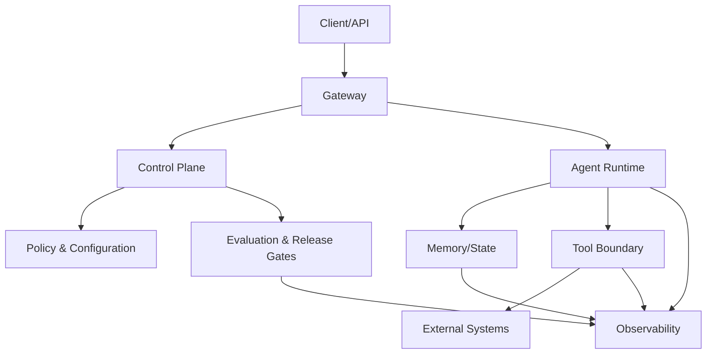

# 09 — Production Architecture

> [!IMPORTANT]
> Produção não é apenas hospedar um agente. É manter comportamento, custo, segurança, disponibilidade e capacidade de recuperação sob mudança, carga e falha.

## Para quem é este módulo

Este módulo é destinado a estudantes que já conseguem:

- explicar contratos, políticas, stop conditions e hard gates;
- executar testes locais e interpretar logs estruturados;
- distinguir efeito externo, checkpoint, retry, rollback e reconciliação;
- reconhecer riscos de segredo, cross-tenant leakage e prompt injection;
- comparar baseline e candidato antes de release.

Quem ainda não domina esses pontos deve concluir a [Trilha Zero](../../zero-track/README.md) e revisar os módulos 01 a 08.

## Resultado final observável

Ao final, você deverá entregar uma arquitetura de produção simulada que:

- separe control plane, data plane, state plane e observability plane;
- valide artefato, configuração, política, schema e rota de modelo;
- implemente liveness, readiness, startup e deep health;
- defina SLI, SLO e error budget;
- execute rollout canary com abort criteria;
- faça rollback completo e verificável;
- degrade para modo seguro sem ampliar privilégios;
- preserve idempotência, filas e estado;
- teste restore de backup;
- produza relatório de release, rollback e incidente.

## Diagnóstico inicial

Antes de estudar, responda sem consultar o material:

1. Por que liveness não prova readiness?
2. O que precisa ser revertido além do código?
3. Quando um error budget não pode justificar continuidade?
4. Como uma fila pode duplicar efeitos?
5. Como provar que um backup é realmente útil?

Registre as respostas e repita o diagnóstico ao final.

## Objetivos

- Transformar componentes agentic em serviços operáveis.
- Projetar fronteiras entre runtime, tools, memória, políticas e telemetria.
- Definir SLI, SLO, error budget, rollout progressivo e rollback verificável.
- Implementar health checks que distinguem processo vivo de serviço útil.
- Planejar degradação segura, disaster recovery e resposta a incidentes.
- Tratar migrações, filas, concorrência e configuração como contratos de produção.

## Pré-requisitos

- [Módulo 08 — Guardrails & Security Engineering](../08-guardrails-security-engineering/README.md) concluído;
- noções de segurança operacional e avaliação de release;
- JSON, YAML, logs e testes básicos;
- Python 3.11+ recomendado;
- nenhuma chave de API necessária para a prática local.

## Explicação em três camadas

### Camada 1 — explicação simples

Produção significa colocar o agente em um ambiente onde ele precisa continuar funcionando mesmo quando algo muda, demora, falha ou fica indisponível.

### Camada 2 — explicação operacional

Uma arquitetura de produção precisa saber qual versão está ativa, se está pronta, quanto pode falhar, como limitar dano, como voltar atrás e como provar o que aconteceu.

### Camada 3 — explicação de engenharia

Production Architecture transforma o sistema agentic em uma plataforma operável com planos separados, contratos imutáveis por execução, rollout controlado, estado versionado, telemetria correlacionada, recuperação testada e hard gates de release.

## Glossário essencial

| Termo | Definição operacional |
|---|---|
| control plane | configuração, políticas, versões, rollout e kill switch |
| data plane | processamento de requisições e execução agentic |
| state plane | checkpoints, memória, filas, idempotência e migrações |
| observability plane | traces, métricas, logs e eventos de segurança |
| SLI | indicador medido de comportamento do serviço |
| SLO | objetivo explícito para um SLI |
| error budget | tolerância operacional restante, sem substituir hard gates |
| readiness | capacidade real de atender corretamente |
| canary | exposição limitada de uma nova versão |
| rollback | retorno coordenado a um estado operacional conhecido |
| RTO | tempo-alvo para recuperação |
| RPO | perda máxima aceitável de dados |
| backpressure | redução controlada de entrada diante de saturação |
| bulkhead | isolamento de falhas entre componentes |

## Arquitetura de referência NEXUS



Descrição textual: o gateway recebe requisições; o control plane governa versões, políticas e rollout; o runtime executa; o state plane preserva estado e idempotência; o observability plane registra evidências sem segredos.

### Control plane

Responsável por:

- configuração versionada;
- políticas;
- modelos autorizados;
- budgets;
- feature flags;
- rollout e rollback;
- kill switch;
- decisões de release.

Não deve depender de instruções livres da tarefa.

### Data plane

Executa requisições, coordena loops, chama tools e produz respostas. Deve receber políticas validadas e operar com privilégios mínimos.

### State plane

Mantém:

- checkpoints;
- memória;
- chaves de idempotência;
- filas;
- artefatos;
- migrações;
- reconciliação.

Estado crítico deve possuir schema, versão, retenção, backup e estratégia de restore.

### Observability plane

Registra traces, logs, métricas, eventos de política, custo, latência, efeitos externos e razões de parada. Deve permitir reconstrução sem registrar segredos.

## Contrato mínimo de deployment

```yaml
service: nexus-agent-runtime
version: 0.9.0
artifact_digest: sha256:...
config_version: 17
policy_version: 12
schema_version: 8
model_route: approved-default
rollout:
  strategy: canary
  initial_percent: 5
  max_percent: 100
  abort_on:
    critical_policy_violations: 1
    success_rate_drop_pct: 3
    p95_latency_increase_pct: 20
    cost_per_success_increase_pct: 15
rollback:
  previous_artifact_digest: sha256:...
  previous_config_version: 16
  previous_policy_version: 11
  target_recovery_minutes: 10
```

O deployment deve ser imutável, identificável e reproduzível.

## SLI, SLO e error budget

| Dimensão | SLI sugerido |
|---|---|
| Disponibilidade | requisições válidas atendidas / válidas recebidas |
| Qualidade | casos aprovados / casos avaliados |
| Segurança | violações críticas por execução |
| Latência | p50, p95 e p99 por tipo de tarefa |
| Custo | custo por execução e por sucesso |
| Confiabilidade | terminal tipado e checkpoint íntegro |
| Efeitos | mutações reconciliadas sem duplicação |
| Recuperação | restores concluídos dentro do RTO |

Exemplo:

```yaml
availability: 99.5%
critical_policy_violations: 0
successful_terminal_reports: 99.9%
p95_latency_ms: 2500
rollback_rto_minutes: 10
checkpoint_recovery_success: 99.9%
```

Error budget não autoriza ignorar segurança, privacidade ou integridade.

## Health checks

- **liveness:** processo responde e não está travado;
- **readiness:** políticas, schemas, modelos e dependências essenciais estão válidos;
- **startup:** migrações e carregamento inicial foram concluídos;
- **deep health:** teste sintético controlado confirma comportamento útil;
- **dependency health:** latência, disponibilidade e circuit breaker por provedor.

Readiness deve falhar quando política, configuração, schema ou rota de modelo forem incompatíveis.

## Configuração e segredos

- configuração versionada e validada antes do deploy;
- valores seguros como padrão;
- segredos fora de código, prompts, logs e artefatos;
- credenciais separadas por ambiente, tenant e função;
- rotação e revogação documentadas;
- configuração imutável durante uma execução;
- diff e aprovação para mudanças sensíveis;
- fail closed em configuração ausente ou inválida.

## Ambientes e promoção

Ambientes mínimos:

```text
local → test → staging → canary → production
```

A promoção deve preservar:

- mesmo artefato por digest;
- configuração equivalente e versionada;
- política aprovada;
- schema compatível;
- evidência de avaliação;
- owner e janela de mudança.

Não reconstrua o artefato entre staging e produção.

## Rollout progressivo

Ordem recomendada:

1. validação local e CI;
2. avaliação offline;
3. shadow traffic sem efeitos;
4. canary restrito;
5. expansão gradual;
6. promoção ou rollback.

Cada estágio deve possuir janela, métricas, owner, abort criteria e evidência.

## Rollback completo

Rollback deve restaurar:

- artefato;
- configuração;
- política;
- rota de modelo;
- schema compatível;
- feature flags;
- estado operacional conhecido;
- consumidores de fila compatíveis.

Reverter apenas o código pode deixar memória, filas ou configurações incompatíveis.

## Migrações de estado

Toda migração deve declarar:

- versão de origem e destino;
- compatibilidade de leitura e escrita;
- estratégia expand/contract quando aplicável;
- backfill idempotente;
- validação antes e depois;
- rollback ou forward-fix;
- impacto em filas, memória e checkpoints.

Migração irreversível exige aprovação humana e plano de contingência.

## Filas e concorrência

Controles mínimos:

- idempotency key;
- visibility timeout;
- dead-letter queue;
- limite de retries;
- deduplicação;
- ordenação quando necessária;
- backpressure;
- limite de concorrência;
- reconciliação após timeout;
- poison message handling.

Uma mensagem reprocessada não pode duplicar efeito externo.

## Degradação segura

Quando uma dependência falha, o sistema pode:

- reduzir tools disponíveis;
- mudar para read-only;
- desativar memória persistente;
- exigir aprovação humana;
- retornar resultado parcial explícito;
- enfileirar tarefa sem duplicar efeitos;
- interromper com razão tipada.

Nunca deve ampliar permissão para compensar indisponibilidade.

## Resiliência

- timeouts por dependência;
- retry apenas para falhas elegíveis;
- circuit breakers;
- bulkheads;
- filas idempotentes;
- backpressure;
- limites de concorrência;
- reconciliação de efeitos;
- chaos tests controlados;
- fallback explícito e testado.

## Observabilidade operacional

Todo trace deve correlacionar:

```text
request_id → run_id → agent_id → handoff_id → tool_call_id → effect_id
```

Campos essenciais:

- artefato, política, configuração e schema;
- terminal state e stop reason;
- latência por etapa;
- tokens e custo;
- tools e resultados normalizados;
- decisão de aprovação;
- eventos de segurança;
- estado do rollout;
- fila, retry e reconciliação;
- região e ambiente.

## Incidentes

Um runbook deve definir:

- critérios de severidade;
- on-call e escalonamento;
- contenção e kill switch;
- preservação de evidências;
- comunicação;
- recuperação;
- postmortem sem culpabilização;
- ação corretiva verificável;
- inclusão de novo caso de regressão.

## Disaster recovery

Defina RTO e RPO para:

- configuração e políticas;
- memória e checkpoints;
- filas;
- artefatos de avaliação;
- registros de auditoria.

Backups sem teste de restauração não contam como controle comprovado.

## Exemplo mínimo

Simule duas versões do runtime:

- `v1` estável;
- `v2` candidata com aumento de latência e uma regressão de qualidade.

O rollout deve iniciar com 5%, detectar a regressão, abortar e restaurar artefato, configuração e política anteriores.

## Demonstração executável

```bash
python examples/production_runtime.py --self-test
```

A demonstração deve provar:

- configuração versionada;
- readiness;
- canary;
- abort criteria;
- rollback completo;
- error budget;
- degradação segura;
- restore simulado;
- relatório operacional.

> [!WARNING]
> Se o exemplo não existir ou não executar no ambiente documentado, registre o bloqueio. Não substitua evidência por descrição.

## Prática guiada

1. desenhe os quatro planes;
2. defina três SLI e dois hard gates;
3. crie contrato de deployment;
4. simule canary de 5%;
5. injete regressão de latência;
6. aborte e faça rollback;
7. valide readiness após retorno;
8. registre evidência.

## Prática independente

Projete uma arquitetura para processar tarefas read-only e uma única mutação sensível. Inclua fila, idempotência, aprovação humana, canary, rollback, read-only degradation e restore de checkpoint.

## Testes negativos obrigatórios

- readiness retorna saudável com política incompatível;
- deploy sem digest;
- configuração mutável durante execução;
- canary sem abort criteria;
- rollback apenas de código;
- migration incompatível;
- mensagem de fila duplicada;
- dead-letter queue ausente;
- restore não testado;
- fallback amplia permissão;
- logs sem correlação;
- incidente sem owner;
- error budget usado para ignorar violação crítica;
- kill switch inoperante.

## Stop conditions para o estudante

Pare e peça revisão quando:

- não houver rollback verificável;
- estado ou filas puderem ficar incompatíveis;
- degradação ampliar privilégios;
- readiness não validar política e schema;
- um restore não puder ser demonstrado;
- o sistema não reconstruir quem fez cada mudança;
- houver efeito ambíguo sem reconciliação.

## Acessibilidade

- diagramas possuem descrição textual;
- tabelas possuem cabeçalhos claros;
- estados não dependem apenas de cor;
- exemplos são copiáveis;
- siglas são expandidas na primeira ocorrência;
- instruções futuras do portal devem funcionar com teclado e leitor de tela;
- vídeos futuros exigem legenda e transcrição.

## Laboratório

Execute o [LAB-901](../../../labs/LAB-901-production-readiness.md).

## Projeto obrigatório

Projete e teste um deployment agentic que:

1. separe control, data, state e observability plane;
2. valide configuração, política, schema e artefato;
3. possua SLOs e hard gates;
4. execute canary progressivo;
5. aborte diante de regressão;
6. faça rollback completo;
7. degrade para modo seguro;
8. trate filas e migrações;
9. prove restore dentro do RTO;
10. gere relatório de release e incidente.

## Avaliação

A avaliação combina:

- diagnóstico inicial e final;
- autoteste da implementação de referência;
- LAB-901;
- projeto obrigatório;
- testes negativos;
- simulação de rollout e rollback;
- teste de restore;
- defesa técnica de dez minutos;
- autoavaliação pela rubrica transversal.

Segurança, rollback, readiness, integridade de estado e auditabilidade são critérios de bloqueio.

## Rubrica específica

| Nível | Evidência |
|---|---|
| insuficiente | deploy sem hard gates, rollback incompleto ou estado incompatível |
| funcional | health checks, canary e rollback básicos funcionam |
| robusta | migrações, filas, degradação, restore e incidentes são testados |
| excelente | SLOs, recuperação, custo, segurança e acessibilidade possuem evidência completa |

## Quiz

1. Por que liveness não prova readiness?
2. O que deve ser revertido além do código?
3. Quando um error budget não pode justificar continuidade?
4. Qual a função de shadow traffic?
5. Por que configuração deve permanecer imutável durante a execução?

<details>
<summary>Gabarito comentado</summary>

1. Porque um processo vivo pode estar sem políticas, schemas ou dependências válidas.
2. Configuração, política, rota de modelo, schema, flags e estado relacionado.
3. Diante de violação crítica de segurança, privacidade ou integridade.
4. Observar comportamento do candidato sem produzir efeitos reais.
5. Para garantir reprodutibilidade, auditoria e ausência de mudança de autoridade durante a execução.

</details>

## Checklist

- [ ] Control plane separado do runtime.
- [ ] Data, state e observability plane possuem fronteiras explícitas.
- [ ] Configuração, políticas, schemas e artefatos são versionados.
- [ ] Liveness, readiness, startup e deep health estão definidos.
- [ ] SLI, SLO e error budget estão documentados.
- [ ] Canary possui abort criteria.
- [ ] Rollback restaura artefato, configuração, política e estado compatível.
- [ ] Migrações possuem estratégia e validação.
- [ ] Filas usam idempotência, DLQ e backpressure.
- [ ] Degradação nunca amplia privilégio.
- [ ] Telemetria correlaciona execução, rollout e efeitos.
- [ ] Runbook e kill switch foram testados.
- [ ] Restore de backup foi comprovado.
- [ ] Risco residual está documentado.

## Autoavaliação

Consigo explicar e demonstrar:

- diferença entre os quatro planes;
- diferença entre liveness e readiness;
- como definir SLO e hard gate;
- como executar canary e abortar;
- como fazer rollback completo;
- como evitar duplicidade em filas;
- como degradar sem ampliar privilégio;
- como provar restore e RTO.

## Critérios de excelência

| Dimensão | Padrão Premium Elite |
|---|---|
| Operabilidade | toda execução e mudança possui evidência rastreável |
| Disponibilidade | SLO e error budget são medidos |
| Segurança | zero promoção com violação crítica |
| Rollout | canary aborta em regressão definida |
| Recuperação | rollback e restore testados dentro do RTO |
| Estado | schemas, migrações e reconciliação versionados |
| Filas | zero duplicação de efeito na suíte local |
| Custo | custo por sucesso monitorado e limitado |
| Acessibilidade | conteúdo possui alternativas textuais e estrutura navegável |

## Referências

- Google — Site Reliability Engineering e SRE Workbook.
- AWS Well-Architected Framework — Reliability Pillar.
- Microsoft Azure Architecture Center — Health Endpoint Monitoring e Deployment Stamps.
- OpenTelemetry — traces, metrics e logs.
- NIST SP 800-61 — Computer Security Incident Handling Guide.

> [!WARNING]
> A implementação local demonstra invariantes arquiteturais. Produção real exige revisão de infraestrutura, segurança, privacidade, custos, contratos de provedores e resposta a incidentes compatíveis com o domínio.

## Próximo passo

Conclua o LAB-901 e obtenha nível funcional ou superior antes de avançar para [10 — Observability Engineering](../10-observability-engineering/README.md).