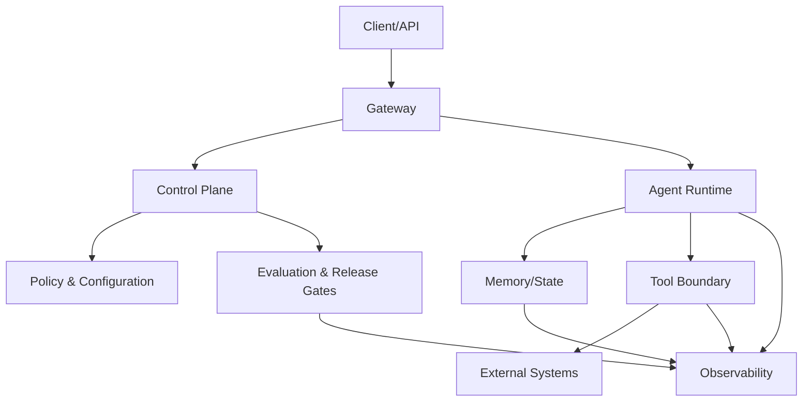

# 09 — Production Architecture

> [!IMPORTANT]
> Produção não é apenas hospedar um agente. É manter comportamento, custo, segurança, disponibilidade e capacidade de recuperação sob mudança e falha.

## Objetivos

- Transformar componentes agentic em serviços operáveis.
- Projetar fronteiras entre runtime, ferramentas, memória, políticas e telemetria.
- Definir SLI, SLO, error budget, rollout progressivo e rollback verificável.
- Implementar health checks que distinguem processo vivo de serviço útil.
- Planejar degradação segura, disaster recovery e resposta a incidentes.

## Arquitetura de referência NEXUS



### Control plane

Responsável por configuração versionada, políticas, modelos autorizados, budgets, rollout, kill switch, feature flags e decisões de release. Não deve depender de instruções livres da tarefa.

### Data plane

Executa requisições, coordena loops, chama ferramentas e produz respostas. Deve receber políticas já validadas e operar com privilégios mínimos.

### State plane

Mantém checkpoints, memória, idempotência, artefatos e reconciliação. Estado crítico deve possuir schema, versão, retenção, backup e estratégia de migração.

### Observability plane

Registra traces, logs, métricas, eventos de política, custo, latência, efeitos externos e razões de parada. Telemetria deve permitir reconstruir uma execução sem registrar segredos.

## Contrato mínimo de deployment

```yaml
service: nexus-agent-runtime
version: 0.9.0
artifact_digest: sha256:...
config_version: 17
policy_version: 12
model_route: approved-default
rollout:
  strategy: canary
  initial_percent: 5
  max_percent: 100
  abort_on:
    critical_policy_violations: 1
    success_rate_drop_pct: 3
    p95_latency_increase_pct: 20
    cost_per_success_increase_pct: 15
rollback:
  previous_artifact_digest: sha256:...
  target_recovery_minutes: 10
```

## SLI, SLO e error budget

Métricas mínimas:

| Dimensão | SLI sugerido |
|---|---|
| Disponibilidade | requisições válidas atendidas / requisições válidas |
| Qualidade | casos aprovados / casos avaliados |
| Segurança | violações críticas por execução |
| Latência | p50, p95 e p99 por tipo de tarefa |
| Custo | custo por execução e por sucesso |
| Confiabilidade | execuções com terminal tipado e checkpoint íntegro |
| Efeitos | mutações reconciliadas sem duplicação |

Exemplo de SLO:

```yaml
availability: 99.5%
critical_policy_violations: 0
successful_terminal_reports: 99.9%
p95_latency_ms: 2500
rollback_rto_minutes: 10
checkpoint_recovery_success: 99.9%
```

Error budget não autoriza ignorar incidentes de segurança. Violações críticas permanecem hard gates.

## Health checks

- **liveness**: processo responde e não está travado;
- **readiness**: dependências essenciais, políticas e schemas estão válidos;
- **startup**: migrações e carregamento inicial concluídos;
- **deep health**: teste sintético controlado confirma comportamento útil;
- **dependency health**: circuit breaker, latência e disponibilidade por provedor.

Readiness deve falhar quando a versão da política, schema ou configuração é incompatível.

## Configuração e segredos

- configuração versionada e validada antes do deploy;
- segredos fora de código, logs, prompts e artefatos;
- rotação e revogação documentadas;
- configuração imutável durante uma execução;
- diff e aprovação para mudanças sensíveis;
- valores seguros como padrão.

## Rollout progressivo

Ordem recomendada:

1. validação local e CI;
2. avaliação offline;
3. shadow traffic sem efeitos;
4. canary restrito;
5. expansão gradual;
6. promoção ou rollback.

Cada estágio precisa de janela, métricas, owner, abort criteria e evidência.

## Rollback

Rollback deve restaurar:

- artefato;
- configuração;
- política;
- rota de modelo;
- schema compatível;
- estado operacional conhecido.

Reverter apenas o código pode deixar memória, filas ou configurações incompatíveis. O plano deve incluir reconciliação.

## Degradação segura

Quando uma dependência falha, o sistema pode:

- reduzir ferramentas disponíveis;
- mudar para modo read-only;
- desativar memória persistente;
- exigir aprovação humana;
- retornar resposta parcial explícita;
- enfileirar tarefa sem duplicar efeitos;
- interromper com razão tipada.

Nunca deve ampliar permissão para compensar indisponibilidade.

## Resiliência

Controles mínimos:

- timeouts por dependência;
- retry apenas para falhas elegíveis;
- circuit breakers;
- bulkheads;
- filas com idempotência;
- backpressure;
- limites de concorrência;
- reconciliação de efeitos;
- chaos tests controlados.

## Observabilidade

Todo trace deve correlacionar:

```text
request_id → run_id → agent_id → handoff_id → tool_call_id → effect_id
```

Campos essenciais:

- versão de artefato, política, configuração e schema;
- terminal state e stop reason;
- latência por etapa;
- tokens/custo quando aplicável;
- ferramenta e resultado normalizado;
- decisão de aprovação;
- eventos de segurança;
- estado de rollout.

## Incidentes

Um runbook deve definir:

- critérios de severidade;
- on-call e escalonamento;
- contenção e kill switch;
- preservação de evidências;
- comunicação;
- recuperação;
- postmortem sem culpabilização;
- ação corretiva verificável.

## Disaster recovery

Defina RTO e RPO para:

- configuração e políticas;
- memória e checkpoints;
- filas;
- artefatos de avaliação;
- registros de auditoria.

Backups sem teste de restauração não contam como controle comprovado.

## Implementação de referência

```bash
python examples/production_runtime.py --self-test
```

A implementação local prova configuração versionada, readiness, rollout canary, abort criteria, rollback, error budget, degradação segura e relatório operacional.

## Laboratório

- [LAB-901](../../../labs/LAB-901-production-readiness.md)

## Projeto

Projetar e testar um deployment agentic que:

1. separe control e data plane;
2. valide configuração, política e schema;
3. possua SLOs e hard gates;
4. execute canary progressivo;
5. aborte diante de regressão;
6. faça rollback completo;
7. degrade para modo seguro;
8. gere relatório de release e incidente.

## Quiz

1. Por que liveness não prova readiness?
2. O que deve ser revertido além do código?
3. Quando um error budget não pode justificar continuidade?
4. Qual a função de shadow traffic?
5. Por que configuração deve permanecer imutável durante a execução?

<details>
<summary>Gabarito comentado</summary>

1. Porque um processo vivo pode estar sem políticas, schemas ou dependências válidas.
2. Configuração, política, rota de modelo, schema e estado relacionado.
3. Diante de violação crítica de segurança ou integridade.
4. Observar comportamento do candidato sem produzir efeitos reais.
5. Para garantir reprodutibilidade, auditoria e ausência de mudança de autoridade no meio da execução.

</details>

## Checklist

- [ ] Control plane separado do runtime.
- [ ] Configuração e políticas versionadas.
- [ ] Liveness, readiness e deep health definidos.
- [ ] SLI, SLO e error budget documentados.
- [ ] Canary possui abort criteria.
- [ ] Rollback restaura artefato e configuração.
- [ ] Degradação nunca amplia privilégio.
- [ ] Telemetria correlaciona execução e efeitos.
- [ ] Runbook e kill switch testados.
- [ ] Restauração de backup comprovada.

## Critérios de excelência

| Dimensão | Padrão Premium Elite |
|---|---|
| Operabilidade | toda execução e mudança possui evidência rastreável |
| Disponibilidade | SLO e error budget medidos, não apenas declarados |
| Segurança | zero promoção com violação crítica |
| Rollout | canary aborta automaticamente em regressão definida |
| Recuperação | rollback e restore testados dentro do RTO |
| Estado | schemas, migrações e reconciliação versionados |
| Custo | custo por sucesso monitorado e limitado |

## Referências

- Google — Site Reliability Engineering e SRE Workbook.
- AWS Well-Architected Framework — Reliability Pillar.
- Microsoft Azure Architecture Center — Health Endpoint Monitoring e Deployment Stamps.
- OpenTelemetry — traces, metrics e logs.
- NIST SP 800-61 — Computer Security Incident Handling Guide.

## Próximo passo

Conclua o LAB-901 antes de avançar para observabilidade avançada, automações e capstone.