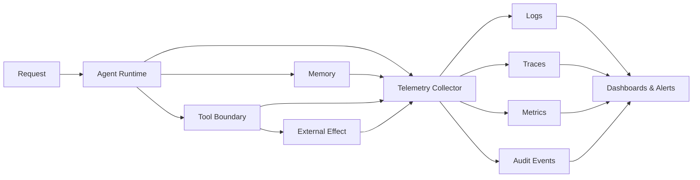

# 10 — Observability Engineering

> [!IMPORTANT]
> Observabilidade não é acumular logs. É conseguir explicar o que aconteceu, por que aconteceu, qual foi o impacto, quais evidências sustentam o diagnóstico e qual ação segura deve ser tomada.

## Para quem é este módulo

Este módulo é destinado a estudantes que já conseguem:

- interpretar estados terminais, SLOs, políticas e rollouts;
- ler JSON, traces e logs estruturados;
- distinguir efeito externo, evento de auditoria e métrica operacional;
- executar exemplos locais em Python;
- reconhecer riscos de segredo, PII, cardinalidade e retenção.

Quem ainda não domina esses pontos deve revisar os módulos 07, 08 e 09 e, quando necessário, retornar à [Trilha Zero](../../zero-track/README.md).

## Resultado final observável

Ao final, você deverá entregar uma camada local de observabilidade que:

- propague IDs opacos e correlacionados;
- gere logs, traces, métricas e eventos de auditoria;
- aplique redaction antes da persistência;
- controle cardinalidade e retenção;
- preserve 100% dos eventos críticos;
- detecte regressões de qualidade, segurança, custo e latência;
- produza alertas com owner, impacto e runbook;
- degrade com segurança quando o collector falhar;
- prove integridade e completude da trilha causal;
- gere relatório operacional reproduzível.

## Diagnóstico inicial

Antes de estudar, responda sem consultar o material:

1. Qual a diferença entre log, métrica, trace e evento de auditoria?
2. Por que `request_id` não deve ser label de métrica?
3. Como preservar eventos críticos sem armazenar todo o tráfego?
4. O que deve acontecer quando o collector fica indisponível?
5. Como provar que uma telemetria é suficiente para reconstruir um efeito externo?

Registre as respostas. Repita o diagnóstico ao final e compare evolução, lacunas e incertezas.

## Objetivos

- Projetar telemetria end-to-end para agentes, ferramentas, memória e efeitos externos.
- Correlacionar requisição, execução, handoff, tool call, aprovação e efeito.
- Definir métricas orientadas a usuário, qualidade, segurança, custo e confiabilidade.
- Implementar redaction, sampling, retenção, controle de cardinalidade e acesso.
- Construir alertas acionáveis e runbooks verificáveis.
- Detectar falhas de cobertura, perda, duplicação e corrupção de telemetria.
- Produzir evidência operacional sem registrar segredos.

## Pré-requisitos

- Módulos 00–09 concluídos;
- familiaridade com estados terminais, SLOs, rollout e resposta a incidentes;
- Python 3.11+ recomendado;
- nenhuma chave de API necessária;
- capacidade de executar testes locais e interpretar JSON.

## Explicação em três camadas

### Camada 1 — explicação simples

Observabilidade é a capacidade de entender um sistema pelo que ele mostra enquanto funciona. Você precisa saber:

- o que ocorreu;
- onde ocorreu;
- em qual ordem;
- quem ou qual política autorizou;
- qual foi o impacto;
- o que fazer depois.

### Camada 2 — explicação operacional

Logs explicam eventos locais, traces conectam a trajetória, métricas mostram comportamento agregado, eventos de auditoria provam autoridade e efeitos, e evidências de avaliação mostram mudança de qualidade.

### Camada 3 — explicação de engenharia

Observability Engineering projeta sinais, correlação, schemas, retenção, integridade e resposta operacional como contratos verificáveis. Telemetria é parte do sistema de controle e não um subproduto opcional.

## Glossário essencial

| Termo | Definição operacional |
|---|---|
| log estruturado | evento técnico com campos tipados e pesquisáveis |
| trace | representação causal de uma execução distribuída |
| span | unidade temporal dentro de um trace |
| métrica | série agregada para tendência, SLI e alerta |
| evento de auditoria | evidência de decisão, autoridade ou efeito |
| correlação | ligação estável entre sinais relacionados |
| cardinalidade | quantidade de combinações distintas de labels |
| sampling | política de retenção parcial de telemetria |
| redaction | remoção ou transformação de dado sensível |
| SLI | indicador medido do nível de serviço |
| alerta acionável | notificação com impacto, owner e runbook |
| telemetry loss | perda parcial ou total de sinais esperados |
| clock skew | diferença de relógio entre componentes |

## Modelo de observabilidade NEXUS



Descrição textual: todos os componentes emitem sinais para um collector. Os sinais são persistidos conforme política, correlacionados e apresentados em dashboards, alertas e trilhas de auditoria.

## Contrato de correlação

Toda execução deve propagar identificadores estáveis:

```text
request_id → run_id → agent_id → handoff_id → tool_call_id → approval_id → effect_id
```

Regras:

- IDs devem ser opacos e não conter PII;
- IDs não podem ser reutilizados entre tenants;
- cada efeito deve apontar para decisão, política e aprovação;
- eventos devem registrar versões de artefato, configuração, política, schema e modelo;
- telemetria não pode alterar o resultado funcional;
- ausência de um elo causal deve ser detectada como falha de cobertura.

## Os cinco sinais mínimos

| Sinal | Pergunta respondida |
|---|---|
| Logs estruturados | O que ocorreu em um ponto específico? |
| Traces distribuídos | Qual foi o caminho causal da execução? |
| Métricas | O comportamento agregado está saudável? |
| Eventos de auditoria | Quem ou qual política autorizou uma ação? |
| Evidências de avaliação | A qualidade mudou em relação ao baseline? |

## Schema mínimo de evento

```json
{
  "event_id": "evt_opaque",
  "timestamp": "2026-01-01T00:00:00Z",
  "ingested_at": "2026-01-01T00:00:01Z",
  "event_type": "tool.completed",
  "severity": "info",
  "tenant_id": "tenant_opaque",
  "request_id": "req_opaque",
  "run_id": "run_opaque",
  "agent_id": "agent.planner",
  "tool_call_id": "tool_opaque",
  "policy_version": "12",
  "artifact_version": "0.10.0",
  "schema_version": "1",
  "duration_ms": 84,
  "outcome": "success",
  "attributes": {"tool": "catalog.read"}
}
```

Campos desconhecidos devem ser recusados ou quarentenados conforme política.

## Logs estruturados

- Use campos tipados, não mensagens livres como fonte primária.
- Separe mensagem humana de atributos pesquisáveis.
- Nunca registre prompts integrais, segredos, tokens ou payloads sensíveis por padrão.
- Aplique redaction antes da persistência.
- Registre stop reasons, erros normalizados e versões.
- Use event IDs para deduplicação.
- Preserve timestamps de evento e ingestão.

## Traces

Cada span deve possuir:

- nome estável;
- início, fim e duração;
- parent span;
- status tipado;
- versões relevantes;
- atributos de baixa cardinalidade;
- eventos de política e retry;
- links para efeitos assíncronos;
- sinalização de sampling.

Não use conteúdo do usuário como nome de span ou label.

## Métricas essenciais

| Dimensão | Exemplos |
|---|---|
| Disponibilidade | success rate, terminal reports válidos |
| Latência | p50, p95, p99 por classe de tarefa |
| Qualidade | pass rate, regressões, groundedness |
| Segurança | policy denials, approval failures, exfiltration attempts |
| Custo | custo por execução e por sucesso |
| Ferramentas | timeout, retry, circuit breaker, efeitos duplicados |
| Memória | hit rate, stale reads, rejeições de tenant |
| Operação | queue depth, saturation, telemetry drop rate |
| Integridade | missing spans, orphan effects, schema rejection rate |

Toda métrica precisa declarar unidade, denominador, janela, owner e fonte.

## Cardinalidade

Não use como label:

- `request_id`;
- `run_id`;
- texto do prompt;
- email, CPF ou identificador de cliente;
- mensagem de erro livre;
- URL completa com parâmetros;
- hash exclusivo por execução.

Esses dados, quando permitidos, pertencem a logs ou traces com acesso e retenção controlados.

## Sampling

- Preserve 100% dos eventos críticos de segurança e auditoria.
- Use head sampling para controle simples de volume.
- Use tail sampling para reter erros, violações e alta latência.
- Registre versão da política de sampling.
- Não calcule taxas sem considerar o sampling.
- Monitore `telemetry_drop_rate` e viés de amostragem.

## Redaction e privacidade

Pipeline recomendado:

```text
collect → classify → redact → validate → persist → expire
```

Princípios:

- deny-by-default para campos desconhecidos;
- allowlist de atributos persistíveis;
- hashing não elimina risco de reidentificação;
- retenção mínima necessária;
- acesso por função, tenant e finalidade;
- trilha de consulta a dados sensíveis;
- exclusão e expiração verificáveis;
- separação entre dados operacionais e evidência de auditoria.

## Integridade e cobertura

A telemetria deve provar:

- ausência de efeitos órfãos;
- ausência de spans órfãos críticos;
- sequência causal coerente;
- event IDs únicos;
- schema válido;
- assinaturas ou hashes quando aplicável;
- ausência de lacunas em decisões sensíveis;
- correspondência entre efeito real e evento auditado.

Métricas recomendadas:

- `trace_completeness_rate`;
- `orphan_effect_rate`;
- `audit_event_missing_rate`;
- `duplicate_event_rate`;
- `schema_rejection_rate`;
- `clock_skew_rate`.

## Alertas acionáveis

Um alerta deve indicar:

1. qual SLO ou hard gate foi violado;
2. impacto estimado;
3. evidência e janela temporal;
4. owner responsável;
5. runbook;
6. condição de resolução;
7. risco de falso positivo;
8. ação automática permitida, se houver.

Evite alertas sem impacto, salvo segurança crítica.

## Dashboards

Ordem recomendada:

1. experiência do usuário;
2. qualidade e segurança;
3. fluxo da execução;
4. dependências;
5. custo e capacidade;
6. detalhes diagnósticos.

Dashboard não substitui alerta, trace, runbook ou auditoria.

## Telemetria de agentes

Registre explicitamente:

- objetivo e classe da tarefa, sem conteúdo sensível;
- agente ativo e handoffs;
- contexto selecionado e proveniência por ID;
- decisão de política;
- chamada e resultado normalizado da ferramenta;
- retries e budgets restantes;
- stop condition;
- terminal state;
- avaliação e feedback posterior;
- aprovação e efeito externo.

## Falhas de observabilidade

- collector indisponível: buffer limitado e política de degradação;
- fila cheia: priorizar eventos críticos;
- schema incompatível: rejeitar ou quarentenar;
- clock skew: registrar timestamps de evento e ingestão;
- duplicação: event IDs e consumidores idempotentes;
- perda de telemetria crítica: bloquear ou suspender efeitos sensíveis;
- redaction falha: não persistir payload bruto;
- backend degradado: manter audit trail mínimo local e reconciliar depois.

## Degradação segura

Quando a observabilidade falhar:

- operações read-only podem continuar sob política explícita;
- efeitos sensíveis devem ser suspensos se a auditoria não puder ser preservada;
- eventos críticos devem usar buffer prioritário;
- o sistema deve emitir estado `telemetry_degraded`;
- a perda deve ser mensurada;
- a recuperação deve reconciliar eventos pendentes.

Nunca amplie privilégios para compensar falha de telemetria.

## Exemplo mínimo

O exemplo local simula:

- uma requisição;
- dois agentes;
- uma tool read-only;
- uma aprovação;
- um efeito externo simulado;
- um collector com falha parcial;
- redaction e sampling;
- um alerta operacional.

## Demonstração executável

```bash
python examples/observability_pipeline.py --self-test
```

A implementação deve provar:

- correlação completa;
- spans hierárquicos;
- métricas de baixa cardinalidade;
- redaction antes da persistência;
- preservação de eventos críticos;
- detecção de efeito órfão;
- schema rejection;
- alerta com owner e runbook;
- degradação segura do collector;
- relatório operacional reproduzível.

> [!WARNING]
> Se o exemplo não existir ou não executar, registre o bloqueio. Não substitua evidência de execução por descrição.

## Prática guiada

1. desenhe o fluxo causal de uma execução;
2. defina IDs de correlação;
3. escreva um schema de evento;
4. classifique cinco campos por sensibilidade;
5. defina uma política de sampling;
6. crie um alerta com owner e runbook;
7. simule perda do collector;
8. verifique se efeitos sensíveis são suspensos.

## Prática independente

Projete observabilidade para um agente que consulta memória, chama uma tool e produz um efeito simulado. Inclua:

- logs;
- traces;
- métricas;
- eventos de auditoria;
- redaction;
- cardinalidade;
- retenção;
- alerta;
- runbook;
- teste de perda de telemetria.

## Testes negativos obrigatórios

- `request_id` como label de métrica;
- prompt integral em log;
- segredo em trace;
- evento sem tenant;
- span sem parent crítico;
- efeito sem approval ID;
- sampling descartando evento crítico;
- collector indisponível;
- fila cheia;
- schema incompatível;
- event ID duplicado;
- clock skew não detectado;
- alerta sem owner;
- runbook inexistente;
- retenção indefinida;
- redaction após persistência;
- efeito sensível executado sem trilha de auditoria.

## Stop conditions para o estudante

Pare o exercício e peça revisão quando:

- houver segredo em qualquer sinal persistido;
- uma métrica usar label de alta cardinalidade;
- efeito sensível puder ocorrer sem audit trail;
- o collector falhar sem política de degradação;
- alertas não possuírem owner ou runbook;
- não for possível reconstruir o caminho causal;
- eventos críticos puderem ser amostrados.

## Acessibilidade

- diagramas devem ter descrição textual;
- dashboards futuros não podem depender apenas de cor;
- tabelas devem possuir cabeçalhos claros;
- alertas devem usar texto e prioridade explícita;
- exemplos devem ser copiáveis;
- vídeos futuros devem ter legenda e transcrição;
- o portal futuro deve permitir navegação por teclado e leitor de tela.

## Laboratório

Execute o [LAB-1001](../../../labs/LAB-1001-agent-observability.md).

## Projeto obrigatório

Construa uma camada de observabilidade que:

1. gere IDs correlacionados;
2. produza logs, traces, métricas e eventos de auditoria;
3. remova segredos antes da persistência;
4. bloqueie labels de alta cardinalidade;
5. preserve eventos críticos independentemente do sampling;
6. detecte regressões de latência, qualidade e segurança;
7. gere alertas com owner e runbook;
8. degrade sem ampliar privilégios;
9. detecte falhas de cobertura e integridade;
10. documente risco residual.

## Avaliação

A avaliação combina:

- diagnóstico inicial e final;
- autoteste da implementação de referência;
- LAB-1001;
- projeto obrigatório;
- suíte negativa;
- simulação de falha do collector;
- defesa técnica de dez minutos;
- autoavaliação pela [rubrica transversal](../../rubrics/transversal-rubric.md).

Segredo persistido, efeito sem auditoria e perda silenciosa de evento crítico são critérios de bloqueio.

## Rubrica específica

| Nível | Evidência |
|---|---|
| insuficiente | sinais desconectados, segredos persistidos ou efeitos sem auditoria |
| funcional | correlação e sinais básicos operam com cobertura parcial |
| robusta | redaction, sampling, integridade, alertas e degradação são testados |
| excelente | diagnóstico causal, privacidade, acessibilidade e resposta operacional são demonstrados de ponta a ponta |

## Quiz

1. Por que `request_id` não deve ser label de métrica?
2. Qual a diferença entre log e evento de auditoria?
3. Quando tail sampling é preferível?
4. Por que prompts integrais não devem ser registrados por padrão?
5. O que fazer quando o collector fica indisponível?

<details>
<summary>Gabarito comentado</summary>

1. Porque cria cardinalidade praticamente ilimitada e custo elevado.
2. Log explica comportamento técnico; auditoria comprova decisão, autoridade e efeito.
3. Quando erros, violações ou alta latência só são conhecidos ao final do trace.
4. Porque podem conter PII, segredos e dados desnecessários ao diagnóstico.
5. Aplicar buffer limitado, priorizar eventos críticos e seguir política explícita de degradação.

</details>

## Checklist

- [ ] IDs correlacionados, opacos e segregados por tenant.
- [ ] Schema de eventos versionado.
- [ ] Redaction antes da persistência.
- [ ] Labels com cardinalidade controlada.
- [ ] Eventos críticos preservados em 100%.
- [ ] Métricas orientadas a SLO e usuário.
- [ ] Alertas possuem owner, impacto e runbook.
- [ ] Retenção e acesso estão definidos.
- [ ] Falha do collector possui degradação segura.
- [ ] Telemetria reconstrói efeitos externos.
- [ ] Integridade e cobertura são medidas.
- [ ] Risco residual está documentado.

## Autoavaliação

Consigo explicar e demonstrar:

- como os sinais se complementam;
- como a correlação funciona;
- onde redaction ocorre;
- como cardinalidade é controlada;
- como eventos críticos escapam do sampling;
- como alertas são acionáveis;
- como o sistema reage à perda de telemetria;
- como reconstruir um efeito externo.

## Critérios de excelência

| Dimensão | Padrão Premium Elite |
|---|---|
| Correlação | caminho causal completo entre requisição e efeito |
| Segurança | zero segredo persistido e eventos críticos não amostrados |
| Operabilidade | alertas acionáveis e runbooks testados |
| Qualidade | regressões detectadas contra baseline versionado |
| Custo | cardinalidade, retenção e sampling governados |
| Integridade | schemas, cobertura e auditoria verificáveis |
| Privacidade | minimização, segregação por tenant e acesso rastreável |
| Acessibilidade | dashboards e alertas compreensíveis sem depender de cor |

## Referências

- OpenTelemetry — Specification e Semantic Conventions.
- Google — Site Reliability Engineering e SRE Workbook.
- NIST SP 800-92 — Guide to Computer Security Log Management.
- OWASP — Logging Cheat Sheet.
- CNCF — Observability and telemetry patterns.

> [!WARNING]
> Observabilidade reduz incerteza operacional, mas não prova segurança absoluta. Produção exige revisão humana, políticas de acesso, retenção, resposta a incidentes e validação contínua.

## Próximo passo

Conclua o LAB-1001 e obtenha nível funcional ou superior antes de avançar para [11 — Automação Operacional](../11-operational-automation/README.md).