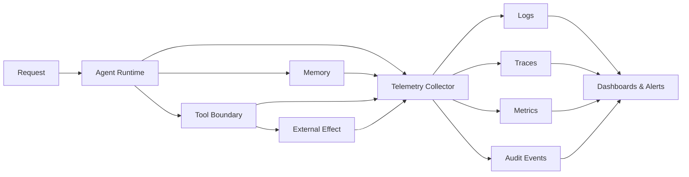

# 10 — Observability Engineering

> [!IMPORTANT]
> Observabilidade não é acumular logs. É conseguir explicar o que aconteceu, por que aconteceu, qual foi o impacto e qual ação segura deve ser tomada.

## Objetivos

- Projetar telemetria end-to-end para agentes, ferramentas, memória e efeitos externos.
- Correlacionar requisição, execução, handoff, chamada de ferramenta e efeito.
- Definir métricas orientadas a usuário, qualidade, segurança, custo e confiabilidade.
- Implementar redaction, amostragem, retenção e controle de cardinalidade.
- Construir alertas acionáveis e runbooks verificáveis.

## Pré-requisitos

- Modules 00–09 concluídos.
- Familiaridade com estados terminais, SLOs, políticas e rollout.
- Capacidade de executar exemplos Python locais.

## Modelo de observabilidade NEXUS



## Contrato de correlação

Toda execução deve propagar identificadores estáveis:

```text
request_id → run_id → agent_id → handoff_id → tool_call_id → effect_id
```

Regras:

- IDs devem ser opacos, não conter PII e não ser reutilizados entre tenants.
- Cada efeito externo deve apontar para uma decisão e uma aprovação, quando aplicável.
- Eventos devem registrar versões de artefato, configuração, política, schema e modelo.
- Telemetria não pode alterar o resultado da execução.

## Os cinco sinais mínimos

| Sinal | Pergunta respondida |
|---|---|
| Logs estruturados | O que ocorreu em um ponto específico? |
| Traces distribuídos | Qual foi o caminho causal da execução? |
| Métricas | O comportamento agregado está saudável? |
| Eventos de auditoria | Quem/qual política autorizou uma ação? |
| Evidências de avaliação | A qualidade mudou em relação ao baseline? |

## Schema mínimo de evento

```json
{
  "timestamp": "2026-01-01T00:00:00Z",
  "event_type": "tool.completed",
  "severity": "info",
  "request_id": "req_opaque",
  "run_id": "run_opaque",
  "agent_id": "agent.planner",
  "tool_call_id": "tool_opaque",
  "policy_version": "12",
  "artifact_version": "0.10.0",
  "duration_ms": 84,
  "outcome": "success",
  "attributes": {"tool": "catalog.read"}
}
```

## Logs estruturados

- Use campos tipados, não mensagens livres como fonte primária.
- Separe mensagem humana de atributos pesquisáveis.
- Nunca registre prompts integrais, segredos, tokens, credenciais ou payloads sensíveis por padrão.
- Aplique redaction antes da persistência.
- Registre razões de parada e erros normalizados.

## Traces

Cada span deve possuir:

- nome estável;
- início, fim e duração;
- parent span;
- status tipado;
- versões relevantes;
- atributos de baixa cardinalidade;
- eventos de política e retry;
- links para efeitos assíncronos quando necessário.

Não use conteúdo do usuário como nome de span ou label de métrica.

## Métricas essenciais

| Dimensão | Exemplos |
|---|---|
| Disponibilidade | success rate, terminal reports válidos |
| Latência | p50, p95, p99 por classe de tarefa |
| Qualidade | pass rate, regressões, groundedness |
| Segurança | policy denials, approval failures, exfiltration attempts |
| Custo | custo por execução e por sucesso |
| Ferramentas | timeout, retry, circuit breaker, duplicação de efeitos |
| Memória | hit rate, stale reads, rejeições de tenant |
| Operação | queue depth, saturation, dropped telemetry |

## Cardinalidade

Labels de alta cardinalidade podem inviabilizar custos e consultas. Não use como label:

- `request_id`;
- `run_id`;
- texto do prompt;
- email, CPF ou identificador de cliente;
- mensagem de erro livre;
- URL completa com parâmetros.

Esses dados, quando permitidos, pertencem a logs ou traces com retenção e acesso controlados.

## Amostragem

- Preserve 100% dos eventos críticos de segurança e auditoria.
- Use head sampling para controle simples de volume.
- Use tail sampling para reter erros, alta latência e violações.
- Registre a política de sampling e sua versão.
- Não calcule taxas sem considerar dados amostrados.

## Redaction e privacidade

Pipeline recomendado:

```text
collect → classify → redact → validate → persist → expire
```

Princípios:

- deny-by-default para campos desconhecidos;
- allowlist de atributos persistíveis;
- hashing não substitui avaliação de reidentificação;
- retenção mínima necessária;
- acesso por função e tenant;
- trilha de consulta a dados sensíveis.

## Alertas acionáveis

Um alerta deve indicar:

1. qual SLO ou hard gate foi violado;
2. impacto estimado;
3. evidência e janela temporal;
4. owner responsável;
5. runbook;
6. condição de resolução.

Evite alertas baseados em eventos isolados sem impacto, salvo segurança crítica.

## Dashboards

Ordem recomendada:

1. experiência do usuário;
2. qualidade e segurança;
3. fluxo da execução;
4. dependências;
5. custo e capacidade;
6. detalhes diagnósticos.

Dashboard não substitui alertas, traces ou runbooks.

## Telemetria de agentes

Registre explicitamente:

- objetivo e classe da tarefa, sem conteúdo sensível;
- agente ativo e handoffs;
- contexto selecionado e proveniência por ID;
- decisão de política;
- chamada e resultado normalizado da ferramenta;
- retries e budgets restantes;
- stop condition;
- terminal state;
- avaliação e feedback posterior.

## Falhas de observabilidade

- logging falha: execução crítica não deve perder trilha de auditoria silenciosamente;
- collector indisponível: buffer limitado e comportamento de degradação definido;
- fila cheia: priorizar eventos críticos;
- schema incompatível: rejeitar ou quarentenar, nunca reinterpretar silenciosamente;
- clock skew: usar timestamps de evento e ingestão;
- duplicação: event IDs e consumidores idempotentes.

## Implementação de referência

```bash
python examples/observability_pipeline.py --self-test
```

A implementação demonstra correlação, spans, métricas, redaction, cardinalidade, sampling, audit events, alertas e degradação segura.

## Laboratório

- [LAB-1001](../../../labs/LAB-1001-agent-observability.md)

## Projeto

Construa uma camada de observabilidade que:

1. gere IDs correlacionados;
2. produza logs, traces, métricas e eventos de auditoria;
3. remova segredos antes da persistência;
4. bloqueie labels de alta cardinalidade;
5. preserve eventos críticos independentemente do sampling;
6. detecte regressões de latência, qualidade e segurança;
7. gere alertas com owner e runbook;
8. degrade sem ampliar privilégios ou perder efeitos críticos.

## Quiz

1. Por que `request_id` não deve ser label de métrica?
2. Qual a diferença entre log e evento de auditoria?
3. Quando tail sampling é preferível?
4. Por que observabilidade não pode registrar prompts integrais por padrão?
5. O que fazer quando o collector fica indisponível?

<details>
<summary>Gabarito comentado</summary>

1. Porque cria cardinalidade praticamente ilimitada e custo operacional elevado.
2. Log explica comportamento técnico; auditoria comprova decisão, autoridade e efeito com integridade e retenção próprias.
3. Quando é necessário preservar erros, violações ou alta latência descobertos apenas ao final do trace.
4. Porque podem conter PII, segredos, propriedade intelectual e dados não necessários ao diagnóstico.
5. Aplicar buffer limitado, priorizar eventos críticos e seguir uma política explícita de degradação.

</details>

## Checklist

- [ ] IDs correlacionados e opacos.
- [ ] Schema de eventos versionado.
- [ ] Redaction antes da persistência.
- [ ] Labels com cardinalidade controlada.
- [ ] Segurança e auditoria preservadas em 100%.
- [ ] Métricas orientadas a SLO e usuário.
- [ ] Alertas possuem owner e runbook.
- [ ] Retenção e acesso definidos.
- [ ] Falha do collector possui degradação segura.
- [ ] Telemetria permite reconstruir efeitos externos.

## Critérios de excelência

| Dimensão | Padrão Premium Elite |
|---|---|
| Correlação | caminho causal completo entre requisição e efeito |
| Segurança | zero segredo persistido e eventos críticos não amostrados |
| Operabilidade | alertas acionáveis e runbooks testados |
| Qualidade | regressões detectadas contra baseline versionado |
| Custo | cardinalidade, retenção e sampling governados |
| Integridade | schemas e eventos de auditoria versionados e idempotentes |
| Privacidade | minimização, segregação por tenant e acesso rastreável |

## Referências

- OpenTelemetry — Specification: traces, metrics, logs e semantic conventions.
- Google — Site Reliability Engineering e SRE Workbook.
- NIST SP 800-92 — Guide to Computer Security Log Management.
- OWASP — Logging Cheat Sheet.
- CNCF — Observability and telemetry patterns.

## Próximo passo

Conclua o LAB-1001 e valide a suíte completa antes de avançar para automação operacional e capstone.