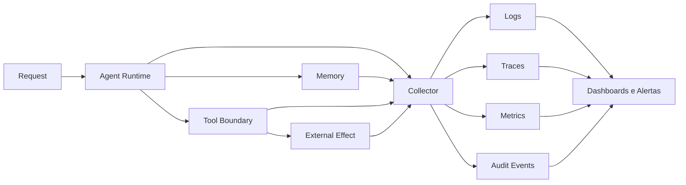

# 10 — Observability Engineering

> [!IMPORTANT]
> Observabilidade não é acumular logs. É conseguir explicar o que aconteceu, por que aconteceu, qual foi o impacto, quais evidências sustentam o diagnóstico e qual ação segura deve ser tomada.

## Para quem é este módulo

Este módulo é destinado a estudantes que já conseguem interpretar estados terminais, SLOs, políticas, rollouts, JSON, traces e logs estruturados. Quem ainda não domina esses pontos deve revisar os módulos 07, 08 e 09 e, quando necessário, retornar à [Trilha Zero](../../zero-track/README.md).

## Resultado final observável

Ao final, você deverá entregar uma camada local de observabilidade que:

- propague IDs opacos e correlacionados;
- gere logs, traces, métricas e eventos de auditoria;
- aplique redaction antes da persistência;
- controle cardinalidade, sampling, retenção e acesso;
- preserve todos os eventos críticos;
- detecte regressões de qualidade, segurança, custo e latência;
- produza alertas com owner, impacto e runbook;
- degrade com segurança quando o collector falhar;
- prove integridade e completude da trilha causal;
- gere relatório operacional reproduzível.

## Diagnóstico inicial

Antes de estudar, responda sem consultar o material:

1. Qual a diferença entre log, métrica, trace e evento de auditoria?
2. Por que `request_id` não deve ser label de métrica?
3. Como preservar eventos críticos sem armazenar todo o tráfego?
4. O que deve acontecer quando o collector fica indisponível?
5. Como provar que a telemetria reconstrói um efeito externo?

Repita o diagnóstico ao final e registre lacunas remanescentes.

## Objetivos

- Projetar telemetria end-to-end para agentes, ferramentas, memória e efeitos externos.
- Correlacionar requisição, execução, handoff, tool call, aprovação e efeito.
- Definir métricas orientadas a usuário, qualidade, segurança, custo e confiabilidade.
- Implementar redaction, sampling, retenção, cardinalidade e controle de acesso.
- Construir alertas acionáveis e runbooks verificáveis.
- Detectar perda, duplicação, corrupção e falhas de cobertura.

## Pré-requisitos

- Módulos 00–09 concluídos.
- Familiaridade com estados terminais, SLOs, rollout e incidentes.
- Python 3.11+ recomendado.
- Nenhuma chave de API necessária.

## Explicação em três camadas

### Camada 1 — simples

Observabilidade permite saber o que ocorreu, onde, em qual ordem, com qual impacto e qual ação deve ser tomada.

### Camada 2 — operacional

Logs explicam eventos locais, traces conectam a trajetória, métricas mostram comportamento agregado, eventos de auditoria provam autoridade e efeitos, e avaliações mostram mudança de qualidade.

### Camada 3 — engenharia

Observability Engineering projeta sinais, correlação, schemas, retenção, integridade e resposta operacional como contratos verificáveis. Telemetria é parte do sistema de controle.

## Glossário essencial

| Termo | Definição operacional |
|---|---|
| log estruturado | evento técnico com campos tipados |
| trace | representação causal de uma execução |
| span | unidade temporal dentro de um trace |
| métrica | série agregada para tendência e SLI |
| evento de auditoria | evidência de decisão, autoridade ou efeito |
| cardinalidade | combinações distintas de labels |
| sampling | retenção parcial governada |
| redaction | remoção de dado sensível |
| telemetry loss | perda de sinais esperados |
| clock skew | diferença de relógio entre componentes |

## Modelo de observabilidade NEXUS



Descrição textual: os componentes emitem sinais ao collector; os sinais são validados, redigidos, persistidos conforme política e correlacionados para diagnóstico, alerta e auditoria.

## Contrato de correlação

```text
request_id → run_id → agent_id → handoff_id → tool_call_id → approval_id → effect_id
```

Regras:

- IDs são opacos e não contêm PII;
- IDs não são reutilizados entre tenants;
- cada efeito aponta para decisão, política e aprovação;
- eventos registram versões de artefato, configuração, política, schema e modelo;
- lacunas causais são detectadas como falha de cobertura.

## Cinco sinais mínimos

| Sinal | Pergunta respondida |
|---|---|
| Logs estruturados | O que ocorreu localmente? |
| Traces | Qual foi o caminho causal? |
| Métricas | O comportamento agregado está saudável? |
| Auditoria | Quem ou qual política autorizou? |
| Avaliação | A qualidade mudou frente ao baseline? |

## Schema mínimo de evento

```json
{
  "event_id": "evt_opaque",
  "timestamp": "2026-01-01T00:00:00Z",
  "ingested_at": "2026-01-01T00:00:01Z",
  "event_type": "tool.completed",
  "severity": "info",
  "tenant_id": "tenant_opaque",
  "request_id": "req_opaque",
  "run_id": "run_opaque",
  "tool_call_id": "tool_opaque",
  "policy_version": "12",
  "artifact_version": "0.10.0",
  "schema_version": "1",
  "duration_ms": 84,
  "outcome": "success",
  "attributes": {"tool": "catalog.read"}
}
```

Campos desconhecidos devem ser recusados ou quarentenados.

## Logs, traces e métricas

Logs usam campos tipados e nunca registram prompts integrais, tokens ou payloads sensíveis por padrão. Cada span possui nome estável, parent, status, duração, versões e atributos de baixa cardinalidade. Métricas precisam declarar unidade, denominador, janela, owner e fonte.

Métricas essenciais incluem disponibilidade, p50/p95/p99, qualidade, violações de política, custo por sucesso, erros de tools, stale reads, queue depth, telemetry drop rate e orphan effect rate.

## Cardinalidade

Nunca use como label:

- `request_id` ou `run_id`;
- texto do prompt;
- email, CPF ou identificador de cliente;
- mensagem de erro livre;
- URL completa com parâmetros;
- hash exclusivo por execução.

## Sampling

- Preserve 100% dos eventos críticos de segurança e auditoria.
- Use head sampling para volume previsível.
- Use tail sampling para erros, violações e alta latência.
- Versione a política.
- Monitore viés e `telemetry_drop_rate`.

## Redaction e privacidade

```text
collect → classify → redact → validate → persist → expire
```

Aplique deny-by-default para campos desconhecidos, allowlist de atributos, retenção mínima, segregação por tenant, acesso por função e trilha de consulta. Hashing não elimina risco de reidentificação.

## Integridade e cobertura

A telemetria deve detectar:

- efeitos órfãos;
- spans críticos ausentes;
- event IDs duplicados;
- schema inválido;
- clock skew;
- decisões sensíveis sem auditoria;
- divergência entre efeito real e evento registrado.

Métricas mínimas: `trace_completeness_rate`, `orphan_effect_rate`, `audit_event_missing_rate`, `duplicate_event_rate`, `schema_rejection_rate` e `clock_skew_rate`.

## Alertas acionáveis

Todo alerta deve conter:

1. SLO ou hard gate violado;
2. impacto estimado;
3. evidência e janela;
4. owner;
5. runbook;
6. condição de resolução;
7. risco de falso positivo.

## Falhas e degradação segura

Quando o collector, fila ou backend falhar:

- priorize eventos críticos;
- use buffer limitado;
- rejeite ou quarentene schemas incompatíveis;
- emita estado `telemetry_degraded`;
- suspenda efeitos sensíveis se a auditoria não puder ser preservada;
- reconcilie eventos pendentes após recuperação;
- nunca amplie privilégios.

## Demonstração executável

```bash
python examples/observability_pipeline.py --self-test
```

A demonstração deve provar correlação, spans, métricas de baixa cardinalidade, redaction, preservação de eventos críticos, detecção de efeito órfão, schema rejection, alerta acionável e degradação segura.

> [!WARNING]
> Se o exemplo não executar, registre o bloqueio. Não substitua evidência por descrição.

## Prática guiada

1. Desenhe o fluxo causal.
2. Defina IDs de correlação.
3. Escreva um schema de evento.
4. Classifique campos por sensibilidade.
5. Defina sampling e retenção.
6. Crie um alerta com owner e runbook.
7. Simule perda do collector.
8. Verifique a suspensão de efeitos sensíveis.

## Prática independente

Projete observabilidade para um agente que consulta memória, chama uma tool e produz efeito simulado. Inclua logs, traces, métricas, auditoria, redaction, retenção, alertas, runbook e teste de perda de telemetria.

## Testes negativos obrigatórios

- ID único como label;
- prompt integral em log;
- segredo em trace;
- evento sem tenant;
- efeito sem approval ID;
- sampling descartando evento crítico;
- collector indisponível;
- fila cheia;
- schema incompatível;
- event ID duplicado;
- clock skew não detectado;
- alerta sem owner;
- retenção indefinida;
- redaction após persistência;
- efeito sensível sem audit trail.

## Stop conditions para o estudante

Pare e peça revisão quando houver segredo persistido, label de alta cardinalidade, efeito sem auditoria, collector sem degradação segura, alerta sem owner ou impossibilidade de reconstruir o caminho causal.

## Acessibilidade

- Diagramas possuem descrição textual.
- Dashboards não dependem apenas de cor.
- Tabelas têm cabeçalhos claros.
- Alertas usam texto e prioridade explícita.
- Exemplos são copiáveis.
- Vídeos futuros terão legenda e transcrição.

## Laboratório

Execute o [LAB-1001](../../../labs/LAB-1001-agent-observability.md).

## Projeto obrigatório

Construa uma camada que:

1. gere IDs correlacionados;
2. produza os cinco sinais mínimos;
3. remova segredos antes da persistência;
4. bloqueie alta cardinalidade;
5. preserve eventos críticos;
6. detecte regressões e falhas de cobertura;
7. gere alertas com owner e runbook;
8. degrade sem ampliar privilégios;
9. reconcilie telemetria pendente;
10. documente risco residual.

## Avaliação

A avaliação combina diagnóstico inicial e final, autoteste, LAB-1001, projeto, suíte negativa, simulação de falha do collector, defesa técnica e [rubrica transversal](../../rubrics/transversal-rubric.md).

Segredo persistido, efeito sem auditoria e perda silenciosa de evento crítico são bloqueadores.

## Rubrica específica

| Nível | Evidência |
|---|---|
| insuficiente | sinais desconectados, segredos ou efeitos sem auditoria |
| funcional | correlação e sinais básicos com cobertura parcial |
| robusta | redaction, sampling, integridade, alertas e degradação testados |
| excelente | diagnóstico causal, privacidade, acessibilidade e resposta operacional ponta a ponta |

## Quiz

1. Por que `request_id` não deve ser label?
2. Qual a diferença entre log e auditoria?
3. Quando tail sampling é preferível?
4. Por que prompts integrais não devem ser registrados?
5. O que fazer quando o collector fica indisponível?

<details>
<summary>Gabarito comentado</summary>

1. Porque cria cardinalidade praticamente ilimitada.
2. Log explica comportamento técnico; auditoria comprova decisão, autoridade e efeito.
3. Quando erros ou violações só são conhecidos ao final.
4. Porque podem conter PII, segredos e dados desnecessários.
5. Usar buffer limitado, priorizar eventos críticos e aplicar degradação segura.

</details>

## Checklist

- [ ] IDs correlacionados, opacos e segregados.
- [ ] Schema versionado.
- [ ] Redaction antes da persistência.
- [ ] Cardinalidade controlada.
- [ ] Eventos críticos preservados.
- [ ] Métricas orientadas a SLO e usuário.
- [ ] Alertas com owner e runbook.
- [ ] Retenção e acesso definidos.
- [ ] Falha do collector testada.
- [ ] Efeitos externos reconstruíveis.
- [ ] Integridade e cobertura medidas.
- [ ] Risco residual documentado.

## Autoavaliação

Consigo explicar e demonstrar correlação, redaction, cardinalidade, sampling, alertas, degradação segura, integridade e reconstrução de efeitos externos.

## Critérios de excelência

| Dimensão | Padrão Premium Elite |
|---|---|
| Correlação | caminho causal completo entre requisição e efeito |
| Segurança | zero segredo persistido e eventos críticos preservados |
| Operabilidade | alertas acionáveis e runbooks testados |
| Qualidade | regressões detectadas contra baseline |
| Custo | cardinalidade, retenção e sampling governados |
| Integridade | schemas, cobertura e auditoria verificáveis |
| Privacidade | minimização e segregação por tenant |
| Acessibilidade | sinais compreensíveis sem depender de cor |

## Referências

- OpenTelemetry — Specification e Semantic Conventions.
- Google — Site Reliability Engineering e SRE Workbook.
- NIST SP 800-92 — Guide to Computer Security Log Management.
- OWASP — Logging Cheat Sheet.
- CNCF — Observability and telemetry patterns.

> [!WARNING]
> Observabilidade reduz incerteza, mas não prova segurança absoluta. Produção exige revisão humana, políticas de acesso, retenção e validação contínua.

## Próximo passo

Conclua o LAB-1001 e obtenha nível funcional ou superior antes de avançar para [11 — Automação](../11-automation/README.md).