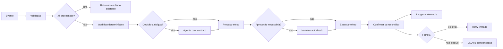

# 11 — Automação Agentic

> [!IMPORTANT]
> Automação confiável não é encadear blocos até “funcionar”. É garantir que reentrega, concorrência, timeout, falha parcial e intervenção humana não produzam efeitos duplicados, invisíveis ou sem responsável.

## Para quem é este módulo

Este módulo é destinado a estudantes que já conseguem:

- modelar tools, loops, memória, avaliação e segurança;
- interpretar filas, eventos, retries, logs e traces;
- explicar idempotência, least privilege e stop conditions;
- executar exemplos Python locais;
- registrar evidências técnicas em Markdown e JSON.

Quem ainda não domina esses pontos deve concluir a [Trilha Zero](../../zero-track/README.md) e revisar os módulos 03, 04, 09 e 10.

## Resultado final observável

Ao final, você deverá entregar uma automação local que:

- receba eventos versionados;
- valide schema, tenant e origem;
- use agente apenas em decisões ambíguas;
- aplique chave idempotente por efeito;
- tolere reentrega e concorrência;
- limite retries e timeouts;
- use dead-letter queue para falhas não resolvidas;
- exija aprovação humana para efeitos sensíveis;
- reconcilie efeitos ambíguos;
- execute compensação quando aplicável;
- gere trace, ledger e relatório terminal auditáveis;
- possua caminho manual seguro.

## Diagnóstico inicial

Antes de estudar, responda sem consultar o material:

1. Por que retry pode duplicar um efeito externo?
2. Qual a diferença entre rollback, compensação e reconciliação?
3. Quando um agente deve participar de um workflow?
4. O que fazer quando um webhook é entregue duas vezes?
5. Como provar que uma aprovação humana corresponde ao payload executado?

Registre as respostas e repita o diagnóstico ao final.

## Objetivos

- Separar orquestração determinística de decisão probabilística.
- Projetar webhooks, filas, idempotency keys, compensação e approval tasks.
- Implementar o mesmo fluxo em código e automação visual e comparar trade-offs.
- Instrumentar cada etapa com telemetria, owner, SLA, retry budget e trilha de auditoria.
- Projetar caminhos seguros para falha de IA, dependência e operador.
- Demonstrar recuperação sem duplicação de efeitos.

## Pré-requisitos

- [Módulo 10 — Observability Engineering](../10-observability-engineering/README.md) concluído;
- APIs, eventos, filas e padrões de integração;
- noções de idempotência, reconciliação, least privilege e observabilidade;
- Python 3.11+ recomendado;
- nenhuma chave de API é necessária.

## Explicação em três camadas

### Camada 1 — explicação simples

Uma automação confiável recebe um evento, verifica se já o processou, executa apenas o necessário, registra o resultado e sabe o que fazer quando algo falha.

### Camada 2 — explicação operacional

O workflow valida o evento, cria uma chave idempotente, executa etapas determinísticas, chama um agente apenas quando há ambiguidade, solicita aprovação quando há risco e reconcilia o efeito final.

### Camada 3 — explicação de engenharia

Automação Agentic combina event-driven architecture, state machine, policy enforcement, idempotent consumers, saga/compensation e observabilidade distribuída. O modelo não deve controlar identidade, autoridade, retries, persistência ou confirmação de efeito.

## Glossário essencial

| Termo | Definição operacional |
|---|---|
| evento | fato imutável que descreve algo ocorrido |
| comando | solicitação explícita para produzir um efeito |
| webhook | entrega HTTP de um evento ou comando |
| workflow | sequência governada de estados e transições |
| idempotency key | chave que impede repetição do mesmo efeito lógico |
| retry budget | limite de novas tentativas por etapa e execução |
| compensação | ação corretiva de negócio para efeito já confirmado |
| reconciliação | verificação do estado real após resultado ambíguo |
| DLQ | fila de mensagens que exigem tratamento separado |
| backpressure | redução controlada de consumo diante de saturação |
| approval task | decisão humana vinculada ao artefato exato |
| ledger | registro durável dos efeitos e estados observados |

## Arquitetura de referência



Descrição textual: o evento é validado e deduplicado antes do workflow. O agente participa apenas em decisão ambígua. Efeitos sensíveis exigem aprovação vinculada. O resultado é confirmado ou reconciliado, registrado em ledger e tratado por retry, DLQ ou compensação.

## Evento versus comando

Não trate todo webhook como autorização para agir.

- **evento** informa que algo ocorreu;
- **comando** pede uma ação;
- **conteúdo recuperado** é dado, não autoridade;
- **aprovação** precisa estar vinculada ao comando exato.

Eventos devem possuir, no mínimo:

```json
{
  "event_id": "evt-001",
  "event_type": "order.received",
  "event_version": "1.0",
  "occurred_at": "2026-07-21T12:00:00Z",
  "source": "orders-api",
  "tenant_id": "tenant-123",
  "correlation_id": "corr-001",
  "payload": {"order_id": "ord-001"}
}
```

## Estado do workflow

Estados recomendados:

```text
received
→ validated
→ deduplicated
→ decision_pending
→ approval_pending
→ effect_pending
→ effect_unknown
→ reconciled
→ completed
→ compensated
→ dead_lettered
→ stopped
```

Toda transição precisa registrar origem, destino, razão, owner, timestamp e versão do workflow.

## Idempotência

A chave idempotente deve representar o efeito lógico, não apenas a tentativa.

Exemplo:

```text
hash(tenant_id + workflow_version + business_object_id + effect_type)
```

Controles mínimos:

- armazenamento durável da chave;
- status `pending`, `succeeded`, `failed` ou `unknown`;
- retorno do resultado anterior em reentrega;
- lock ou compare-and-set para concorrência;
- TTL coerente com a janela de duplicação;
- reconciliação antes de repetir efeito `unknown`.

## Retries seguros

Retry só deve ocorrer quando:

- a falha for classificada como transitória;
- a operação for idempotente ou reconciliável;
- o budget não estiver esgotado;
- houver backoff e jitter;
- o sistema souber se o efeito anterior ocorreu.

Nunca faça retry cego após timeout de operação mutável.

## Timeout e efeito ambíguo

Um timeout não prova que a ação falhou. O estado correto pode ser `effect_unknown`.

Fluxo seguro:

```text
timeout
→ consultar sistema de destino
→ localizar por idempotency key ou effect_id
→ confirmar sucesso, falha ou ausência
→ somente então repetir, compensar ou encerrar
```

## Compensação

Compensação não é “desfazer tecnicamente” em todos os casos. É uma ação de negócio explícita.

Exemplos:

- cancelar reserva confirmada;
- emitir estorno;
- revogar permissão concedida;
- publicar correção;
- criar tarefa manual.

Toda compensação deve ter:

- precondições;
- owner;
- idempotency key própria;
- evidência do efeito original;
- limite de tentativas;
- resultado terminal.

## Filas, concorrência e DLQ

Controles mínimos:

- consumidores idempotentes;
- limite de concorrência;
- visibility timeout coerente;
- retry count explícito;
- dead-letter queue;
- poison message detection;
- backpressure;
- ordenação somente quando necessária;
- reconciliação de mensagens parcialmente processadas.

DLQ não é lixeira. Cada item precisa de owner, classificação, evidência e política de reprocessamento.

## Aprovação humana segura

A aprovação precisa estar vinculada a:

- identidade e papel do aprovador;
- tenant e projeto;
- comando;
- argumentos canônicos;
- hash do preview;
- política vigente;
- validade temporal;
- versão do executor.

Qualquer alteração invalida a aprovação.

## Onde usar agente

Use agente quando existir ambiguidade real, por exemplo:

- classificar texto não estruturado;
- resumir evidência;
- sugerir prioridade;
- propor resposta;
- detectar intenção incerta.

Não use agente para:

- deduplicação;
- autenticação;
- autorização;
- cálculo de retry;
- geração de idempotency key;
- validação de schema;
- execução de efeito sem gate;
- confirmação do estado real.

## Código versus automação visual

Compare as alternativas pelas mesmas dimensões:

| Dimensão | Código/SDK | Plataforma visual |
|---|---|---|
| versionamento | forte quando integrado ao Git | varia por export e governança |
| testes | maior controle | depende da plataforma |
| observabilidade | customizável | frequentemente integrada |
| portabilidade | maior | pode haver lock-in |
| velocidade inicial | moderada | geralmente alta |
| governança | explícita em código | exige configuração disciplinada |
| recuperação | programável | limitada pelos recursos disponíveis |

Não declare uma opção superior sem medir o caso real.

## Segurança

- validar assinatura e timestamp de webhook;
- bloquear replay fora da janela permitida;
- aplicar tenant e least privilege;
- manter segredos fora de payloads, logs e prompts;
- tratar outputs de agentes como não confiáveis;
- usar allowlist de destinos e operações;
- impedir mudança de ambiente pelo modelo;
- suspender efeitos sensíveis sem audit trail íntegro;
- possuir kill switch e caminho manual.

## Observabilidade

Correlacione:

```text
event_id → workflow_run_id → agent_decision_id → approval_id → effect_id → reconciliation_id
```

Registre:

- estado e transição;
- versão do workflow;
- owner;
- tentativas e budgets;
- latência por etapa;
- motivo de retry;
- aprovação;
- efeito real;
- compensação;
- razão terminal;
- item de DLQ, quando houver.

## Métricas essenciais

| Métrica | Interpretação |
|---|---|
| duplicate_effect_rate | efeitos duplicados / efeitos totais |
| redelivery_rate | eventos reentregues / eventos recebidos |
| idempotency_hit_rate | reentregas resolvidas pelo ledger |
| retry_success_rate | retries que recuperaram a execução |
| unknown_effect_rate | efeitos que exigiram reconciliação |
| compensation_rate | execuções que exigiram compensação |
| DLQ rate | mensagens encaminhadas à DLQ |
| manual_intervention_rate | execuções que precisaram de operador |
| workflow_success_rate | execuções concluídas corretamente |
| time_to_reconcile | tempo até confirmar efeito ambíguo |

## Implementação de referência

Execute:

```bash
python examples/idempotent_automation.py --self-test
```

A implementação local deve provar:

- validação de evento;
- deduplicação;
- concorrência segura;
- retry limitado;
- efeito ambíguo;
- reconciliação;
- compensação;
- DLQ;
- aprovação vinculada;
- relatório terminal auditável.

> [!WARNING]
> Se o exemplo não existir ou não executar no ambiente documentado, registre o bloqueio. Não substitua evidência por descrição.

## Prática guiada

1. modele um webhook de pedido recebido;
2. declare schema, versão e tenant;
3. gere a idempotency key;
4. simule duas entregas simultâneas;
5. force timeout após o efeito;
6. reconcilie o destino;
7. envie uma falha permanente à DLQ;
8. registre o trace esperado.

## Prática independente

Implemente o mesmo fluxo em:

- Python ou TypeScript;
- uma plataforma visual, quando disponível.

Compare idempotência, testes, auditoria, custo, lock-in, manutenção e recuperação.

## Testes negativos obrigatórios

- webhook sem assinatura;
- evento sem versão;
- tenant ausente;
- replay fora da janela;
- duas entregas concorrentes;
- retry após timeout sem reconciliação;
- idempotency key inconsistente;
- aprovação reutilizada em payload diferente;
- agente tentando alterar destino;
- segredo em log;
- DLQ sem owner;
- compensação duplicada;
- fila sem backpressure;
- efeito confirmado sem ledger;
- caminho manual inexistente.

## Stop conditions para o estudante

Pare o exercício e peça revisão quando:

- reentrega puder duplicar efeito;
- timeout for tratado automaticamente como falha;
- o agente controlar identidade, permissão ou retry;
- uma aprovação puder ser reutilizada;
- não houver owner para DLQ ou intervenção manual;
- o sistema não conseguir reconstruir evento, decisão e efeito;
- segredos aparecerem em payload, prompt ou log.

## Acessibilidade

- diagramas devem possuir descrição textual;
- tabelas devem ter cabeçalhos claros;
- informação não deve depender apenas de cor;
- exemplos precisam estar disponíveis como texto copiável;
- siglas devem ser expandidas na primeira ocorrência;
- vídeos futuros devem possuir legenda e transcrição;
- o futuro portal deve permitir navegação por teclado e leitor de tela.

## Laboratório

Execute o [LAB-1101 — Idempotência e compensação](../../../labs/LAB-1101-idempotent-automation.md).

## Projeto obrigatório

Construa uma automação que:

1. processe evento versionado;
2. valide origem, tenant e schema;
3. use agente apenas na decisão ambígua;
4. exija aprovação vinculada;
5. registre efeitos por chave idempotente;
6. suporte reentrega e concorrência;
7. limite retries e timeouts;
8. reconcilie efeito ambíguo;
9. execute compensação ou DLQ;
10. produza relatório humano e legível por máquina;
11. possua caminho manual seguro;
12. documente risco residual.

## Avaliação

A avaliação combina:

- diagnóstico inicial e final;
- autoteste da implementação de referência;
- LAB-1101;
- projeto obrigatório;
- testes negativos;
- comparação código versus plataforma visual;
- defesa técnica de dez minutos;
- autoavaliação pela [rubrica transversal](../../rubrics/transversal-rubric.md).

Idempotência, segurança, reconciliação e rastreabilidade são critérios de bloqueio.

## Rubrica específica

| Nível | Evidência |
|---|---|
| insuficiente | reentrega duplica efeitos, retries são cegos ou não há trilha |
| funcional | fluxo principal funciona com deduplicação e tratamento básico |
| robusta | concorrência, reconciliação, DLQ, compensação e aprovação são testadas |
| excelente | benefício, segurança, acessibilidade, operação e recuperação são demonstrados com métricas e auditoria completas |

## Quiz

1. Por que retry após timeout pode ser perigoso?
2. Qual a diferença entre evento e comando?
3. Quando compensação é necessária?
4. Por que DLQ precisa de owner?
5. O que torna uma aprovação íntegra?

<details>
<summary>Gabarito comentado</summary>

1. Porque o efeito pode ter ocorrido mesmo sem resposta, gerando duplicação.
2. Evento descreve algo ocorrido; comando solicita uma ação autorizada.
3. Quando um efeito confirmado precisa de ação corretiva de negócio.
4. Porque mensagens não resolvidas exigem decisão, evidência e destino operacional.
5. Vinculação à identidade, payload, preview, política, prazo e versão do executor.

</details>

## Checklist

- [ ] Reentrega e execução concorrente são seguras.
- [ ] Evento, comando e conteúdo não confiável estão separados.
- [ ] Estado, ownership e correlação de cada etapa estão visíveis.
- [ ] Existe caminho manual quando IA ou dependência falha.
- [ ] Efeitos externos usam idempotency key e ledger verificável.
- [ ] Retry, timeout, compensação e DLQ têm limites explícitos.
- [ ] Efeito ambíguo exige reconciliação.
- [ ] Aprovação está vinculada ao artefato exato.
- [ ] Agente não controla autoridade nem confirmação de efeito.
- [ ] Alertas possuem owner, runbook e condição de resolução.
- [ ] Segurança e auditoria são preservadas em falhas.
- [ ] Risco residual está documentado.

## Autoavaliação

Consigo explicar e demonstrar:

- por que a automação é idempotente;
- como concorrência é controlada;
- quando retry é seguro;
- como efeito ambíguo é reconciliado;
- como compensação funciona;
- quando uma mensagem vai para DLQ;
- como aprovação é vinculada;
- por que o agente participa apenas em etapas ambíguas;
- como reconstruir toda a execução.

## Critérios de excelência

| Dimensão | Padrão Premium Elite |
|---|---|
| Idempotência | zero efeito duplicado na suíte local |
| Concorrência | reentrega simultânea produz um único efeito lógico |
| Recuperação | timeout, falha parcial e DLQ possuem caminho reproduzível |
| Segurança | identidade, tenant, permissão e aprovação permanecem fora do modelo |
| Observabilidade | evento, decisão, aprovação, efeito e compensação são correlacionados |
| Operação | owners, SLA, alertas e runbooks estão definidos |
| Comparabilidade | código e plataforma visual são avaliados pelos mesmos critérios |
| Acessibilidade | conteúdo possui alternativas textuais e estrutura navegável |

## Bibliografia

HOHPE, Gregor; WOOLF, Bobby. *Enterprise Integration Patterns*. Addison-Wesley, 2003.

## Referências

- [CloudEvents 1.0.2](https://github.com/cloudevents/spec/blob/v1.0.2/cloudevents/spec.md), CNCF, 2022.
- [NIST SP 800-204D](https://doi.org/10.6028/NIST.SP.800-204D), estratégias de segurança para software baseado em eventos.

> [!WARNING]
> Plataformas visuais aceleram integração, mas não substituem contratos, idempotência, testes, segregação de acesso, reconciliação e resposta a incidentes.

## Próximo passo

Conclua o LAB-1101 e obtenha nível funcional ou superior antes de avançar para [12 — Capstone](../12-capstone/README.md).