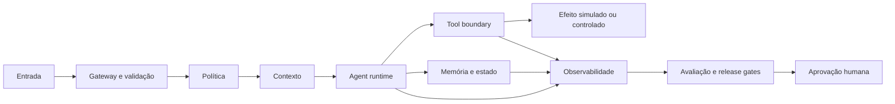

# 12 — Capstone production-grade

> [!IMPORTANT]
> O capstone não é uma vitrine de funcionalidades. É uma defesa integrada de que o sistema pode ser explicado, testado, protegido, observado, interrompido e recuperado com evidência suficiente para reprodução independente.

## Para quem é este módulo

Este módulo é destinado a estudantes que concluíram os módulos 00–11 e já conseguem:

- escrever contratos de agente, contexto, tool, loop e memória;
- implementar idempotência, budgets, stop conditions e reconciliação;
- construir datasets e hard gates de avaliação;
- modelar ameaças e aplicar least privilege;
- definir rollout, rollback, SLOs e observabilidade;
- explicar limitações sem alegar segurança ou conformidade absolutas.

## Resultado final observável

Ao final, você deverá entregar um sistema agentic executável que:

- resolve um problema real com escopo limitado;
- possui requisitos, non-goals e critérios de sucesso rastreáveis;
- executa localmente sem segredo obrigatório para a demo principal;
- separa control, data, state e observability plane;
- protege tools, memória, handoffs e efeitos externos;
- mede qualidade, segurança, custo e latência;
- bloqueia release diante de hard gates;
- permite pausar, retomar, reconciliar e reverter;
- sobrevive a um game day controlado;
- produz documentação, evidências e defesa técnica reproduzíveis.

## Diagnóstico inicial

Antes de iniciar, responda:

1. Qual problema será resolvido e qual ficará fora do escopo?
2. Qual é o menor vertical slice que produz valor observável?
3. Quais efeitos são reversíveis, compensáveis ou irreversíveis?
4. Quais falhas bloqueiam release independentemente da média?
5. Como outra pessoa provará que a demo funciona sem depender de você?
6. Qual risco residual continuará existindo?

Registre as respostas e revise-as ao final.

## Objetivos

- Integrar os módulos 00–11 em uma arquitetura coerente.
- Construir um vertical slice antes de ampliar escopo.
- Transformar requisitos em contratos, testes, métricas e evidências.
- Demonstrar segurança, avaliação, observabilidade e recuperação.
- Operar piloto controlado com rollback e game day.
- Defender decisões arquiteturais com ADRs e trade-offs explícitos.
- Produzir documentação acessível para usuários, operadores e revisores.

## Pré-requisitos

- módulos 00–11 concluídos;
- projeto aprovado no [brief do capstone](../../../projects/capstone/README.md);
- Python 3.11+ recomendado;
- Git e ambiente local funcional;
- rubrica transversal compreendida;
- nenhuma chave de API obrigatória para a execução de referência.

## Explicação em três camadas

### Camada 1 — explicação simples

Você construirá um sistema completo, mas pequeno o suficiente para ser testado. Ele deve fazer algo útil, falhar com segurança e deixar evidências.

### Camada 2 — explicação operacional

O projeto conecta entrada, política, contexto, decisão, tools, memória, avaliação, telemetria, automação e operação. Cada etapa possui contrato, owner, teste, budget e stop condition.

### Camada 3 — explicação de engenharia

O capstone valida um sistema sociotécnico: software, modelos, pessoas, políticas, dados, fornecedores e procedimentos. A qualidade depende da coerência entre arquitetura, governança e evidência.

## Glossário essencial

| Termo | Definição operacional |
|---|---|
| vertical slice | fluxo mínimo ponta a ponta que entrega valor e evidência |
| non-goal | capacidade explicitamente fora do escopo |
| acceptance criterion | condição observável para aceitar uma entrega |
| ADR | registro versionado de decisão arquitetural |
| release gate | condição que permite ou bloqueia promoção |
| game day | simulação controlada de falhas e ataques |
| pilot | uso limitado, monitorado e reversível |
| residual risk | risco que permanece após os controles |
| operational readiness | evidência de que o sistema pode ser operado e recuperado |
| evidence bundle | conjunto versionado de relatórios, traces, testes e decisões |

## Escolha do problema

O problema deve:

- ter usuário ou operador identificável;
- possuir valor observável;
- permitir definição clara de sucesso e falha;
- caber em 30–60 horas;
- evitar domínio de alto risco sem supervisão especializada;
- possuir alternativa manual;
- permitir demo local segura.

Evite projetos cujo sucesso dependa apenas de uma resposta visualmente impressionante.

## Critérios de escopo

```yaml
problem: triagem de solicitações internas simuladas
primary_user: operador de suporte
success:
  - classificar caso com justificativa
  - encaminhar somente após aprovação
non_goals:
  - responder automaticamente ao cliente real
  - acessar dados pessoais reais
  - executar mutação irreversível
constraints:
  - demo local
  - dados sintéticos
  - zero segredo obrigatório
```

## Arquitetura mínima



Descrição textual: a entrada é validada antes do runtime; políticas limitam contexto e tools; estado e efeitos são rastreados; observabilidade alimenta avaliação; efeitos sensíveis dependem de aprovação vinculada ao artefato exato.

## Invariantes obrigatórias

Durante execução normal, falha e game day:

- tenant e projeto não trocam silenciosamente;
- autoridade não é ampliada pelo modelo;
- conteúdo recuperado permanece não confiável;
- efeitos externos usam idempotency key;
- timeout mutável não autoriza retry cego;
- segredos não aparecem em prompts, logs ou artefatos;
- hard gates não são compensados por médias;
- eventos críticos não são descartados por sampling;
- operador consegue interromper o sistema;
- estado terminal possui razão tipada.

## Entregáveis obrigatórios

### 1. Requisitos

Inclua problema, usuários, jornadas, requisitos funcionais e não funcionais, non-goals, critérios de aceitação, restrições, riscos e dependências.

### 2. Arquitetura

Inclua diagramas de contexto e componentes, fronteiras de confiança, fluxo de dados, planes, adapters, degradação e decisão build versus buy.

### 3. ADRs

Registre arquitetura, modelo ou adapter, memória, efeitos e aprovação, avaliação, rollout e rollback.

### 4. Threat model

Mapeie ativos, atores, fronteiras, capabilities, abuse cases, controles, testes, owners e risco residual.

### 5. Evaluation suite

Inclua dataset versionado, baseline, casos críticos e adversariais, graders, métricas, hard gates, regressão e decisão de release.

### 6. Observabilidade

Comprove correlação, logs estruturados, traces, métricas, auditoria, redaction, cardinalidade e alertas com owner e runbook.

### 7. Automação

Demonstre reentrega segura, concorrência, idempotência, retry budget, timeout ambíguo, reconciliação, DLQ, compensação e caminho manual.

### 8. Operação

Inclua SLI, SLO, canary, abort criteria, rollback, kill switch, restore quando aplicável, runbook e comunicação.

### 9. Evidence bundle

Inclua versões, CI, relatórios de avaliação e segurança, traces redigidos, game day, riscos, limitações e instruções de reprodução.

## Plano de execução

### Fase 1 — framing

- definir problema, usuário e non-goals;
- criar critérios de sucesso;
- identificar riscos críticos;
- aprovar o brief.

### Fase 2 — vertical slice

- construir fluxo mínimo ponta a ponta;
- usar dados sintéticos;
- evitar dependências desnecessárias;
- produzir primeiro trace e caso de avaliação.

### Fase 3 — hardening

- adicionar segurança, memória, retries, idempotência e budgets;
- expandir suíte adversarial;
- documentar limitações.

### Fase 4 — operational readiness

- definir SLOs;
- implementar alertas e runbooks;
- provar rollback e reconciliação;
- preparar game day.

### Fase 5 — pilot readiness

- executar suíte completa;
- revisar evidências;
- corrigir bloqueios;
- realizar defesa técnica;
- decidir `go`, `no-go` ou `go-with-constraints`.

## Demonstração executável

```bash
python examples/capstone_reference_system.py --self-test
```

A demonstração deve provar entrada válida e inválida, deny-by-default, proveniência, tool segura, loop com budgets, memória governada, avaliação, observabilidade, automação idempotente, kill switch e relatório terminal.

> [!WARNING]
> Caso a implementação de referência ainda não exista, registre o bloqueio. Pseudocódigo ou descrição não são evidência executável.

## Laboratório

- [LAB-1201 — Game day do capstone](../../../labs/LAB-1201-capstone-game-day.md): simular falhas, ataques, consumo de budget, timeout ambíguo, falha do collector e reentrega concorrente preservando invariantes e evidências.

## Prática guiada

1. escolha um problema limitado;
2. escreva cinco requisitos e três non-goals;
3. desenhe o vertical slice;
4. identifique três ameaças;
5. defina cinco casos de avaliação;
6. escolha dois hard gates;
7. defina um SLO;
8. escreva um rollback;
9. descreva o game day;
10. peça revisão antes de ampliar o escopo.

## Prática independente

Construa um protótipo local com dados sintéticos que processe uma solicitação, produza decisão justificada, exija aprovação para efeito simulado, registre trace e gere relatório de avaliação.

## Projeto

Entregue um sistema agentic completo e limitado que:

1. possua requisitos, non-goals e baseline;
2. implemente vertical slice executável;
3. use contratos para contexto, tools, loops e memória;
4. aplique least privilege e aprovação vinculada;
5. mantenha idempotência, ledger e reconciliação;
6. execute avaliação baseline versus candidato;
7. gere telemetria correlacionada sem segredos;
8. possua SLO, canary, rollback e kill switch;
9. conclua o LAB-1201;
10. produza evidence bundle e defesa técnica;
11. seja reproduzido por outra pessoa;
12. documente limitações e riscos residuais.

## Game day Premium Elite

O game day deve injetar:

- indisponibilidade de dependência;
- prompt injection indireta;
- consumo anormal de budget;
- timeout com efeito desconhecido;
- falha do collector;
- reentrega concorrente.

O sistema deve detectar, conter, preservar evidência, evitar duplicação, manter isolamento, permitir ação do operador e recuperar ou encerrar com razão tipada.

## Testes negativos obrigatórios

- requisito sem critério de aceitação;
- non-goal ausente;
- segredo obrigatório para demo;
- agente ampliando autoridade;
- tenant trocado;
- tool fora da allowlist;
- aprovação reutilizada;
- prompt injection indireta;
- memória contaminada;
- efeito duplicado;
- timeout com retry cego;
- hard gate ignorado;
- collector indisponível;
- rollback incompleto;
- game day sem evidência;
- demo não reproduzível;
- risco residual omitido.

## Stop conditions

Pare o projeto e peça revisão quando:

- o escopo não couber no prazo;
- não existir alternativa manual;
- houver dado sensível real sem governança;
- efeito irreversível não possuir aprovação especializada;
- hard gate estiver sendo contornado;
- a demo depender de segredo compartilhado;
- o operador não conseguir interromper o sistema;
- risco crítico ou alto permanecer sem tratamento.

## Acessibilidade

- diagramas possuem descrição textual;
- vídeos futuros possuem legenda e transcrição;
- demo não depende somente de cor, animação ou áudio;
- documentação usa títulos navegáveis;
- comandos e exemplos estão disponíveis como texto;
- interface futura deve funcionar com teclado;
- erros devem ser comunicados com texto claro;
- defesa técnica aceita formato equivalente acessível.

## Avaliação

A avaliação combina brief, requisitos, ADRs, arquitetura, threat model, sistema executável, suíte de avaliação, testes adversariais, observabilidade, automação, LAB-1201, evidence bundle, defesa técnica, reprodução independente e rubrica transversal.

Segurança, isolamento, idempotência, rastreabilidade e capacidade de interrupção são critérios bloqueantes.

## Defesa técnica

A defesa deve responder:

1. Por que este problema justifica um agente?
2. Qual é o baseline mais simples?
3. Onde está a autoridade real?
4. Como o sistema falha fechado?
5. Como efeitos duplicados são impedidos?
6. Qual evidência sustenta a decisão de release?
7. Como um operador contém um incidente?
8. Qual risco residual permanece?
9. O que seria removido para simplificar?
10. O que precisaria mudar para produção real?

## Rubrica específica

| Nível | Evidência |
|---|---|
| insuficiente | demo frágil, escopo vago, sem hard gates ou recuperação |
| funcional | vertical slice executa e possui controles básicos |
| robusta | segurança, avaliação, observabilidade, automação e rollback são testados |
| excelente | reprodução independente, game day, defesa e benefício líquido são demonstrados com acessibilidade e risco residual explícito |

## Checklist

- [ ] Problema, usuários, requisitos e non-goals são rastreáveis.
- [ ] Existe vertical slice executável.
- [ ] Baseline e justificativa agentic estão documentados.
- [ ] Contexto, tools, memória e loops possuem contratos.
- [ ] Threat model e suíte adversarial estão versionados.
- [ ] Hard gates bloqueiam release.
- [ ] Telemetria reconstrói decisão, aprovação e efeito.
- [ ] Reentrega e concorrência não duplicam efeitos.
- [ ] Timeout ambíguo exige reconciliação.
- [ ] Operador consegue pausar, retomar, reconciliar e encerrar.
- [ ] Rollout, rollback e kill switch foram testados.
- [ ] LAB-1201 possui evidências e postmortem.
- [ ] Outra pessoa reproduziu a demo.
- [ ] Limitações e riscos residuais estão explícitos.
- [ ] Acessibilidade foi revisada.

## Autoavaliação

Consigo demonstrar por que o agente é necessário, o que o sistema não faz, onde decisões são registradas, como autoridade e tenant são protegidos, como qualidade e segurança são medidas, como efeitos são reconciliados, como o sistema é interrompido, como um incidente é reconstruído, como outra pessoa reproduz o projeto e quais riscos permanecem.

## Critérios de excelência

| Dimensão | Padrão Premium Elite |
|---|---|
| Escopo | problema e non-goals limitados e testáveis |
| Arquitetura | fronteiras, contratos e trade-offs explícitos |
| Segurança | zero violação crítica tolerada |
| Avaliação | baseline, regressão e hard gates reproduzíveis |
| Operação | SLO, rollout, rollback, kill switch e runbooks testados |
| Automação | idempotência, reconciliação e compensação comprovadas |
| Observabilidade | caminho causal completo sem segredo persistido |
| Resiliência | game day preserva invariantes e evidências |
| Reprodutibilidade | outra pessoa executa sem informação tácita |
| Acessibilidade | documentação e demo possuem alternativas acessíveis |
| Honestidade | limitações e risco residual são explícitos |

## Bibliografia

FORD, Neal et al. *Software Architecture: The Hard Parts*. O’Reilly, 2021.

HOHPE, Gregor; WOOLF, Bobby. *Enterprise Integration Patterns*. Addison-Wesley, 2003.

## Referências

- NIST Secure Software Development Framework 1.1.
- Google Site Reliability Engineering Workbook.
- OWASP Agentic AI Threats and Mitigations.
- OpenTelemetry Specification.
- CloudEvents 1.0.2.

## Conclusão da trilha

A conclusão deste módulo não significa certificação automática, conformidade jurídica ou prontidão irrestrita para produção. O projeto permanece em `review` até cumprir o gate Premium Elite, passar por revisão humana e demonstrar evidências em ambiente controlado.