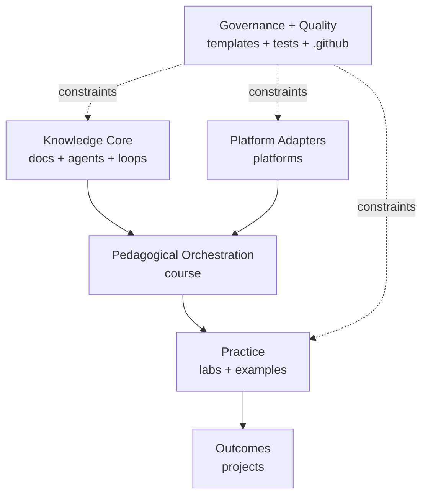

# Arquitetura da fundação

## Drivers

1. **Portabilidade:** conceitos não podem depender de uma API específica.
2. **Rastreabilidade:** cada objetivo liga-se a laboratório, projeto e evidência.
3. **Segurança por construção:** ações externas exigem política, budget e observabilidade.
4. **Evolução independente:** conteúdo, adapters e automação possuem ciclos diferentes.
5. **Tradução segura:** identidade conceitual permanece estável entre idiomas.

## Camadas

### Knowledge Core

Define vocabulário, invariantes, padrões e modelos de falha. Não importa SDKs.

### Platform Adapters

Traduz uma capacidade conceitual para uma plataforma. Cada adapter registra fonte oficial, versão/data verificada,
capacidade, lacunas e riscos. Não redefine o conceito.

### Pedagogical Orchestration

Ordena resultados de aprendizagem e pré-requisitos. Um módulo referencia o core, adapters, laboratórios e projetos;
não duplica conteúdo extenso.

### Practice e Outcomes

Laboratórios isolam hipóteses; projetos integram requisitos realistas. Exemplos são pequenos e comparáveis, nunca
substitutos para arquitetura.

## Contratos estáveis

| Contrato | Identidade | Mudança incompatível |
|---|---|---|
| Documento | `frontmatter.id` | trocar ou reutilizar ID |
| Módulo | `course.module.*` | remover objetivo avaliado |
| Adapter | `platform.*` | declarar paridade sem evidência |
| Laboratório | entradas + critérios | alterar resultado sem versão |
| Projeto | rubrica + ameaças | remover requisito de segurança |

## Estado de execução de um agente

```mermaid
stateDiagram-v2
    [*] --> Receive
    Receive --> Plan: objetivo válido
    Plan --> Act: política permite
    Act --> Observe
    Observe --> Plan: trabalho restante
    Observe --> Complete: critério atingido
    Plan --> AwaitApproval: ação de alto risco
    AwaitApproval --> Act: aprovado
    AwaitApproval --> Cancelled: negado/expirado
    Plan --> Stopped: budget/stop condition
    Act --> Recover: falha
    Recover --> Plan: retry seguro
    Recover --> Stopped: circuit breaker
    Complete --> [*]
    Cancelled --> [*]
    Stopped --> [*]
```

## Decisões

- Português é canônico; traduções espelham IDs, não caminhos necessariamente.
- Markdown puro é o formato fonte; renderizadores são consumidores descartáveis.
- Python standard library valida a fundação para minimizar bootstrap.
- Apache-2.0 oferece licença permissiva com concessão explícita de patentes.
- Integrações entram como adapters experimentais até testes de equivalência.

Registre novas decisões com [ADR](../../templates/adr.md).

