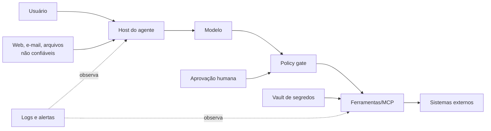

# Segurança de sistemas agentes

> [!WARNING]
> Saída de modelo e conteúdo externo são entradas não confiáveis. Nenhuma instrução textual substitui autorização,
> isolamento, validação determinística ou aprovação humana.

## Modelo de ameaça

Fronteiras críticas: conteúdo→modelo, modelo→ação, host→servidor MCP, ferramenta→sistema externo e logs→operadores.

## Catálogo de riscos e controles

| Risco | Prevenção | Detecção | Recuperação |
|---|---|---|---|
| Prompt injection direta/indireta | separar instrução de dados, reduzir contexto, allowlists | canários, policy gate, auditoria de ações | revogar tokens, invalidar memória, investigar alcance |
| Exfiltração de segredos | secret manager, escopo mínimo, nunca colocar segredo no prompt | DLP, redaction, alertas de egress | rotacionar e revogar, preservar evidência |
| Tool/MCP abuse | schemas estritos, audience binding, consentimento | logs por chamada e identidade | desabilitar ferramenta, isolar servidor |
| Loop sem fim/custo | budgets e stop conditions | métricas de passos, custo e latência | circuit breaker, checkpoint e cancelamento |
| Efeito destrutivo | dry-run, idempotência, aprovação humana | trilha de auditoria e reconciliação | compensação/rollback testado |
| Multiagente confuso | identidade, contratos e capacidades por agente | traces de handoff e proveniência | quarentena e retomada no checkpoint |

## Prompt injection

Trate páginas, issues, e-mails, tool outputs, memória recuperada e documentos como dados potencialmente hostis. Use
defesa em profundidade: rotulagem de proveniência, minimização, parsing estruturado, política de ação fora do modelo,
confirmação contextual e escopos mínimos. Classificadores ajudam, mas também podem falhar; não são autoridade final.

Checklist:

- [ ] O agente distingue origem confiável, usuário e conteúdo externo.
- [ ] Conteúdo externo não pode ampliar permissões.
- [ ] A decisão de executar valida intenção original, identidade, recurso e parâmetros.
- [ ] Renderização de Markdown/HTML impede egress invisível.
- [ ] Casos adversariais fazem parte da avaliação contínua.

## MCP Security

O host controla consentimento e isolamento. Cada conexão cliente–servidor deve ser independente; capacidades são
negociadas, não presumidas. Para HTTP remoto, valide issuer, audience/resource, expiração e escopo; não faça token
passthrough. Para `stdio`, trate o processo local como código com os privilégios do usuário e fixe origem/versão.

- Inventarie servidor, mantenedor, versão, hash/origem e ferramentas expostas.
- Bloqueie mudanças inesperadas de tool schema.
- Separe credenciais do servidor e do usuário final.
- Nunca confie no `Mcp-Session-Id` como autorização.
- Use HTTPS, PKCE e redirect URI exata quando OAuth se aplicar.

## Segredos e least privilege

Segredos vivem em vaults, expiram e são injetados apenas no processo que precisa deles. Prefira credenciais por tarefa,
recursos específicos, acesso read-only e egress restrito. Redija logs antes de persistir; `.env` é conveniência local,
não secret manager.

## Human approval

A aprovação inclui ação, alvo, efeito, diff/preview, credencial usada, custo e prazo. Reaproveitar um “sim” genérico para
outra ação é inválido. Exija aprovação fresca para publicação, exclusão, gasto, comunicação externa, mudança de acesso
e uso de dados sensíveis.

## Rollback, circuit breaker e stop conditions

Rollback é uma operação testada, não uma promessa. Prefira ações idempotentes, transações, versionamento e operações
compensatórias. O circuit breaker abre após limiar de falhas e só retorna após cooldown e probe controlado.

Stop conditions mínimas: objetivo atingido, usuário cancela, aprovação negada/expira, budget esgota, progresso cessa,
violação de política, dependência indisponível, resultado ambíguo de ação não idempotente ou breaker aberto.

## Resposta a incidentes

1. **Detectar e classificar:** impacto, dados, identidades, ferramentas e intervalo.
2. **Conter:** parar loops, revogar tokens, desabilitar adapters e preservar logs.
3. **Erradicar:** remover conteúdo/memória contaminada e corrigir fronteira violada.
4. **Recuperar:** restaurar checkpoint, reconciliar efeitos e monitorar recorrência.
5. **Aprender:** timeline sem culpa, controle corretivo, teste regressivo e divulgação coordenada.

Use o [template de threat model](../../templates/threat-model.md) e o
[runbook de incidente](../../templates/incident-runbook.md).

## Referências essenciais

- [OWASP — LLM Prompt Injection Prevention](https://cheatsheetseries.owasp.org/cheatsheets/LLM_Prompt_Injection_Prevention_Cheat_Sheet.html), acesso 2026-07-19.
- [OWASP — AI Agent Security Cheat Sheet](https://cheatsheetseries.owasp.org/cheatsheets/AI_Agent_Security_Cheat_Sheet.html), acesso 2026-07-19.
- [MCP Specification 2025-11-25](https://modelcontextprotocol.io/specification/2025-11-25), acesso 2026-07-19.
- [NIST AI RMF: Generative AI Profile, NIST AI 600-1](https://doi.org/10.6028/NIST.AI.600-1), 2024.

