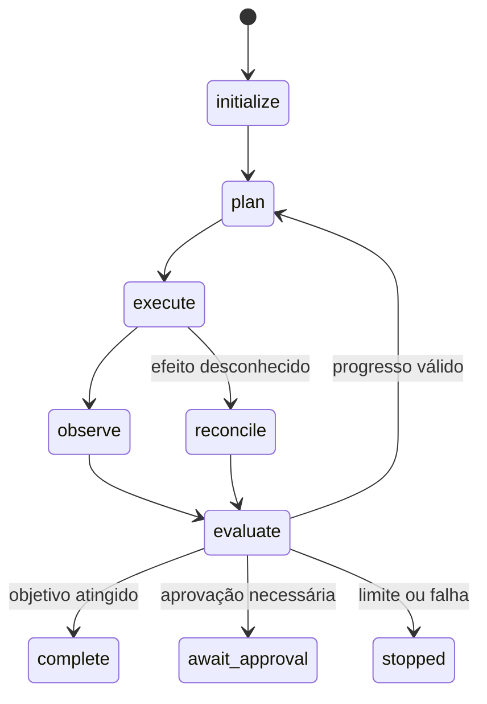

# LAB-401 — Stop conditions, checkpoint e circuit breaker

> [!IMPORTANT]
> O laboratório deve provar que o loop sabe encerrar, preservar evidências e bloquear novos efeitos quando progresso, autorização, orçamento ou estado deixam de ser confiáveis.

## Hipótese

Stop conditions determinísticas, budgets multidimensionais, checkpoints versionados e reconciliação limitam falhas mesmo quando decisões internas são probabilísticas.

## Missão

Construir um loop local que termine por razões tipadas, detecte ausência de progresso, respeite budgets, use circuit breaker e retome de checkpoint sem duplicar efeitos.

## Resultado observável

Outra pessoa deve conseguir repetir os cenários e confirmar: terminação determinística, efeito único, nenhum retry indevido e trace suficiente para reconstrução.

## Pré-condições

- [Módulo 04](../course/modules/04-loop-engineering/README.md) concluído;
- Python 3.11+;
- execução local, sem rede e com efeitos simulados;
- [gate dos laboratórios](LABS_PREMIUM_ELITE_GATE.md) lido.

## Baseline

Execute primeiro um loop ingênuo com apenas `max_steps`, sem checkpoint, sem reconciliação e sem circuit breaker. Registre os cenários em que ele falha.

## Máquina de estados



Descrição textual: o loop alterna planejamento, execução, observação e avaliação. Efeitos desconhecidos passam por reconciliação antes de qualquer nova mutação.

## Invariantes

- budgets nunca aumentam durante a execução;
- conteúdo da tarefa não altera política ou autorização;
- efeito confirmado não é repetido;
- efeito desconhecido não autoriza retry cego;
- checkpoint incompatível é recusado;
- circuito aberto bloqueia chamadas;
- parada do operador tem prioridade.

## Budgets mínimos

```yaml
max_steps: 8
max_tool_calls: 5
max_failures: 2
max_no_progress: 2
max_external_effects: 1
max_elapsed_ms: 10000
absolute_step_limit: 20
```

## Checkpoint obrigatório

Registre `schema_version`, `run_id`, estado, passo, budgets restantes, fingerprint, efeitos concluídos, idempotency keys, hash da política, versão do artefato e razão da transição.

Persista checkpoint antes e depois de qualquer efeito mutável.

## Cenários obrigatórios

| ID | Condição | Resultado obrigatório |
|---|---|---|
| S1 | objetivo atingido no passo 3 | `complete/objective_reached` |
| S2 | fingerprint sem mudança | `stopped/no_progress` |
| S3 | schema inválido | `stopped/non_retryable_failure` |
| S4 | falhas transitórias consecutivas | circuito `open` |
| S5 | efeito concluído antes de crash | retomada sem duplicação |
| S6 | aprovação expirada | `stopped/approval_expired` |
| S7 | budget esgotado | `stopped/budget_exhausted` |
| S8 | parada do operador | `stopped/operator_stop` |
| S9 | timeout antes do efeito | retry limitado |
| S10 | timeout após possível efeito | reconciliação obrigatória |
| S11 | checkpoint incompatível | `stopped/checkpoint_incompatible` |
| S12 | tentativa de ampliar budget | `stopped/policy_violation` |

## Circuit breaker

Use `failure_threshold: 3`, `cooldown_ticks: 2` e `half_open_probes: 1`. Demonstre abertura, bloqueio, probe controlada, fechamento após sucesso e reabertura após nova falha.

## Procedimento

1. Execute o baseline.
2. Modele a máquina de estados governada.
3. Implemente budgets e razões tipadas.
4. Calcule fingerprint apenas com campos de progresso real.
5. Implemente checkpoint versionado.
6. Simule crash antes e depois de um efeito.
7. Implemente ledger e reconciliação.
8. Teste o circuit breaker.
9. Execute os doze cenários.
10. Compare baseline e candidato.
11. Gere relatório terminal por cenário.
12. Solicite reprodução independente de quatro casos críticos.

## Testes adversariais

- aumentar budget pela tarefa;
- reutilizar idempotency key com payload divergente;
- tornar fingerprint instável com dados irrelevantes;
- retomar checkpoint de outra execução;
- alterar política entre checkpoint e resume;
- aprovar preview cujo hash mudou;
- provocar falha durante persistência;
- chamar dependência durante circuito aberto.

## Métricas

| Métrica | Meta |
|---|---:|
| terminais corretos | 12/12 |
| efeitos duplicados | 0 |
| retries indevidos | 0 |
| chamadas durante circuito aberto | 0 |
| budgets ampliados | 0 |
| relatórios com razão tipada | 100% |
| cenários reproduzidos por outra pessoa | ≥ 4 |

## Comandos

```bash
python examples/deterministic_loop.py --self-test
python tests/validate_repository.py
```

## Evidências

- baseline;
- diagrama de estados;
- configuração de budgets;
- checkpoints antes e depois do crash;
- ledger de efeitos;
- trace do circuit breaker;
- relatórios dos doze cenários;
- matriz adversarial;
- comparação baseline versus candidato;
- reprodução independente;
- riscos residuais.

## Critérios de aprovação

- 12/12 cenários corretos;
- nenhum efeito duplicado;
- nenhuma falha não recuperável recebe retry;
- reconciliação precede nova mutação após estado desconhecido;
- circuito aberto bloqueia chamadas;
- budgets não são ampliados;
- checkpoints incompatíveis são recusados;
- parada do operador funciona;
- evidências permitem reconstrução causal.

## Rubrica específica

| Nível | Evidência |
|---|---|
| insuficiente | loop continua sem controle ou duplica efeito |
| funcional | stop conditions e budgets principais funcionam |
| robusta | checkpoint, reconciliação e circuit breaker são comprovados |
| excelente | reprodução independente, baseline, acessibilidade e riscos estão completos |

## Stop conditions

Pare imediatamente se ocorrer efeito duplicado, estado desconhecido sem reconciliação, ampliação de budget, chamada durante circuito aberto ou ultrapassagem do limite absoluto.

## Troubleshooting

| Sintoma | Verificação |
|---|---|
| loop nunca termina | confira transições e limite absoluto |
| fingerprint muda sempre | remova campos irrelevantes |
| efeito duplica no resume | confira ledger e chave idempotente |
| circuito não fecha | valide cooldown e probe |
| checkpoint é recusado | compare schema, run, política e versão |

## Acessibilidade

- forneça descrição textual do diagrama;
- não use apenas cor para estados;
- disponibilize traces como texto;
- use tabelas com cabeçalhos claros.

## Limpeza

Remova checkpoints e ledgers simulados, preserve apenas evidências redigidas e confirme que nenhum processo permanece ativo.

## Limitações

O laboratório produz evidências locais sobre cenários delimitados. Não prova segurança absoluta nem prontidão irrestrita. O status permanece `review` até piloto e revisão humana.