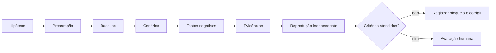

# Laboratórios NEXUS

> [!IMPORTANT]
> Um laboratório NEXUS não existe para confirmar que o estudante seguiu passos. Ele existe para testar uma hipótese, expor falhas, produzir evidências reproduzíveis e registrar limites honestos.

## Finalidade

Os laboratórios transformam conceitos dos módulos em experiências controladas. Cada atividade deve:

- isolar uma hipótese verificável;
- usar dados sintéticos e ferramentas fake sempre que possível;
- produzir evidências reproduzíveis;
- incluir cenário positivo, negativo e adversarial;
- definir stop conditions;
- registrar ambiente, versão e limitações;
- impedir efeitos externos indevidos;
- permitir reprodução por outra pessoa.

## Contrato Premium Elite

Todo laboratório canônico deve conter, no mínimo:

1. frontmatter válido e status `review` até validação humana;
2. hipótese falsificável;
3. missão e resultado observável;
4. pré-requisitos e materiais;
5. preparação reproduzível;
6. procedimento numerado;
7. cenários obrigatórios;
8. testes negativos ou adversariais;
9. stop conditions;
10. evidências esperadas;
11. critérios de aprovação;
12. rubrica de quatro níveis;
13. acessibilidade;
14. limitações e risco residual;
15. instruções de limpeza ou rollback quando aplicável.

## Catálogo

| Lab | Módulo | Evidência principal | Risco |
|---|---|---|---|
| [LAB-000](LAB-000-repository-orientation.md) | 00 | relatório do validador + mapa de navegação | baixo |
| [LAB-101](LAB-101-agent-contract.md) | 01 | agent spec revisada e testes de contrato | baixo |
| [LAB-201](LAB-201-context-selection-and-injection.md) | 02 | seleção de contexto avaliada contra corpus sintético | médio |
| [LAB-301](LAB-301-safe-tool-boundary.md) | 03 | fronteira de tool com policy gate e reconciliação | alto controlado |
| [LAB-401](LAB-401-stop-conditions.md) | 04 | matriz de terminação e recuperação | médio |
| [LAB-501](LAB-501-governed-memory.md) | 05 | memória governada com proveniência e expiração | alto controlado |
| [LAB-601](LAB-601-governed-multi-agent-coordination.md) | 06 | coordenação limitada e rastreável | alto controlado |
| [LAB-701](LAB-701-agent-evaluation-and-regression.md) | 07 | suíte reproduzível e relatório de regressão | médio |
| [LAB-801](LAB-801-agent-security-red-team.md) | 08 | red team controlado, containment e risco residual | alto controlado |
| [LAB-901](LAB-901-production-readiness.md) | 09 | rollout, operação, rollback e restore | alto controlado |
| [LAB-1001](LAB-1001-agent-observability.md) | 10 | telemetria correlacionada, redaction e alertas | médio |
| [LAB-1101](LAB-1101-idempotent-automation.md) | 11 | efeito único, reconciliação e compensação | alto controlado |
| [LAB-1201](LAB-1201-capstone-game-day.md) | 12 | game day, postmortem e regressões | alto controlado |

## Fluxo de execução



Descrição textual: o estudante formula a hipótese, prepara o ambiente, registra baseline, executa cenários e testes negativos, coleta evidências, solicita reprodução independente e somente então segue para avaliação humana.

## Regras de segurança

- Use ambiente local ou isolado.
- Não utilize credenciais de produção.
- Não use dados pessoais reais.
- Não execute mutações irreversíveis.
- Não desative validadores para fazer o exercício passar.
- Não repita efeito mutável após timeout sem reconciliação.
- Não registre prompts integrais, segredos ou identificadores pessoais.
- Em risco de atingir sistema real, acione a stop condition e encerre.

## Evidence bundle mínimo

Cada entrega deve registrar:

```text
lab_id
commit_sha
sistema_operacional
runtime_e_versao
comandos_executados
configuracoes_relevantes
casos_executados
resultados_observados
falhas_e_bloqueios
evidencias_redigidas
risco_residual
reprodutor_independente
```

Evidência deve demonstrar resultado, não apenas afirmar que ocorreu.

## Rubrica transversal dos laboratórios

| Nível | Evidência |
|---|---|
| insuficiente | procedimento incompleto, evidência ausente ou risco não controlado |
| funcional | cenário principal executa e evidência básica é registrada |
| robusta | cenários negativos, recuperação e reprodução independente são demonstrados |
| excelente | hipótese é testada com rigor, riscos são tratados e melhorias são incorporadas à regressão |

Segurança, isolamento, integridade e rastreabilidade são bloqueadores. Sofisticação técnica não compensa violação crítica.

## Acessibilidade

Todos os laboratórios devem:

- usar títulos hierárquicos;
- fornecer descrição textual para diagramas;
- não depender apenas de cor;
- disponibilizar comandos e resultados em texto copiável;
- explicar siglas na primeira ocorrência;
- permitir execução por teclado;
- evitar instruções baseadas apenas em posição visual;
- prever legenda e transcrição para futuras demonstrações em vídeo.

## Revisão e promoção

O status permanece `review` até que o laboratório tenha:

- execução no ambiente documentado;
- revisão técnica;
- revisão pedagógica;
- revisão de segurança proporcional ao risco;
- reprodução por pessoa diferente do autor;
- evidências anexadas;
- acessibilidade revisada;
- CI verde no mesmo SHA;
- aprovação humana explícita.

Os critérios completos estão em [LABS_PREMIUM_ELITE_GATE.md](LABS_PREMIUM_ELITE_GATE.md).

## Regra de unicidade

Cada número LAB identifica um único arquivo canônico. Variações e exercícios complementares devem ser incorporados ao laboratório principal ou receber identificador não conflitante.

Labs descritos em módulos só podem ser tratados como disponíveis quando existe arquivo canônico, entrada neste catálogo e validação do repositório. Todo novo laboratório usa [lab-template.md](../templates/lab-template.md).
