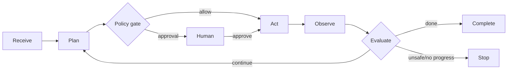

# Loop Engineering

Loop Engineering torna o ciclo agentic explícito, observável e interrompível.

## Invariantes

- Toda iteração incrementa contadores de budget antes da próxima ação.
- Tool result é dado não confiável e recebe proveniência.
- Ação ambígua não idempotente não é repetida automaticamente.
- Estado de aprovação é persistível e tem expiração.
- “Sem progresso” é mensurável, não uma impressão do modelo.

## Stop conditions recomendadas

`objective_met`, `user_cancelled`, `approval_denied`, `approval_expired`, `budget_exhausted`, `deadline_reached`,
`no_progress`, `policy_violation`, `dependency_unavailable`, `ambiguous_side_effect`, `circuit_open`.

Comece pelo [exemplo de loop determinístico](../examples/deterministic-loop/README.md) e use o
[template de loop](../templates/loop-spec.md).

