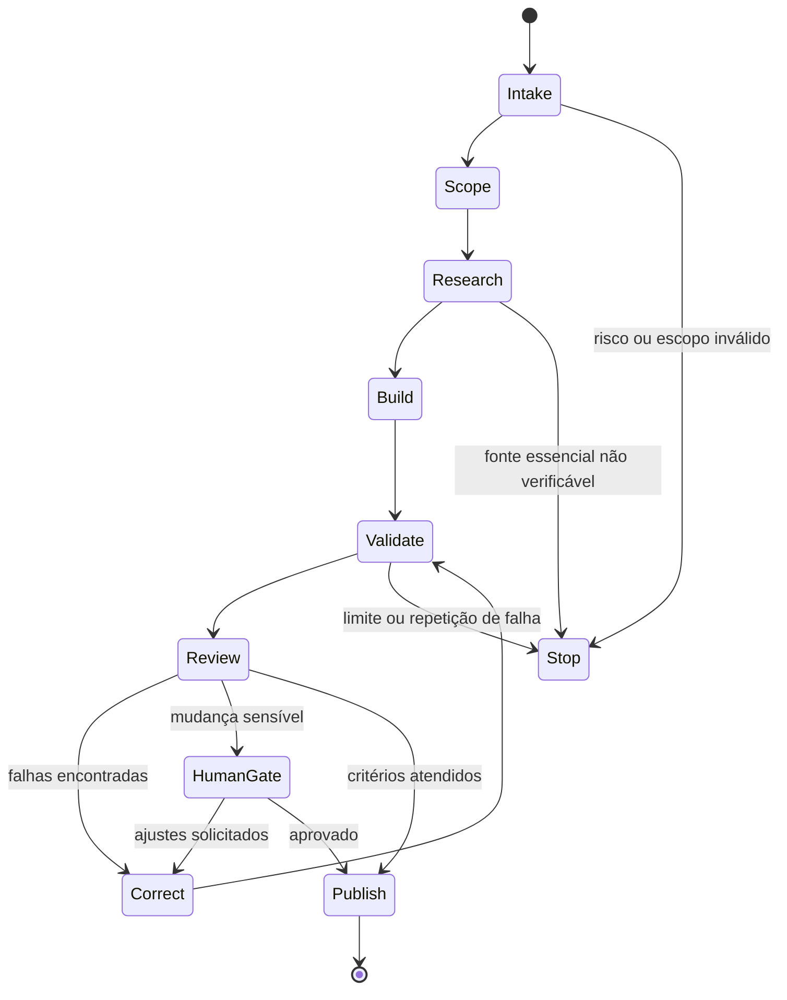

# Loop Mestre de Qualidade NEXUS

## Objetivo

Transformar qualquer tarefa de conteúdo, código, laboratório, imagem, tradução ou documentação em uma entrega verificável, segura, baseada em evidências e pedagogicamente útil.

## Máquina de estados

## Etapas

### 1. Intake

Registrar tarefa, público, idioma, formato, prazo, risco e resultado esperado.

### 2. Scope

Definir arquivos afetados, critérios de aceite, dependências, orçamento de iterações e ações que exigem aprovação humana.

### 3. Research

Usar fontes oficiais e primárias. Registrar título, organização ou autores, versão, data, URL ou DOI, data de acesso e limitações.

### 4. Build

Produzir a menor entrega coerente. Preservar IDs, frontmatter, links relativos, estilo editorial e compatibilidade com Obsidian.

### 5. Validate

Executar validadores, testes, lint, verificação de links, exemplos e comandos. Não declarar sucesso sem evidência observável.

### 6. Review

Aplicar seis lentes independentes:

- técnica;
- pedagógica;
- científica e bibliográfica;
- segurança;
- visual e acessibilidade;
- multilíngue.

### 7. Correct

Corrigir primeiro falhas críticas, depois altas, médias e baixas. Uma correção não pode degradar outro critério sem registro explícito do trade-off.

### 8. Human Gate

Exigir aprovação para publicação, mudança de licença, uso de marca, ação destrutiva, aumento de permissões, integração com contas, coleta de dados ou alegação sensível.

### 9. Publish

Abrir pull request com resumo, testes, fontes, riscos, checklist e rollback. Não fazer merge automático em mudanças curriculares ou de segurança.

## Budgets padrão

| Recurso | Limite padrão |
|---|---:|
| Iterações completas | 12 |
| Repetição da mesma falha | 3 |
| Tentativas de comando | 3 |
| Falhas críticas permitidas | 0 |
| Falhas altas permitidas | 0 |
| Nota mínima | 9,2/10 |

## Detector de progresso

Considere que houve progresso apenas quando pelo menos um item ocorreu:

- teste anteriormente falho passou;
- requisito passou de incompleto para completo;
- falha foi reduzida de severidade;
- incerteza foi resolvida por fonte confiável;
- conteúdo ficou mensuravelmente mais claro, acessível ou reproduzível.

Alteração cosmética sem melhoria verificável não reinicia o contador de estagnação.

## Circuit breaker

Interromper e solicitar decisão humana quando:

- três ciclos não produzirem progresso;
- uma fonte essencial contradizer outra fonte de autoridade equivalente;
- houver risco de vazamento de dados;
- o agente solicitar permissão além do necessário;
- a tarefa exigir acesso não concedido;
- uma ação não puder ser revertida;
- licença, autoria ou direito de imagem estiverem incertos.

## Checklist de saída

- [ ] Objetivo e público identificados.
- [ ] Critérios de aceite atendidos.
- [ ] Fontes verificáveis registradas.
- [ ] Conteúdo prático e não apenas expositivo.
- [ ] Exercício, desafio ou demonstração presente.
- [ ] Segurança e critérios de parada explícitos.
- [ ] Imagens com origem, licença e texto alternativo.
- [ ] Links e metadados válidos.
- [ ] Traduções rastreadas quando aplicável.
- [ ] Testes executados e resultados registrados.
- [ ] Limitações e pendências declaradas.
- [ ] Pull request pronto para revisão humana.
